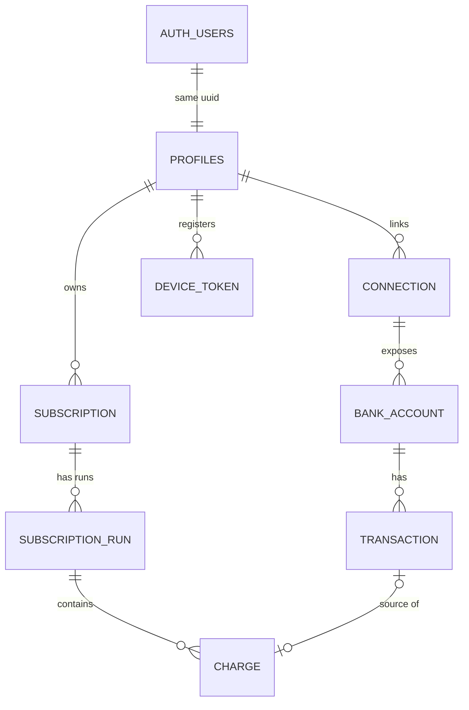

# Subscription Tracker — Data Model

> **Living document** · Last updated **2026-07-14** (v6) · See [changelog](#changelog) at the bottom.

## Entity relationship diagram

---

## Tables

### AUTH_USERS

Managed entirely by Supabase Auth — not part of our schema.

| Column | Type | Notes |
|---|---|---|
| `id` | uuid PK | Managed by Supabase Auth |
| `email` | string | Lives here, **not** in profiles |
| `providers` | string | google / email+password |

### PROFILES

| Column | Type | Notes |
|---|---|---|
| `id` | uuid PK | References `auth_users(id)` — same UUID, PK and FK |
| `display_name` | string | |
| `created_at` | timestamptz | |

### CONNECTION

| Column | Type | Notes |
|---|---|---|
| `id` | uuid PK | |
| `user_id` | uuid FK | References `profiles(id)` |
| `provider_connection_id` | string | Aggregator (Pluggy) item id; `UNIQUE(user_id, provider_connection_id)` |
| `institution_id` | string | Aggregator connector id, for re-initiating flows |
| `institution_name` | string | |
| `status` | string | active / needs_action / expired / disconnected; **no default, sync states it** |
| `consent_expires_at` | date | Warn user before lapse; renewal is manual |
| `last_synced_at` | timestamptz | Incremental sync cursor |
| `last_sync_error` | string | Nullable; surfaced in UI |
| `created_at` | timestamptz | |

### BANK_ACCOUNT

| Column | Type | Notes |
|---|---|---|
| `id` | uuid PK | |
| `connection_id` | uuid FK | |
| `provider_account_id` | string | Aggregator account id; `UNIQUE(connection_id, provider_account_id)` |
| `type` | string | credit_card / checking |
| `brand` | string | Card network: Visa / Mastercard / Elo…; null for non-cards |
| `last4` | string | |
| `official_name` | string | Bank's display name; **sync may overwrite** |
| `nickname` | string | User's own label; **never touched by sync** |
| `status` | string | active / closed; no default, sync states it |
| `created_at` | timestamptz | |

### TRANSACTION

| Column | Type | Notes |
|---|---|---|
| `id` | uuid PK | |
| `account_id` | uuid FK | |
| `provider_tx_id` | string | `UNIQUE(account_id, provider_tx_id)`; idempotent sync |
| `status` | string | pending / posted; only posted feeds detection; no default |
| `type` | string | DEBIT / CREDIT; Pluggy's direction signal; **detection keys off this, never off sign** |
| `date` | date | When the purchase happened; drives interval detection |
| `amount` | numeric | Exactly as sent; sign varies by account type (cards: positive = charge) |
| `currency` | string | 3-char, NOT NULL, no default; sync copies Pluggy `currencyCode` |
| `raw_description` | string | Immutable once posted |
| `normalized_merchant` | string | Derived; pipeline may rewrite anytime |
| `provider_category` | string | Aggregator's hint, nullable, sync-owned |
| `created_at` | timestamptz | = first import of this row |

### SUBSCRIPTION

| Column | Type | Notes |
|---|---|---|
| `id` | uuid PK | |
| `user_id` | uuid FK | Belongs to the **user, not the card** |
| `service_name` | string | Display name, e.g. Netflix; catalog- or pipeline-seeded |
| `nickname` | string | User's own label, e.g. "Netflix (mom)"; nullable |
| `merchant_key` | string | Matching attribute; **non-unique** |
| `dedupe_key` | string | Identity; `UNIQUE(user_id, dedupe_key)`; engine-assigned |
| `category` | string | Seeded by detection, user-editable after |
| `logo_url` | string | Nullable; from merchant catalog |
| `identification` | string | auto / user_confirmed / user_renamed; default `auto` |
| `ignored` | boolean | User said not-a-subscription; remembered across syncs; default `false` |
| `remind_before_days` | int | Nullable; null = reminders off; user-owned (RLS UPDATE grant); delivery deferred |
| `created_at` | timestamptz | First detected = "tracking since" |

### SUBSCRIPTION_RUN

| Column | Type | Notes |
|---|---|---|
| `id` | uuid PK | |
| `subscription_id` | uuid FK | |
| `start_date` | date | Corrected retroactively by R2 backfill |
| `end_date` | date | Null = active; = last charge + 1 interval (**paid-through**); recomputed if R5 trailing charge appends |
| `cancelled_date` | date | Nullable; null on non-cancelled runs; when the user asserted cancellation; `date` not `timestamptz` (date-granularity doctrine) |
| `billing_interval` | string | monthly / annual (more later if needed) |
| `status` | string | possible / active / overdue / ended / cancelled; no default, writer states it (engine or cancel Edge Function) |
| `detected_by` | string | R1 / R3 / R4; engine-stated, no default; powers expected-exact vs expected-approximate |
| `next_expected_date` | date | Engine cache: last charge + interval; powers renewal alerts; **always NULL on cancelled runs** (never in "Coming up", never overdue) |
| `created_at` | timestamptz | |

### CHARGE

| Column | Type | Notes |
|---|---|---|
| `id` | uuid PK | |
| `run_id` | uuid FK | |
| `transaction_id` | uuid FK | Nullable; UNIQUE where present (no double-count); `ON DELETE SET NULL` |
| `date` | date | Duplicated on purpose (self-contained history) |
| `amount` | numeric | Duplicated on purpose |
| `currency` | string | 3-char, NOT NULL, no default; engine copies from source transaction |
| `card_label` | string | Snapshot at billing time, e.g. "Visa 4821"; survives raw-data deletion |
| `created_at` | timestamptz | |

### DEVICE_TOKEN

| Column | Type | Notes |
|---|---|---|
| `id` | uuid PK | |
| `user_id` | uuid FK | References `profiles(id)`; `ON DELETE CASCADE` |
| `token` | string | APNs device token; UNIQUE |
| `platform` | string | ios (more later if needed) |
| `created_at` | timestamptz | |
| `last_seen_at` | timestamptz | Refresh on app launch; prune stale tokens later |

---

## Core decisions

### Identity & auth

- **USER replaced by AUTH_USERS + PROFILES** (v2): `AUTH_USERS` is managed by Supabase Auth; `PROFILES` is our table. `profiles.id = auth.users.id` (same UUID, PK and FK). No email / password_hash in our schema — identity lives in `auth.users`.
- **Account linking ON (both directions)**: same verified email = same account, whether Google or email+password came first. One `auth.users` row with multiple identities; profiles and all downstream data unaffected. (Google-first case: adding a password goes through the verified "set password" flow, not plain signup.)

### Connections & accounts

- **Connection death never deletes data**: expiry / revocation / disconnect changes status and stops syncing, but all downstream rows survive. (Explicit user-initiated deletion is separate — see [User deletion tiers](#user-deletion-tiers).)
- **`UNIQUE(user_id, provider_connection_id)`**: the DB rejects duplicate registration of the same bank link (double-tap / retry / duplicate webhook).
- **Accounts die independently of connections**: closed card ⇒ `status = closed`, data survives. Card replacement = new `BANK_ACCOUNT` row (new provider id / last4); subscriptions are unaffected since they belong to the user, not the card.
- **Sync-owned vs user-owned columns never overlap**: `official_name` is sync's, `nickname` is the user's. Now **enforced**, not convention — see [RLS](#migration-1-decisions).

### Transactions & sign convention

- **Transaction immutability, precisely**: `raw_description` / `date` / `amount` are frozen once posted; pending rows are drafts (may update or vanish); `normalized_merchant` is derived and rewritable by the pipeline.
- **Sign convention (locked, Option A — faithful mirror)**: `amount` is stored **exactly as Pluggy sends it**, `type` numeric. Pluggy's dialects differ: bank accounts negative = outflow; credit cards positive = new charge. The sync-owned column `TRANSACTION.type` (DEBIT / CREDIT — Pluggy's explicit direction signal) is what detection keys direction off, **never the sign**. Outflow = type DEBIT; refunds = type CREDIT (still ignored by detection). The raw layer stays a literal record of the aggregator; no interpretation smuggled into the evidence.
  - Consequence for doctrine: "same amount" in R1/continuation compares **magnitudes** — `abs(amount)` — so cross-account-type comparisons never break on sign.
- **`currency` on TRANSACTION and CHARGE**: 3-char, NOT NULL, no default; always written explicitly. No more BRL default — sync copies Pluggy's `currencyCode`; detection copies the source transaction's currency onto the charge.
- **Writer-states-everything doctrine**: no status column anywhere has a DB default. Sync states status for the raw chain, the engine states it for runs. Rationale: a connection is not "active" until verified; defaults that guess hide bugs, explicit writes surface them. Only semantic defaults kept: `subscription.identification = 'auto'` and `ignored = false` (the true birth state of every subscription).
- **Refunds**: never rewrite a charge; a refund is a separate transaction (type CREDIT) in the raw layer, ignored by detection (DEBITs only). Optional later: `refund_transaction_id` link on CHARGE, purely additive.

### Subscription identity

- **`merchant_key` matches, `dedupe_key` identifies.** Handles both mirror problems:
  - one merchant / several instances (`netflix`, `netflix:2` — forked when two charges land in one cycle), and
  - one descriptor / several services (`apple:4.90`, `apple:34.90`).
- Ambiguous splits are resolved by the user via merge/split actions (later UI).
- **Future app-level table — MERCHANT_CATALOG** (patterns → service, logo, category, subscription-only flag). Feeds R4 and `logo_url`.

---

## Detection doctrine

Replayable over full history, date granularity only. **Strict to create, generous to extend, re-runs repair.** Runs need a possible/confirmed state to host R3/R4 suggestions.

| Rule | Mode | What it does |
|---|---|---|
| **R1 — anchor** | auto | 2 charges, same merchant+amount, one cadence apart (monthly = 28–33d, ±3d window). Continuation is amount-flexible (price hikes never split a run). |
| **R2 — backfill** | auto | On confirmation, claim an unclaimed same-merchant charge ~1 interval before run start, any amount; fix `start_date`. |
| **R3 — cadence-beats-amount** | suggest-only | 3+ date-aligned charges, varying amounts (FX-priced subs, utilities). User confirms/ignores. On BR credit cards, international (USD-priced) subs post converted to BRL with fluctuating amounts — **R3 is what catches them**; the currency column does not (it will read BRL). |
| **R4 — catalog fast path** | suggest-only | 1 charge from a known subscription-only merchant ⇒ "possible" immediately. |
| **R5 — trailing charge on cancelled runs** | auto | See below. |

### R5 — trailing charge on cancelled runs

A cancelled run may claim **at most one** continuation charge — `merchant_key` match, within one cadence (−3/+3) of the run's last claimed charge, amount-flexible like any continuation.

- Claiming it recomputes `end_date` (paid-through extends one interval); the timeline renders it as *"Charged · after cancellation"*.
- If a **second** matching charge lands one cadence later, the trailing charge is **un-claimed**: removed from the cancelled run (original `end_date` restored) and both charges anchor a **new run** via standard R1 (`detected_by = 'R1'`) — a resubscription, not a resurrection.
- Beyond one cadence, a post-cancel charge is just an unclaimed charge waiting for R1 the normal way.
- Stated as a **replay rule** on purpose: incremental sync and full replay must converge on identical state.

> **Note:** this is the **only** place a charge ever moves between runs — un-claiming is a required engine capability; replayability is what makes it safe.

### Possible state

R3/R4 suggestions live as real runs; user says yes ⇒ `active`, no ⇒ parent subscription `ignored = true` (recoverable in the settings screen).

---

## Run lifecycle

- **Asymmetric matching window** around the expected date: −3/+3 days = normal charge matching.
- Expected date passes with no charge ⇒ **overdue**. Overdue lingers to **+10 days** (documented payment retry window) before flipping to **ended**, with `end_date` set. A late charge within +10 (same merchant+amount) still claims the run.
- **No reopening after ended**: any later matching charge starts a **new run**, always. (Applies to `ended`; `cancelled` runs have the narrow one-charge R5 trailing exception.)
- **`end_date` semantics**: paid-through (last charge + 1 `billing_interval`), not last-charge date (which stays derivable from charges). Holds for cancelled runs too.

### User cancellation (locked 2026-07-14)

The user can assert "I cancelled this" from the detail screen.

- New run status **`cancelled`** (added to the CHECK — this is exactly why CHECK beat enums), distinct from `ended`: **ended** = engine inferred death at +10; **cancelled** = user asserted it. UI copy differs ("You cancelled this" vs "Charges stopped").
- The action goes through an **Edge Function** (status is not a user-owned column) which sets `status = 'cancelled'`, `cancelled_date` (nullable DATE column on SUBSCRIPTION_RUN — date not timestamptz, consistent with the date-granularity doctrine; null on all non-cancelled runs), `end_date` = paid-through as usual, and **NULLs** `next_expected_date`.
- `next_expected_date` **stays** null on cancelled runs even if a trailing charge appends (R5) — cancelled runs never appear in "Coming up" and can never trip overdue.
- Charges landing after cancellation are handled by R5: one = trailing charge of the cancelled run; two = resubscription, new run.

---

## Home screen contract

*Locked 2026-07-13 — defines the queries/endpoint powering the home screen; UI reads state, never guesses.*

- **Hero number** = sum of **landed** charges in the current calendar month (`charge.date >=` first of month), joined up to non-ignored subscriptions, restricted to the user's primary currency. Pure read of CHARGE — no predictions, no annual amortization. The number grows through the month as charges land.
- **Delta ("vs Jun")** = like-for-like partial-month comparison: current month-to-date vs the **same day-span** of the previous month (Jul 1–13 vs Jun 1–13), never vs the previous month's full total. Hidden when the difference is exactly zero (no threshold — real amounts rarely tie exactly; a threshold would invent a magic number).
- **Primary currency** = derived per user, never stored/configured: the dominant currency across the user's charges. No `user.currency` column, no country setting, nothing hardcoded to 'BRL' in the display path — **the data decides**. BR users compute to BRL today; a future non-BR Open-Finance-equivalent integration works with zero migration. Rationale: BR banks auto-convert foreign purchases to BRL (+ IOF) before posting, so BR raw data is uniformly BRL anyway — fluctuating converted amounts are R3's job to catch, not currency's.
- **Charges outside the primary currency**: excluded from the hero sum, never silently hidden — surfaced via footnote:
  - exactly 2 distinct currencies present ⇒ *"+N charges in \<code\>"* (name the one other currency, e.g. "+2 charges in USD");
  - 3+ distinct currencies ⇒ *"+N charges in other currencies"*.
  - In v1 the footnote simply never renders.
- **Prediction confidence**: "Coming up" amounts are predictions from the last charge. The endpoint must flag each as **expected-exact** (R1-stable) or **expected-approximate** (R3 cadence-matched, FX-priced); the UI renders approximate amounts with a tilde ("~R$ 21,90"). Backing column: `SUBSCRIPTION_RUN.detected_by` (R1 / R3 / R4; text + CHECK, engine-stated, no default — writer-states-everything). R1 ⇒ exact; R3 ⇒ approximate; R4 runs are possible-only until confirmed (a confirming charge pattern re-stamps them R1/R3). Note R2 is backfill, not creation — it never appears in `detected_by`.
- **Overdue surfacing**: overdue runs render as standalone tinted rows above "Coming up" (subtitle "Overdue · N days" = days past expected date, i.e. depth into the +10 retry window). Multiple simultaneous overdue subs **stack** as separate rows — no "+1 more" collapse; rare but must stay visible (payment failures are never summarized away).
- **Connection problems and overdue runs are separate severity channels**: connection issues get the top banner (data is stale — structural), overdue never does (payment may have failed — transactional; lives in subtitle count + tinted rows only). The banner slot always means "plumbing problem".

---

## Subscription detail contract

*Locked 2026-07-14 — design 4b: ink hero card + self-narrating timeline; UI reads state, never guesses.*

- **Timeline**: single event stream, newest first. First-class event types (extended 2026-07-14, screens 5a–5d):
  - upcoming renewal (*"Renews"*),
  - landed charge (*"Charged"*),
  - price change (*"Price raised · was R$ X"* — continuation is amount-flexible, so raises live **inside** a run and the history narrates them),
  - trailing charge (*"Charged · after cancellation"*, from R5),
  - run start (*"First charge · start of run"* — the oldest charge of a run, marks the boundary),
  - user cancellation (*"Cancelled by you · paid through \<end_date\>"* — synthesized from `cancelled_date`),
  - missed charge (*"Expected charge missed"* — synthesized from the expected date that passed unclaimed),
  - run death (*"Ended · charges stopped · N days past expected"* — synthesized from `status = ended` + `end_date`).

  **Endpoint-synthesis note**: the timeline is **not** a pure CHARGE query. The last four event types are synthesized by the **endpoint** from run state (`cancelled_date`, `end_date` + `status`, expected-date arithmetic) and interleaved with charge rows by date. "UI reads state, never guesses" therefore means the *endpoint* derives these rows — the client renders a pre-assembled event stream and computes nothing.

  Lifetime totals in the hero (THIS YEAR / SINCE \<start\>) are pure CHARGE aggregations — the permanent-history promise made visible.
- **Tilde rule** (inherited from the home contract, applies here too): the "Renews" row amount is a prediction from the last charge; R1-stable runs render exact, R3 cadence-matched runs render approximate ("~R$ 21,90"). `detected_by` powers it; **detail and home must never disagree**.
- **Hero date slot is uniform per run state** (locked 2026-07-14, fixes 5c): active/overdue runs show **RENEWS + `next_expected_date`**; dead runs — both `cancelled` **and** `ended` — show **PAID THROUGH + `end_date`**. Never "last charge" (derivable from charges, and easily confused with the expected date). One slot, one meaning, powered by one column; "paid through" also tells the user when access actually lapsed.
- **Card row**: means "card of the **most recent** charge", derived at query time — nothing stored on subscription, no "preferred card" concept ever (the data decides, same philosophy as primary currency).
  - If the latest charge's `transaction_id` resolves: join charge → transaction → bank_account for the rich row (brand icon, "Visa – 4821", "Nubank · credit", chevron, tap-through).
  - If `transaction_id` is NULL (raw data deleted): degrade to the `card_label` snapshot alone — no subtitle, no chevron. The row never disappears, it loses depth (self-sufficient history rendering, literally).
  - Card-hopping is implicit: the row tracks the newest charge; older charges keep their own `card_label`.
  - **Card-change rendering (locked 2026-07-14, from 5d — un-defers the polish)**: history rows show inline `card_label` **only when it differs from the current card** ("Charged · Tue, Apr 15 · Visa 4821"); the switch-point charge additionally carries a transition annotation (*"card changed to Master 7730"*). The redundant section-header note ("card changed in May") is **cut** — two renderings of the fact, not three.
- **Cancel action**: "Mark cancelled" triggers the [user cancellation](#user-cancellation-locked-2026-07-14) flow (Edge Function). The "Active" badge is **derived** from the latest run's status — the screen needs possible / active / overdue / ended / cancelled variants, not just the happy path.
- **"Since \<date\>" copy** pins to the first run's `start_date` (R2-corrected, *actual* since), **not** `subscription.created_at` (tracking since).
- **Reminder toggle**: maps to `subscription.remind_before_days` (see push skeleton below); toggle on = 2 for now. Renders today, delivers later.
- **Ended-run footer copy** must stay honest about R1's two-charge requirement: a resubscription is invisible for up to one full cycle (first post-ended charge sits unclaimed until the second anchors R1). Copy along the lines of *"if charges resume, tracking restarts after two"* — never promise instant restart.
- **Known screen still to design**: run segmentation (ended run → gap → new run) — how the timeline visually separates runs and treats gaps.

---

## Push notification skeleton

*Locked 2026-07-14; schema only, nothing runs yet.*

- New table **DEVICE_TOKEN** (`user_id` FK → profiles, CASCADE; `token` UNIQUE; `platform`; `created_at`; `last_seen_at`). RLS: user SELECTs own rows; writes via Edge Function, consistent with posture.
- New column **`subscription.remind_before_days`** (nullable int; null = off; the detail-screen toggle maps to it, e.g. 2 = remind 2 days before) — **added to the user-owned column list** in the RLS column-scoped UPDATE grant, alongside nickname/category/ignored.
- The delivery side (APNs, scheduled job reading `next_expected_date`, Apple Developer account) is **deferred entirely** — the skeleton exists so it lands without a redesign later.

---

## User deletion tiers

- **(a) Delete account** = `auth.users` cascade wipes everything.
- **(b) Delete a bank link** = connection → bank_accounts → transactions removed; the user chooses whether associated subscription history (charges/runs/subs) survives or goes with it. `card_label` + duplicated date/amount/currency keep surviving history self-sufficient.

---

## Migration #1 decisions

*All locked, implemented in `initial_schema.sql`.*

- **Status/interval fields: text + CHECK constraints, NOT enums.** Value lists are expected to grow ("more later if needed"); CHECK changes are plain transactional migrations, enum ALTERs have sharp edges. Cost: generated TS types say `string`, not unions — recovered by hand-written union types in a shared `types.ts`.
- **FK delete map**: CASCADE on all seven FKs **except** `charge.transaction_id`, which is `ON DELETE SET NULL`. That single clause implements deletion tier (b) "preserve history": the raw-chain cascade nulls the bridge, the charge survives self-described. `profiles.id → auth.users(id)` also CASCADEs, so tier (a) is one `auth.admin.deleteUser()` call.
  - **Sequencing rule**: tier (b) "delete history too" is **not** handled by cascade (the interpreted chain hangs off profiles, not connection). The Edge Function must find + delete affected subscriptions **before** deleting the connection — after it, `transaction_id`s are NULL and the linkage is gone.
- **RLS** (settled, was an open question): enabled on all 7 tables. Direct `user_id` check on profiles/connection/subscription; join-based EXISTS up the chain for bank_account/transaction/run/charge. `(select auth.uid())` idiom for per-query evaluation.
  - Posture: `authenticated` role = SELECT everywhere + column-scoped UPDATE grants on user-owned columns only (`profiles.display_name`, `bank_account.nickname`, `subscription.{nickname,category,ignored}`); no INSERT/DELETE ever; `anon` = nothing.
  - All writes go through Edge Functions (service role, bypasses RLS). Sync/detection never pay the RLS join cost.
- **Indexes (minimal, migration #1)**: FK-support indexes on `bank_account(connection_id)`, `subscription_run(subscription_id)`, `charge(run_id)`; transaction's widened to `(account_id, date)` — one index serves FK support **and** the engine's fundamental scan. Everything else (`normalized_merchant`, `next_expected_date`, partial status indexes) deferred until real query patterns exist.
- **Signup trigger**: on `auth.users` insert, a security-definer function creates the profiles row (`display_name` from Google `full_name` metadata, falling back to email). Works for both providers.

---

## Open questions

- **Pluggy delete/recreate**: Pluggy may delete a transaction and create a new one (new id) when its data changes too much to confirm identity. Interacts with idempotent sync (`UNIQUE provider_tx_id`) and with `charge.transaction_id` links (a claimed transaction could vanish and reappear under a new id — the charge would go NULL via SET NULL if we hard-delete, or point at a ghost if we don't). Needs a decision when designing the sync function: hard-delete vs soft-delete vanished transactions, and whether re-linking is attempted.

---

## Changelog

- **v6** — Detail contract refined from screens 5a–5d: four new timeline event types (run start, cancelled-by-you, expected-charge-missed, ended) + endpoint-synthesis note (timeline is no longer a pure CHARGE query; the endpoint interleaves synthesized run-state events). Hero date slot made uniform (RENEWS on live runs, PAID THROUGH on dead runs — both cancelled and ended; never "last charge"). Card-change rendering locked (inline `card_label` on differing rows + transition annotation; header note cut) — un-defers the v5 polish. Ended-run footer copy honesty rule (no instant-restart promise).
- **v5** — SUBSCRIPTION DETAIL CONTRACT locked (design 4b: ink hero + self-narrating timeline). User cancellation added (status `cancelled` + `cancelled_date`; `end_date` stays paid-through). R5 trailing-charge rule added to detection doctrine. Push notification skeleton added (DEVICE_TOKEN table + `subscription.remind_before_days`; delivery job deferred). Card row contract locked (derived from most recent charge, degrades to `card_label` snapshot). Tilde rule extended to detail screen.
- **v4** — HOME SCREEN CONTRACT locked (hero number, delta, primary currency, prediction confidence, overdue stacking).
- **v3** — Migration #1 decisions locked; writer-states-everything doctrine; sign convention discovered in Pluggy docs and locked (Option A: faithful mirror + `TRANSACTION.type` DEBIT/CREDIT; magnitude-based amount matching). Currency on TRANSACTION and CHARGE: no more BRL default — always set explicitly by the writer. No status column anywhere has a DB default; only semantic defaults kept (`subscription.identification = 'auto'`, `ignored = false`).
- **v2** — USER replaced by AUTH_USERS (managed by Supabase Auth) + PROFILES (our table). `profiles.id = auth.users.id` (same UUID, PK and FK); no email / password_hash in our schema — identity lives in `auth.users`.
