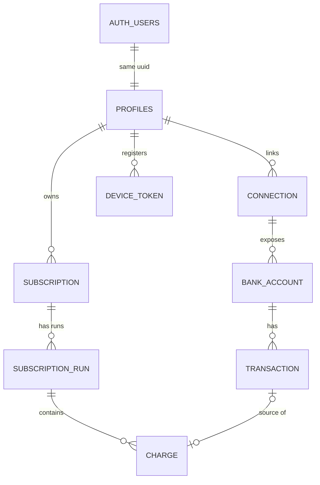

# Signu — Data Model

> **Living document** · Last updated **2026-08-17** (v61) · See [changelog](#changelog) at the bottom.
>
> **Name locked 2026-07-15**: the app is **Signu** (from *assinatura* — subscriptions are things you signed). Verified unused: no app, no Brazilian trademark (INPI classes checked empty), no active brand on the string. With the project now personal-only, domains/trademark/App Store availability are moot — the name was chosen clean anyway, on principle.

## Entity relationship diagram

---

## Tables

### AUTH_USERS

Managed entirely by Supabase Auth — not part of our schema.

| Column | Type | Notes |
|---|---|---|
| `id` | uuid PK | Managed by Supabase Auth |
| `email` | string | Lives here, **not** in profiles |
| `providers` | string | google / email+password |

### PROFILES

| Column | Type | Notes |
|---|---|---|
| `id` | uuid PK | References `auth_users(id)` — same UUID, PK and FK |
| `display_name` | string | |
| `reminder_channels` | string | push / email / both; default `'email'` (semantic default — the birth-state channel; an email address always exists); user-owned (RLS UPDATE grant); see [reminder delivery](#reminder-delivery-skeleton) |
| `created_at` | timestamptz | |

### CONNECTION

| Column | Type | Notes |
|---|---|---|
| `id` | uuid PK | |
| `user_id` | uuid FK | References `profiles(id)` |
| `provider_connection_id` | string | Aggregator (Pluggy) item id; `UNIQUE(user_id, provider_connection_id)` |
| `institution_id` | string | Aggregator connector id, for re-initiating flows |
| `institution_name` | string | |
| `status` | string | active / needs_action / expired / disconnected; **no default, sync states it** |
| `consent_expires_at` | date | Warn user before lapse; renewal is manual |
| `last_synced_at` | timestamptz | Incremental sync cursor |
| `last_sync_error` | string | Nullable; surfaced in UI |
| `created_at` | timestamptz | |

### BANK_ACCOUNT

| Column | Type | Notes |
|---|---|---|
| `id` | uuid PK | |
| `connection_id` | uuid FK | |
| `provider_account_id` | string | Aggregator account id; `UNIQUE(connection_id, provider_account_id)` |
| `type` | string | credit_card / checking |
| `brand` | string | Card network: Visa / Mastercard / Elo…; null for non-cards |
| `last4` | string | |
| `official_name` | string | Bank's display name; **sync may overwrite** |
| `nickname` | string | User's own label; **never touched by sync** |
| `status` | string | active / closed; no default, sync states it |
| `currency` | string | 3-char, nullable. The **unit** for `amount_in_account_currency` — without it "account currency" is an assumption. Sync copies Pluggy's account `currencyCode` |
| `created_at` | timestamptz | |

### TRANSACTION

| Column | Type | Notes |
|---|---|---|
| `id` | uuid PK | |
| `account_id` | uuid FK | |
| `provider_tx_id` | string | `UNIQUE(account_id, provider_tx_id)`; idempotent sync |
| `status` | string | pending / posted; only posted feeds detection; no default |
| `type` | string | DEBIT / CREDIT; Pluggy's direction signal; **detection keys off this, never off sign** |
| `date` | date | When the purchase happened; drives interval detection |
| `amount` | numeric | Exactly as sent; sign varies by account type (cards: positive = charge) |
| `currency` | string | 3-char, NOT NULL, no default; sync copies Pluggy `currencyCode`. **May be a foreign currency** — 57 of 258 real rows are USD |
| `amount_in_account_currency` | numeric | The same movement in the *account's* currency. Nullable, and **null exactly when `currency` already is the account currency** (verified 0 violations over 258 rows). Not derivable from `amount`: the implied FX rate moves per transaction. `coalesce(amount_in_account_currency, amount)` is therefore always in the account currency |
| `raw_description` | string | Immutable once posted |
| `normalized_merchant` | string | Derived; pipeline may rewrite anytime |
| `provider_category` | string | Aggregator's hint, nullable, sync-owned |
| `created_at` | timestamptz | = first import of this row |
| `withdrawn_at` | timestamptz | Soft-delete. Set when Pluggy stops returning the row; **never hard-delete**. Detection reads only `withdrawn_at is null` — see [Pluggy reality contract](#pluggy-reality-contract) |
| `installment_number` | integer | Parcel number. **Presence disqualifies the row from R1** |
| `total_installments` | integer | Parcels in the purchase. Same R1 disqualification |
| `purchase_date` | date | Original purchase date, preserved across every parcel while `date` shifts. `(merchant, purchase_date)` groups one purchase |
| `fee_type_additional_info` | string | Raw fee descriptor (`IOF_COMPRA_INTERNACIONAL`, …). Fee exclusion keys off **this**, not `feeType`. Never stored as a derived `is_fee` boolean |
| `provider_merchant_name` | string | Pluggy-enriched merchant name; ~40% coverage. Stored, **not yet adopted** |
| `provider_merchant_cnpj` | string | Pluggy-enriched CNPJ; ~40% coverage. Stored, **not yet adopted** |

*The last seven are sync-owned, added by Migration #2 (additive). All nullable, no defaults.*

### SUBSCRIPTION

| Column | Type | Notes |
|---|---|---|
| `id` | uuid PK | |
| `user_id` | uuid FK | Belongs to the **user, not the card** |
| `service_name` | string | Display name, e.g. Netflix; catalog- or pipeline-seeded |
| `nickname` | string | User's own label, e.g. "Netflix (mom)"; nullable |
| `merchant_key` | string | Matching attribute; **non-unique** |
| `dedupe_key` | string | Identity; `UNIQUE(user_id, dedupe_key)`; engine-assigned |
| `category` | string | Seeded by detection, user-editable after |
| `identification` | string | auto / user_confirmed / user_renamed; default `auto` |
| `ignored` | boolean | User said not-a-subscription; remembered across syncs; default `false` |
| `remind_before_days` | int | Nullable; null = reminders off; user-owned (RLS UPDATE grant); delivery deferred |
| `created_at` | timestamptz | First detected = "tracking since" |

### SUBSCRIPTION_RUN

| Column | Type | Notes |
|---|---|---|
| `id` | uuid PK | |
| `subscription_id` | uuid FK | |
| `start_date` | date | Corrected retroactively by R2 backfill |
| `end_date` | date | Null = active; = last charge + 1 interval (**paid-through**); recomputed if R5 trailing charge appends |
| `cancelled_date` | date | Nullable; null on non-cancelled runs; when the user asserted cancellation; `date` not `timestamptz` (date-granularity doctrine) |
| `billing_interval` | string | monthly / annual (more later if needed); R4 runs: provisional monthly at creation, user-stated at confirmation — see [R4 billing interval](#r4-billing-interval-locked-2026-07-15) |
| `status` | string | possible / active / overdue / ended / cancelled; no default, writer states it (engine or cancel Edge Function) |
| `detected_by` | string | R1 / R3 / R4; engine-stated, no default; powers expected-exact vs expected-approximate |
| `next_expected_date` | date | Engine cache: last charge + interval; powers renewal alerts; **always NULL on cancelled runs** (never in "Coming up", never overdue) |
| `created_at` | timestamptz | |

### CHARGE

| Column | Type | Notes |
|---|---|---|
| `id` | uuid PK | |
| `run_id` | uuid FK | |
| `transaction_id` | uuid FK | Nullable; UNIQUE where present (no double-count); `ON DELETE SET NULL` |
| `date` | date | Duplicated on purpose (self-contained history) |
| `amount` | numeric | Duplicated on purpose |
| `currency` | string | 3-char, NOT NULL, no default; engine copies from source transaction |
| `amount_in_account_currency` | numeric | Duplicated for the same reason as `amount`: a frozen charge with no account-currency figure could never be totalled, and the frozen region is permanent. Copied through, never computed |
| `card_label` | string | Snapshot at billing time, e.g. "Visa 4821"; survives raw-data deletion |
| `created_at` | timestamptz | |

### DEVICE_TOKEN

| Column | Type | Notes |
|---|---|---|
| `id` | uuid PK | |
| `user_id` | uuid FK | References `profiles(id)`; `ON DELETE CASCADE` |
| `token` | string | APNs device token; UNIQUE |
| `platform` | string | ios (more later if needed) |
| `created_at` | timestamptz | |
| `last_seen_at` | timestamptz | Refresh on app launch; prune stale tokens later |

---

## Core decisions

### Identity & auth

- **USER replaced by AUTH_USERS + PROFILES** (v2): `AUTH_USERS` is managed by Supabase Auth; `PROFILES` is our table. `profiles.id = auth.users.id` (same UUID, PK and FK). No email / password_hash in our schema — identity lives in `auth.users`.
- **Account linking ON (both directions)**: same verified email = same account, whether Google or email+password came first. One `auth.users` row with multiple identities; profiles and all downstream data unaffected. (Google-first case: adding a password goes through the verified "set password" flow, not plain signup.)

### Connections & accounts

- **Connection death never deletes data**: expiry / revocation / disconnect changes status and stops syncing, but all downstream rows survive. (Explicit user-initiated deletion is separate — see [Remove-bank-link flow](#remove-bank-link-flow-12c--deletion-tier-b-made-concrete) for tier (b) and [Delete account](#delete-account-12a12d-data-section--14a) for tier (a).)
- **`UNIQUE(user_id, provider_connection_id)`**: the DB rejects duplicate registration of the same bank link (double-tap / retry / duplicate webhook).
- **Accounts die independently of connections**: closed card ⇒ `status = closed`, data survives. Card replacement = new `BANK_ACCOUNT` row (new provider id / last4); subscriptions are unaffected since they belong to the user, not the card.
- **Sync-owned vs user-owned columns never overlap**: `official_name` is sync's, `nickname` is the user's. Now **enforced**, not convention — see [RLS](#migration-1-decisions).

### Transactions & sign convention

- **Transaction immutability, precisely**: `raw_description` / `date` / `amount` are frozen once posted; pending rows are drafts (may update or vanish); `normalized_merchant` is derived and rewritable by the pipeline.
- **Sign convention (locked, Option A — faithful mirror)**: `amount` is stored **exactly as Pluggy sends it**, `type` numeric. Pluggy's dialects differ: bank accounts negative = outflow; credit cards positive = new charge. The sync-owned column `TRANSACTION.type` (DEBIT / CREDIT — Pluggy's explicit direction signal) is what detection keys direction off, **never the sign**. Outflow = type DEBIT; refunds = type CREDIT (still ignored by detection). The raw layer stays a literal record of the aggregator; no interpretation smuggled into the evidence.
  - Consequence for doctrine: "same amount" in R1/continuation compares **magnitudes** — `abs(amount)` — so cross-account-type comparisons never break on sign.
  - **Money is compared exactly, never with a float epsilon** (locked v23), and **always with its currency** (locked v25). `abs(amount)` equality means `numeric` equality in SQL, or integer cents in any other language — never `abs(a - b) < 0.01`. `abs(6.46 - 6.45)` is `0.009999999999999787` in IEEE float, so an epsilon test makes two amounts a cent apart compare **equal**. That is not a rounding nicety: R1 fires on *same* amount, and a cent-tolerant comparison invents pairs that do not exist. It already produced one false anchor on real data.
  - **Equality of money means equality of currency AND cents** (locked v25). There is no amount-only comparison in the codebase: one merchant already bills in two currencies in real data — Valve charges under a single CNPJ in both BRL and USD across 47 debits — so 6.45 USD and 6.45 BRL must never compare equal. This applies wherever amounts are tested for *equality* (R1's anchor, the internal-transfer filter, R3's distinct-amount count) and nowhere else: continuation is amount-flexible and therefore currency-agnostic, and totals resolve everything to the account currency, so a run may legitimately contain charges in more than one currency.
- **`currency` on TRANSACTION and CHARGE**: 3-char, NOT NULL, no default; always written explicitly. No more BRL default — sync copies Pluggy's `currencyCode`; detection copies the source transaction's currency onto the charge.
- **Writer-states-everything doctrine**: no status column anywhere has a DB default. Sync states status for the raw chain, the engine states it for runs. Rationale: a connection is not "active" until verified; defaults that guess hide bugs, explicit writes surface them. Only semantic defaults kept: `subscription.identification = 'auto'` and `ignored = false` (the true birth state of every subscription).
- **Refunds**: never rewrite a charge; a refund is a separate transaction (type CREDIT) in the raw layer, ignored by detection (DEBITs only). Optional later: `refund_transaction_id` link on CHARGE, purely additive.

### Subscription identity

- **`merchant_key` matches, `dedupe_key` identifies.** Handles both mirror problems:
  - one merchant / several instances (`netflix`, `netflix:2` — forked when two charges land in one cycle), and
  - one descriptor / several services (`apple:4.90`, `apple:34.90`).
- Ambiguous splits are resolved by the user via merge/split actions (later UI).
- **App-level table — BRAND_CATALOG** (patterns → brand, **domain**, category, subscription-only flag, `kind`). Named MERCHANT_CATALOG until v58, renamed when it began holding financial institutions as well as services. Feeds R4 and the [logo sourcing contract](#logo-sourcing-contract) — the nullable `domain` field is what drives logo resolution (v12).

---

## Detection doctrine

Replayable over full history, date granularity only. **Strict to create, generous to extend, re-runs repair.** Runs need a possible/confirmed state to host R3/R4 suggestions.

| Rule | Mode | What it does |
|---|---|---|
| **R1 — anchor** | auto | 2 charges, same merchant+amount, one cadence apart (monthly = 28–33d, ±3d window). Continuation is amount-flexible (price hikes never split a run). **Amended v20**: a row carrying `installment_number` or `total_installments` is disqualified — see [Pluggy reality contract](#pluggy-reality-contract). |
| **R2 — backfill** | auto | On confirmation, claim an unclaimed same-merchant charge ~1 interval before run start, any amount; fix `start_date`. |
| **R3 — cadence-beats-amount** | suggest-only | 3+ date-aligned charges, varying amounts (FX-priced subs, utilities). User confirms/ignores. **Amended v24, the prediction was wrong.** It assumed an FX-priced sub arrives converted, with `currency` reading BRL and a fluctuating amount, so only R3 could catch it. Live data through connector 200 is the opposite: `currency` reads **USD**, `amount` is the **stable foreign amount** (6.45 every month), and the fluctuating BRL figure sits in Pluggy's `amountInAccountCurrency` — which **sync does not store**. So **R1 catches FX-priced subs directly**, on an amount that does not move. 57 of 258 rows are USD. Consequence recorded under [scope limits](#scope-limits-stated): totals cannot be summed across currencies until the BRL amount is stored. **Amended v20**: the IOF line accompanying such a charge is itself varying-amount and date-aligned — excluded via `fee_type_additional_info`, see [Pluggy reality contract](#pluggy-reality-contract). |
| **R4 — catalog fast path** | suggest-only | 1 charge from a known subscription-only merchant ⇒ "possible" immediately. Interval is asked, not guessed — see [R4 billing interval](#r4-billing-interval-locked-2026-07-15). |
| **R5 — trailing charge on cancelled runs** | auto | See below. |

### R5 — trailing charge on cancelled runs

A cancelled run may claim **at most one** continuation charge — `merchant_key` match, within one cadence (−3/+3) of the run's last claimed charge, amount-flexible like any continuation.

- Claiming it recomputes `end_date` (paid-through extends one interval); the timeline renders it as *"Charged · after cancellation"*.
- If a **second** matching charge lands one cadence later, the trailing charge is **un-claimed**: removed from the cancelled run (original `end_date` restored) and both charges anchor a **new run** via standard R1 (`detected_by = 'R1'`) — a resubscription, not a resurrection.
- Beyond one cadence, a post-cancel charge is just an unclaimed charge waiting for R1 the normal way.
- Stated as a **replay rule** on purpose: incremental sync and full replay must converge on identical state.

> **Note:** this is the **only** place a charge ever moves between runs — un-claiming is a required engine capability; replayability is what makes it safe.

### R4 billing interval (locked 2026-07-15)

R4 creates a run from a **single charge** — cadence cannot be measured, so the engine cannot honestly state an interval. Resolution: **ask the user at confirmation.**

- **At creation**: the engine writes a provisional `billing_interval = 'monthly'`. Keeps the column NOT NULL, keeps the pre-confirmation "renews ~\<date\>" prediction renderable (`next_expected_date` computable), and monthly is the overwhelmingly common case. Same shape as `detected_by` re-stamping: a provisional engine write, overwritten by better information at confirmation.
- **At confirmation ("Track it")**: the confirm flow asks *monthly or annual?* — the user's answer overwrites `billing_interval`. This is the authoritative write.
- **R3 confirmations never ask**: 3+ date-aligned charges already *measure* the cadence; asking would be the system pretending not to know something it proved. The extra step is R4-only.
- **Engine test case (flagged for implementation)**: a confirmed R4 run that never receives a second charge must die quietly through the normal machinery — expected date passes ⇒ overdue ⇒ ended at +10. No special casing; the lifecycle already covers it, but it warrants an explicit test.

### Possible state

R3/R4 suggestions live as real runs; user says yes ⇒ `active`, no ⇒ parent subscription `ignored = true` (recoverable in the settings screen).

### Detection candidate filter (locked v21, from a dry run against real data)

Every rule sees the same candidate set. A row is a candidate only if **all** of these hold. Stated here, where the rules live, because the first condition was already doctrine but buried in the [refunds bullet](#transactions--sign-convention) and read as a refund detail rather than a global filter.

| # | Exclusion | Mechanism |
|---|---|---|
| 1 | **`type = CREDIT`** | Refunds, reversals, and bill payments received. Was already implied ("ignored by detection (DEBITs only)"); restated as a filter. |
| 2 | **Fees** | `fee_type_additional_info` **holds a fee-indicating value**. Match on the value, never on presence — see the trap below. |
| 3 | **Installments** | `installment_number` or `total_installments` present. Disqualifies from R1 anchoring *and* from continuing a run. |
| 4 | **Internal transfers** | **New in v21.** See below. |

**Filter 2 is a trap, and the dry run fell into it.** `fee_type_additional_info` is **populated on 164 of 165 card rows** — `'NA'` on 104, `IOF_COMPRA_INTERNACIONAL` on 60. **Presence therefore carries no information whatsoever.** A first pass at this filter tested `IS NOT NULL`, excluded 146 of 258 rows, and detection found nothing at all — including the one true subscription in the data. The whole observed value set is `{NULL, 'NA', 'IOF_COMPRA_INTERNACIONAL'}`.

- **The rule is a growing denylist of fee-indicating values**, with `NULL`, `''`, `'NA'` and `'N/A'` explicitly meaning *no fee*. New institutions will bring new spellings of both sides; an unrecognized fee value silently admits a fee, an unrecognized not-applicable sentinel silently excludes everything.
- This is consistent with storing the field raw: interpretation lives in detection, where the denylist can grow and a re-run repairs history. It is the reason a derived `is_fee` boolean was refused in v20.
- **Symptom to watch for**: candidate count collapsing far below row count. It looks like a quiet, working filter, not a bug.

**Internal transfers — the exclusion the dry run forced.** Paying the credit-card bill produces *two* rows when both accounts are connected: a `CREDIT` on the card and a `DEBIT` on the checking account. Filter 1 catches the card side. **Nothing caught the checking side**, and it is the strongest false positive in the real data — 12 consecutive months, day-of-month 10, gaps 28–33 every time, amounts varying from R$110 to R$5,245. That is R3's trigger condition executed perfectly, and confirming it would have tracked the user's entire card spend as a subscription.

Rule: **a `DEBIT` whose `abs(amount)` equals that of a `CREDIT` on a different `bank_account` of the same user, dated within ±3 days, is an internal transfer and is excluded — both sides.** Verified 12/12 on real data, every pair matching same-day and to the cent.

- **Structural, not lexical, on purpose.** No descriptor blacklist. `PAGAMENTO DE FATURA` / `PAGAMENTO RECEBIDO` are one bank's wording; the amount-and-date correspondence is what the event actually *is*, and it survives translation, rewording, and institutions we have never seen.
- **Known limitation, accepted**: the rule needs *both* accounts connected. Pay the card from an unconnected account and the pairing is invisible, leaving a perfect monthly varying-amount candidate with no defence. It surfaces as an R3 suggestion, which is suggest-only, so the cost is one dismissal — the same bargain as the installment case.
- Excluded at **detection** time, never stored as a flag on the raw row. Which rows pair depends on which accounts are connected *now*; freezing that into the raw chain would defeat replay.

### `merchant_key` derivation (locked v21)

Closes the question v20 left open. **`merchant_key` is `provider_merchant_cnpj` when present, else the normalized descriptor.**

The dry run made this non-optional rather than merely nicer. One real merchant — Valve — bills under **three** descriptors (`STEAMGAMES.COM`, `WL *STEAM PURCHASE`, `STEAM PURCHASE`), all carrying the same CNPJ. Two charges of R$6.45, 30 days apart, landed under two *different* descriptors, so **descriptor-keyed R1 never saw a pair and detected nothing.** CNPJ-keyed, it anchors. Across the card, 15 descriptors collapse to 5 CNPJs, and no descriptor ever maps to more than one CNPJ.

- **Normalization is case and whitespace only. Do not strip trailing digits.** Tried and rejected: a digit-stripping pass merged `LS4246147` with `LS4289481` — two unrelated transactions — and merged nothing else. On this data the aggressive version is pure loss. The feared `PAG*NETFLIX` / `NETFLIX.COM` digit variance does not occur; fragmentation is by *descriptor variant*, which CNPJ solves and string surgery does not.
- **Aggregator exception, and it is load-bearing in the other direction.** One CNPJ (`PAYPAL DO BRASIL`) covers five unrelated merchants — `PAYPAL *RIOTGAMESIN`, `PAYPAL *C.TAFFY11`, `PAYPAL *JAST USA`, `PAYPAL *LOADED COM`, `PAYPAL *ADHOC STUDI`. Keyed on CNPJ alone they become one merchant, and two same-amount purchases a cadence apart would anchor a **phantom** subscription. For CNPJs on an aggregator list, `merchant_key` is `cnpj + ':' + descriptor suffix`. The list starts with PayPal and grows by observation; an unlisted aggregator is a live false-positive source.
- **`''` is not a value.** `businessName` arrives as an empty string on 4 of 66 card rows with a merchant object. Sync coerces `''` → NULL on write, so `IS NOT NULL` means what it says.
- CNPJ coverage is ~40%, so the descriptor fallback is the majority path, not an edge case. Both branches are load-bearing.

### R3 date-alignment, defined (locked v21)

"3+ date-aligned charges" was undefined, and the gap is not academic: under a loose reading — *any* two gaps in the monthly band — `STEAMGAMES.COM` fires with 26 charges spread across 16 distinct days of the month, which would be badly wrong.

**Date-aligned = at least 80% of the charges fall within ±3 days of the median day-of-month, computed circularly** so month-end and month-start are near each other, not 28 days apart. On real data this fires on exactly one group and rejects the six others that a loose reading admits.

---

## Pluggy reality contract

*Locked 2026-08-10, after a live probe of connector 200 against real bank data.
Everything here replaces an inference with an observation. Where a documented
claim and the live feed disagreed, the live feed won and the disagreement is
recorded — the documentation is not silently trusted again.*

### Sync shape: poll-only, no webhook endpoint

- **A full daily re-scan is the sync**, not an incremental cursor. ~500 rows per
  page, ~6 requests per account for a year of history, against a 360 req/min
  limit. Whole-history re-scan costs on the order of two dozen requests.
- **This is not a preference — polling incrementally is impossible.** There is no
  `updatedAtFrom` query parameter. `createdAtFrom` catches only rows Pluggy first
  ingested after T, so it misses every PENDING→POSTED transition and every
  `billId` acquisition. A re-scan is the *only* mechanism that observes updates,
  so the documented cost of missing an update webhook ("you must re-scan") is
  **zero when the re-scan is the baseline**.
- **A re-scan detects all three change classes in one pass**: ids absent locally
  are creations; ids present with a newer `updatedAt` are updates; ids held
  locally and absent from the response are deletions.
- **No webhook endpoint is built.** Reversal of an earlier position that webhooks
  were required for correctness — true for a multi-tenant app polling narrow
  windows, false here. Also avoids a real hazard: **Pluggy offers no webhook
  signature.** No HMAC, no signing scheme. Authenticating a public Edge Function
  would rest on a bearer header that does not bind to the payload plus a single
  hard-coded IP with no documented change policy.
- **Freshness is bounded by the source, not by us**: `nextAutoSyncAt` runs ~27h
  after `lastUpdatedAt`, landing at ~14:42Z. Our sync is scheduled **after** it
  (~15:30Z). A daily scan is exactly as fresh as data that refreshes daily;
  webhooks would buy sub-daily latency on data that has none.

### Deleted and recreated transactions

- **Pluggy's `id` is a content hash, not a stable surrogate key.** When a row's
  date, description, or amount change enough to break the hash, Pluggy deletes
  it and creates a new one with a **new id**. The same happens when a bank
  transiently stops returning a row for 1–3 days and then returns it. Two
  documented causes, one code path.
- **We never hard-delete. `transaction.withdrawn_at` is set instead**, and
  detection reads only `withdrawn_at is null`. Rationale: the deletion is
  frequently temporary, the row is evidence for a replayable interpreted chain,
  and hard-deleting destroys a charge's evidence over what may be a three-day
  bank hiccup.
- **Re-linking is never attempted.** No fuzzy matching on amount-and-date, no
  supersession chain. A detection re-run re-derives the link — "re-runs repair"
  is exactly the doctrine this case exists for. Heuristic identity matching in
  the sync layer would smuggle interpretation into the raw chain.
- `charge.transaction_id` keeps `ON DELETE SET NULL` for connection deletion,
  where it was designed to fire. It never fires for this reason.

### Credit-card lifecycle (verified, not assumed)

- **PENDING while the invoice is open; POSTED when the invoice falls due** —
  *vence*, not *fecha*. The docs describe a typical 7–10 day window between
  close and due in which further parcels can still appear.
- **`billId` correlates exactly with POSTED**: 163 POSTED rows all carry it, both
  PENDING rows carry `billForecastDate` and no `billId`.
- **`billId` survives connector 200 despite `isOpenFinance: false`.** The docs
  restrict `billId` to Open Finance connectors; the proxy passes it through
  anyway. The "Open Finance only" tag is field-specific in what survives, not a
  blanket rule — so it cannot be read as a reliable availability guarantee in
  either direction.
- **The PENDING→POSTED lag has no documented bound** and can exceed a full
  billing cycle. **A PENDING row older than ~45 days is a signal something was
  missed**, not a normal state.
- **`date` semantics are not uniform.** Parcel 1 carries the purchase date;
  parcels 2..N carry the bill-posting date. `date` is stable per id — a change
  to it is precisely what produces a new id — but the mapping from a real-world
  purchase to a `date` value is not stable.

### Installments vs subscriptions — R1's blind spot

- **The threat is real and grounded in Pluggy's own documentation.** Padrão B —
  parcels created one per month, documented as the most common pattern among
  major banks — produces same-merchant, same-amount, one-cadence-apart charges.
  **That is exactly R1's trigger condition**, and R1 is auto, not suggest-only.
  Left undefended, a 12× R$50 purchase silently becomes a tracked R$50/month
  subscription on the second parcel.
- **R1 amendment (locked): presence of `installment_number` or
  `total_installments` disqualifies a transaction from R1**, and from
  continuation of an existing run. Verified populated on every installment row
  observed, so the defence has live evidence behind it.
- **Where a bank omits those fields there is a fallback, found in the dry run.**
  The descriptor itself carries the parcel marker: `AMAZON MARKETPLACE 1/2`,
  `2/2`. A `\b\d{1,2}/\d{1,2}\b` test on the descriptor agreed with the metadata
  **7/7, with zero disagreements in either direction** across 165 rows — no
  descriptor marker without metadata, no metadata without a marker. Used as a
  secondary signal only, since 7 rows is a small sample; where both are absent the
  false positive is still accepted (single-user, one dismissal).
- **`purchase_date` is the grouping key Pluggy says does not exist.** Their docs
  state Open Finance returns no identifier grouping parcels of one purchase and
  recommend heuristics; `purchase_date` is preserved across every parcel while
  `date` shifts, so `(merchant, purchase_date)` groups a purchase exactly. Better
  than the heuristic Pluggy recommends.
- **Truncated installment runs at the history boundary are normal.** A 5× purchase
  whose first parcels predate the 365-day window appears as parcels 3, 4, 5. Not
  data loss; do not "repair" it.

### Fees masquerading as subscriptions (found by the probe, in no documentation)

- **36% of card rows are IOF lines on international purchases** (60 of 165). A
  USD-priced subscription posts **twice** monthly: the converted charge, and its
  IOF line. IOF is a percentage of a fluctuating base, so the amounts vary —
  **which is R3's trigger condition**, the very rule that exists to catch
  FX-priced subscriptions. The tax on the subscription looks like a subscription.
- **Corrected in v21** (v20 said these "fork instances under the dedupe_key
  doctrine" — they do the opposite). 53 of the 60 share a single *generic*
  descriptor, `IOF DE COMPRA INTERNACIONAL`, naming no merchant, so they
  **collapse into one group** of 53 at up to 11 per month rather than forking per
  parent. Only 3 rows name their parent.
- **The exclusion is safe, and this was worth checking rather than assuming**: all
  60 IOF rows literally contain `IOF` in the descriptor and share **zero**
  descriptors with the other 105 rows. They are separate tax lines, not
  international purchases carrying IOF metadata — so excluding them cannot
  exclude a subscription. Reversals (`ESTORNO DE IOF...`) carry the same field and
  are caught too.
- **Wholesale exclusion is the only option, which is stronger than v20's
  reasoning.** Parent attribution is impossible for ~95% of IOF rows: the
  descriptor is generic, only 18 of 60 land on the same date as any non-IOF
  charge (46 within one day, all 60 within two), and 6 have more than one
  candidate parent on their date.
- **Detection excludes rows whose `fee_type_additional_info` identifies a fee.**
- **The signal is in `fee_type_additional_info`, not `feeType`.** `feeType` is
  `'OTHER'` on 164/165 rows and carries nothing. Same shape as every other
  lesson this week: the documented field is not the usable field.
- **But `fee_type_additional_info` is populated on 164/165 rows too** — `'NA'` on
  104 of them. Only its *value* discriminates, never its presence. v21 states the
  filter as a denylist for exactly this reason; testing `IS NOT NULL` excludes 146
  of 258 rows and detects nothing.
- Stored **raw**, never as a derived `is_fee` boolean — the set of fee-indicating
  values will grow, and a stored boolean freezes today's reading into the
  immutable raw chain and defeats replay.

### Enrichment: better than expected

- **`merchant` and `category` are populated on the free path**, contradicting
  their documented "requires Pro subscription level" gating. `category` on 258/258
  rows, `merchant` on 94. Detection is **not** limited to raw description strings.
- **`provider_merchant_name` and `provider_merchant_cnpj` are stored now.** Stored
  because raw evidence not captured is evidence lost — Pluggy retains 12 months,
  and detection cannot replay over data never written. **Adoption is settled in
  v21** — see [`merchant_key` derivation](#merchant_key-derivation-locked-v21).
- **`provider_merchant_name` is populated from `merchant.businessName`, not
  `merchant.name`.** Locked v21 after a live count: `name` is present on **5 of
  258 rows**, `businessName` on 94. Wiring the column to the field its name
  suggests would leave it ~98% null. No migration — the column already exists and
  this is a sync mapping, but it has to be written down or it will be wired the
  obvious wrong way.
- `businessName` is sometimes the **empty string** (4 rows), not null. Sync
  coerces `''` → NULL.

### Deliberately not stored

*Documented by Pluggy, not returned by these banks. Excluded on the same
principle as any unobserved field: a column whose value no writer can state has
no business existing, and all four are purely additive later.*

- **`totalAmount`** — additionally, its meaning is contested three ways (prose
  docs and OpenAPI say sum of all parcels; the SDK comment says the single parcel
  amount). Derivable as `amount × total_installments` regardless.
- **`payeeMCC`**, **`cardNumber`** — unobserved.
- **`otherCreditsType`** — `'OTHER'` on 164/165, no signal today. **Watch item**:
  its `BILL_INSTALLMENT` value means an installment plan on the *bill itself*
  (parcelar a fatura), which generates monthly charges and would read as
  recurring. If a card bill is ever parcelled, this becomes a live
  false-positive source and earns a column.

### Still open

- **Padrão A vs B for these banks** — settleable only longitudinally, by watching
  whether next month's parcel arrives as a new transaction. **No longer
  blocking**: the R1 disqualification works under either pattern because the
  fields are populated. Note that `created_at` cannot answer it — on a freshly
  connected item every row shares one ingest timestamp.
- ~~**`merchant_key` derivation from CNPJ**~~ — **closed in v21**, see
  [`merchant_key` derivation](#merchant_key-derivation-locked-v21).
- **Webhook availability on the free path** — pricing page says absent, technical
  docs are silent. **Now moot**: poll-only needs no answer.
- **The aggregator list has one entry.** PayPal was found because it happened to
  be in one year of one card. Any unlisted aggregator sharing a CNPJ across
  merchants is an undefended phantom-subscription source, and there is no way to
  enumerate them in advance from Pluggy's data.
- **R1's positive path has never fired on real data.** A year of it contains no
  clean same-merchant same-amount monthly pair except the R$6.45 Valve case that
  only v21's CNPJ keying exposes. R1 is verified to produce **zero false
  positives** across 163 POSTED rows; it is not verified to produce a true one.

---

## Sync contract (locked v22)

*Implemented in `backend/supabase/functions/pluggy-sync/`, verified end-to-end
against the real item: 1 connection, 2 accounts, 258 transactions.*

### Shape

- **Two functions, not one.** `pluggy-sync` owns the raw chain (connection,
  bank_account, transaction) and never writes subscription / subscription_run /
  charge. Detection is separate on the replayability doctrine: a detection bug
  must not be able to fail a sync, and detection must be re-runnable over stored
  history without touching Pluggy — which is the recovery path v20 relies on for
  withdrawn rows.
- **Sync chains into detection on success** rather than the two being separately
  scheduled. An independent schedule lets detection wake mid-sync and interpret a
  half-written raw chain; it would self-heal next run ("re-runs repair"), but
  producing knowingly-wrong state in the meantime is avoidable. Both stay
  independently invokable, which is what replay needs.
- **Poll-only, full 365-day re-scan every run**, per v20. Idempotent on
  `UNIQUE (account_id, provider_tx_id)`, which is what makes re-scanning the
  whole window cheap enough to be the baseline.
- **Invocation is gated by a shared secret in `x-sync-secret`, not a JWT**
  (`verify_jwt = false` in `config.toml`). A scheduler has no user session, and
  the URL is publicly addressable. Compared as SHA-256 digests so neither content
  nor length leaks by timing.

### Deliberate gaps

- **Scheduled at 15:30 UTC daily by `pg_cron` (locked v27, Migration #6).** In a
  migration rather than dashboard config, for the same reason the applier is a
  migration: it is versioned with everything else, survives a rebuild, and
  `supabase db reset` reproduces it. A schedule living in a dashboard drifts
  invisibly from the spec.
  - **15:30, not a round hour**: the item's `nextAutoSyncAt` lands about 14:42Z,
    so syncing earlier would read yesterday's data and be a day stale for no
    reason. Sync chains into detection, so one cron entry drives the pipeline.
  - **The URL and secret are not in the repo.** Both are read from Vault by name
    (`signu_sync_url`, `signu_sync_secret`), so the migration is
    environment-independent and commits no secret. Two manual `vault.create_secret`
    calls per environment, documented in the migration header.
  - **Unconfigured means loud, not silent.** `cron.schedule` calls
    `public.trigger_pluggy_sync()`, which raises a named exception when either
    secret is missing rather than POSTing to a null URL — a schedule that quietly
    no-ops is indistinguishable from one that works. *A **wrong** secret is a
    different matter and was silent for three days — see v42.*
  - **The POST is given 150s (Migration #9), not pg_net's default 5s**, because
    the work behind the URL takes ~7s and the default overwrote every real status
    with a timeout. `cron.job_run_details` cannot substitute: it reports success
    for the *queueing*, so a 200, a 403 and a DNS failure all read identically
    there. `net._http_response` is the only record of what actually happened.
  - Idempotent: pg_cron upserts on jobname, so a reset yields exactly one entry.
- **`connection` was seeded by hand** via `supabase/seed/seed-connection.sql`,
  with the itemId passed in rather than committed. Committed as a parameterized
  script rather than an `INSERT` typed once, because a manual step living only in
  shell history is invisible in the way this project keeps getting bitten by.
  *Superseded v31: the in-app flow landed, so the file is deleted rather than
  adapted, exactly as it said it should be — see
  [connecting a bank](#connecting-a-bank-locked-v31-2026-08-12).*

### Timezone — dates are São Paulo, not UTC

`transaction.date` and `purchase_date` are `date` columns; Pluggy sends ISO
timestamps in **UTC** and its docs say to convert to GMT-3 to read them as
Brazilian time. **Sync converts to `America/Sao_Paulo` before truncating.**

Measured, not assumed: **37 of 258 rows** carry a UTC time of 00:00–02:59 and
land on the previous day once converted — one of them crossing a month boundary
(`2026-06-01` → `2026-05-31`), which would have filed a charge in the wrong
billing month. Naive truncation misplaces ~14% of the ledger, perturbing exactly
the gap arithmetic R1/R3 depend on. Named IANA zone rather than a fixed `-3`:
Brazil abolished DST in 2019 but earlier history was GMT-2 in summer.

### Mapping traps (each one verified against a live payload)

| Trap | Correct handling |
|---|---|
| `status` CHECK is **lowercase** (`'pending','posted'`) but `type` CHECK is **uppercase** (`'DEBIT','CREDIT'`) | Pluggy sends both uppercase; status is lowercased, type passes through |
| `bank_account.type` | Maps from Pluggy's **`subtype`** (`CREDIT_CARD`/`CHECKING_ACCOUNT`), not its `type` (`CREDIT`/`BANK`) — different vocabularies, same field name |
| `last4` | Pluggy's `number` is `'2049'` on cards but `'88120381-6'` on checking, where the last 4 *characters* are `'81-6'`. Digits only, then last 4 |
| `brand` | Lives at `creditData.brand`; `creditData` is absent entirely on checking accounts, which is why the column is documented null for non-cards |
| `official_name` | `marketingName` where present, else `name` — `name` alone is `'platinum'` on the card, a tier rather than an account |
| `provider_merchant_name` | From `businessName`; `name` is present on 5 of 258 rows (v21) |
| `''` | Coerced to NULL on write. Verified: 94 merchant objects, 4 with an empty `businessName`, **90 rows written non-null** |
| `fee_type_additional_info` | Stored **raw**, including the `'NA'` sentinel — 104 `NA`, 60 `IOF…`, 94 null. Interpretation is a detection-time denylist (v21) |

### Withdrawn detection

A row absent from the feed is soft-deleted (`withdrawn_at`), never removed, and a
row present in the feed has `withdrawn_at` explicitly set to NULL — so a row that
reappears under the same `provider_tx_id` is un-withdrawn by the next re-scan.

**Scoped to `date >= windowStart`.** Comparing against every stored row would
withdraw the entire pre-window history on every run, since it is absent from a
365-day response by construction. This is the one place where getting the scope
wrong hides transactions from detection rather than merely adding noise.

---

## Detection engine contract

*Locked 2026-08-10. `run-detection` owns the interpreted chain and never writes
the raw one. Sync chains into it on success (v22); both stay independently
invokable, which is what replay needs.*

### Shape: pure core, thin shell, atomic apply

- **The rules are pure functions** over plain inputs — candidate rows in, desired
  runs and charges out. No database access, no clock reads, no I/O. `today` is
  passed **in** as a parameter, never read inside a rule, so every rule is
  testable against a fixed date.
- **TypeScript, not SQL**, chosen for testability. The cost is that integer-cents
  discipline must be re-established in a second language — the exact site where
  the float-epsilon bug lived (v23). Money comparison is therefore centralised in
  **one** helper, and every rule calls it; no rule performs its own arithmetic on
  amounts.
- **The write phase is a single Postgres function** invoked by RPC, taking the
  computed desired state as its argument. Rationale: PostgREST has no transaction
  across calls, and a recompute that fails halfway leaves the interpreted chain in
  a state no rule produced — the thing chaining sync into detection exists to
  prevent. The function is a **dumb applier**: no rules, no arithmetic, no
  interpretation. Rule logic living in SQL is what this shape refuses; a
  transactional write boundary is not rule logic.
- **Two implementations are compared, not just tested** (locked v27).
  `backend/detection-parity.py` feeds the *same* database rows to the TypeScript
  engine and to the Python harness and compares seven counts, failing nonzero on
  any divergence. Thirty-two passing unit tests is weaker evidence than two
  independent implementations agreeing: the epsilon bug (v23) passed every test it
  had and surfaced only when a second implementation disagreed on a count they
  should have shared. The naive version of this check — harness on the raw dump,
  engine on the database — would prove less than it appears to, because sync moves
  37 of 258 rows by a day (v22), so a mismatch could be date handling and a match
  could be luck; feeding both the same rows makes a divergence a *rule*
  divergence. It earned its keep immediately: the harness had never received the
  v25 currency guard, so the two encoded different rules and agreed only because no
  cross-currency amounts collide in this ledger. Local-only, like the dry run —
  it needs a live stack and the gitignored dump.
- **Every false positive the dry run found is a regression test.** Intent was to
  fixture the real 258 rows from v20's probe; that is **not possible in a public
  repo** — `pluggy-probe-raw.json` is gitignored real bank history. The committed
  tests are therefore the *structural equivalent* of each finding, reduced to the
  minimum rows that reproduce it, and the real-258-row check stays local via
  `backend/pluggy-detection-dryrun.py`. Stated rather than quietly substituted,
  because "fixtures are the real rows" would otherwise read as true.

### What "full recompute" means, and where it stops

Recompute is **reconcile, not rebuild.** The engine computes desired state as a
pure function of `(candidate transactions, user assertions, today)` and applies the
difference. Two boundaries scope it:

- **Frozen region — charges with `transaction_id IS NULL`.** Their raw backing was
  deleted by the remove-bank-link flow, on purpose. They are immutable historical
  records: **never recomputed, never deleted, never re-parented.** A run holding
  them reconciles *around* them — including when `start_date` derives from one.
  This is the practical limit of "the interpreted chain is fully replayable over
  the raw chain": it is replayable over the raw chain *that still exists*.
- **User assertions are read, never written.** Enumerated below.

Everything else is derived and rewritten freely.

### User assertions vs derived state

`detected_by` is what distinguishes a derived status from an asserted one — no new
column is needed.

| Field | Derived or asserted | Rule |
|---|---|---|
| `subscription.nickname`, `category`, `ignored`, `remind_before_days` | asserted | never written by the engine |
| `subscription.service_name` | both | engine-seeded; frozen once `identification = 'user_renamed'` |
| `subscription.identification` | asserted | never written by the engine |
| `run.status` where `detected_by = 'R1'` | derived | recomputed freely |
| `run.status` where `detected_by IN ('R3','R4')` **and** stored status ≠ `possible` | **asserted** | the user confirmed a suggestion — preserved |
| `run.status = 'cancelled'` + `cancelled_date` | **asserted** | preserved regardless of `detected_by` |
| `run.billing_interval` where `detected_by = 'R4'` and the run is confirmed | **asserted** | the confirm flow's authoritative write (v11 R4 rule) |
| `run.start_date`, `end_date`, `next_expected_date` | derived | recomputed |
| all `charge` columns | derived | recomputed, except the frozen region |

**R2 stops being an event and becomes a consequence.** Doctrine says R2 fires "on
confirmation." Under recompute it is re-derived every run: confirmation state is
preserved, so R2's precondition holds, so the backfill re-applies and reproduces
the same `start_date`. Nothing needs to remember that R2 ran.

### Run identity across recomputes

A stored run and a desired run are the same run when they **share at least one
claimed transaction**, matched greedily by descending overlap. No stored anchor
column: a frozen derived pointer is the thing this project keeps refusing, and
overlap is computable from state that already exists.

- Two runs of one subscription never share a charge, so overlap is unambiguous.
- **R5 un-claiming is the one case that needs the greedy ordering** and gets an
  explicit test: the trailing charge moves to a new run, so the new run overlaps
  the cancelled run on exactly one charge while the cancelled run overlaps itself
  on many. Highest overlap wins, so the cancelled run keeps its identity and the
  new run is correctly new. This is already flagged as *the only place a charge
  moves between runs*.
- **A stored run whose every live charge has vanished is deleted**, even if it
  carried a user assertion. Its basis is gone; keeping a confirmed run with no
  evidence would be the system asserting something it cannot support. Exception:
  a run holding frozen charges always survives, because those *are* its basis.

### Determinism

Recompute must converge: two runs over identical inputs produce byte-identical
state. Three requirements, each a test.

- **Ordering is total.** Candidates are processed by `(date, provider_tx_id)`.
  Date alone is not a total order — Pluggy's within-day `order` field is not
  stored — and an unstable sort makes anchor selection nondeterministic.
- **`dedupe_key` assignment is deterministic, and this is load-bearing.** Keys are
  `UNIQUE(user_id, dedupe_key)` and fork to `netflix:2` when one merchant hosts two
  concurrent subscriptions. If the fork ordinal came from discovery order, a
  recompute could renumber and silently re-attach a user's nickname, category and
  reminder settings **to the wrong subscription**. The ordinal is therefore
  assigned by ascending first-charge date, tie-broken by `provider_tx_id`.
- **`today` is an input, not a clock read.** `next_expected_date`, `overdue` and
  ended-at-+10 all depend on it, so "identical state" means *same-day* identical.
  Replay is deterministic given `(raw, assertions, today)` — a run on a later date
  legitimately differs, and a test that asserts otherwise is testing the wrong
  thing.

### Idempotency

**Run it twice; the second run changes nothing.** This is the convergence check
that caught the epsilon bug in v23 — two implementations of one rule disagreeing on
a count they should share. Asserted as a test, not assumed.

### Withdrawn transactions

A withdrawn row still exists but is not a candidate, so no charge is produced for
it and its stored charge is deleted; the replacement row arrives under a new id and
anchors normally. If a withdrawal is transient, history briefly loses a charge and
the next run restores it — "re-runs repair," working as designed rather than
tolerated. This closes the question parked since v20 about what a withdrawn
transaction does to its charge: nothing is patched, because charges are derived.

### Cross-account scope

The internal-transfer filter compares a `DEBIT` against `CREDIT`s on *other*
accounts of the same user, so the candidate pass is **per-user, not per-account**.
Detection cannot be sharded by account without silently disabling that filter.

### Scope limits, stated

- **BRAND_CATALOG did not exist** (as MERCHANT_CATALOG), so **R4 could not fire.** The engine ships with
  R1, R2, R3 and R5; R4 is contract-only until the catalog table exists. Said out
  loud because a rule that silently never fires reads as a rule that works.
  *Amended v38: the table exists and is seeded (Migration #8), so the blocker is
  gone — but **R4 still does not fire**, because the engine has not been taught to
  read it. The catalog currently feeds logo resolution only. The same sentence
  applies for the same reason: a rule that never fires reads as a rule that works.*
- **R1's positive path has fired on exactly one anchor** in real data, and that
  anchor only exists because v21 switched `merchant_key` to CNPJ. Zero false
  positives across 163 POSTED rows is evidence about the filters, not about the
  positive path.
- ~~**Amounts are not summable across currencies**~~ — **resolved in v26.** 57 of
  258 rows carry `currency = USD`; `amount_in_account_currency` now stores the
  account-currency figure and totals use
  `coalesce(amount_in_account_currency, amount)`, which is always in the account
  currency. The real subscription totals **R$68.84** where summing `amount` alone
  gave a meaningless `12.90`.

---

## Run lifecycle

- **Asymmetric matching window** around the expected date: −3/+3 days = normal charge matching.
- Expected date passes with no charge ⇒ **overdue**. Overdue lingers to **+10 days** (documented payment retry window) before flipping to **ended**, with `end_date` set. A late charge within +10 (same merchant+amount) still claims the run.
- **No reopening after ended**: any later matching charge starts a **new run**, always. (Applies to `ended`; `cancelled` runs have the narrow one-charge R5 trailing exception.)
- **`end_date` semantics**: paid-through (last charge + 1 `billing_interval`), not last-charge date (which stays derivable from charges). Holds for cancelled runs too.

### User cancellation (locked 2026-07-14)

The user can assert "I cancelled this" from the detail screen.

- New run status **`cancelled`** (added to the CHECK — this is exactly why CHECK beat enums), distinct from `ended`: **ended** = engine inferred death at +10; **cancelled** = user asserted it. UI copy differs ("You cancelled this" vs "Charges stopped").
- The action goes through an **Edge Function** (status is not a user-owned column) which sets `status = 'cancelled'`, `cancelled_date` (nullable DATE column on SUBSCRIPTION_RUN — date not timestamptz, consistent with the date-granularity doctrine; null on all non-cancelled runs), `end_date` = paid-through as usual, and **NULLs** `next_expected_date`.
- `next_expected_date` **stays** null on cancelled runs even if a trailing charge appends (R5) — cancelled runs never appear in "Coming up" and can never trip overdue.
- Charges landing after cancellation are handled by R5: one = trailing charge of the cancelled run; two = resubscription, new run.

---

## Home screen contract

*Locked 2026-07-13 — defines the queries/endpoint powering the home screen; UI reads state, never guesses.*

- **Hero number** = sum of **landed** charges in the current calendar month (`charge.date >=` first of month), joined up to non-ignored subscriptions, restricted to the user's primary currency. Pure read of CHARGE — no predictions, no annual amortization. The number grows through the month as charges land.
- **Delta ("vs Jun")** = like-for-like partial-month comparison: current month-to-date vs the **same day-span** of the previous month (Jul 1–13 vs Jun 1–13), never vs the previous month's full total. Hidden when the difference is exactly zero (no threshold — real amounts rarely tie exactly; a threshold would invent a magic number).
- **Primary currency** = derived per user, never stored/configured: the dominant currency across the user's charges. No `user.currency` column, no country setting, nothing hardcoded to 'BRL' in the display path — **the data decides**. BR users compute to BRL today; a future non-BR Open-Finance-equivalent integration works with zero migration. Rationale: BR banks auto-convert foreign purchases to BRL (+ IOF) before posting, so BR raw data is uniformly BRL anyway — fluctuating converted amounts are R3's job to catch, not currency's.
- **Charges outside the primary currency**: excluded from the hero sum, never silently hidden — surfaced via footnote:
  - exactly 2 distinct currencies present ⇒ *"+N charges in \<code\>"* (name the one other currency, e.g. "+2 charges in USD");
  - 3+ distinct currencies ⇒ *"+N charges in other currencies"*.
  - In v1 the footnote simply never renders.
- **Prediction confidence**: "Coming up" amounts are predictions from the last charge. The endpoint must flag each as **expected-exact** (R1-stable) or **expected-approximate** (R3 cadence-matched, FX-priced); the UI renders approximate amounts with a tilde ("~R$ 21,90"). Backing column: `SUBSCRIPTION_RUN.detected_by` (R1 / R3 / R4; text + CHECK, engine-stated, no default — writer-states-everything). R1 ⇒ exact; R3 ⇒ approximate; R4 runs are possible-only until confirmed (a confirming charge pattern re-stamps them R1/R3). Note R2 is backfill, not creation — it never appears in `detected_by`.
- **Overdue surfacing**: overdue runs render as standalone tinted rows above "Coming up" (subtitle "Overdue · N days" = days past expected date, i.e. depth into the +10 retry window). Multiple simultaneous overdue subs **stack** as separate rows — no "+1 more" collapse; rare but must stay visible (payment failures are never summarized away).
- **Connection problems and overdue runs are separate severity channels**: connection issues get the top banner (data is stale — structural), overdue never does (payment may have failed — transactional; lives in subtitle count + tinted rows only). The banner slot always means "plumbing problem".

### Suggestions on Home (22a, locked v34, 2026-08-12)

*Design 22a — a variant of 21h, drawn to close a defect rather than to add a
feature. No migration, no new query.*

**The defect.** Home picks its watching state (21h) exactly when no run has a
status other than `possible` — and a `possible` run **is** a suggestion. So the
one screen guaranteed to be holding suggestions was the screen announcing that
nothing had been detected, and the review pill that reaches 9a lives only in the
active state (21i). A user whose first sync auto-confirmed nothing was told there
was nothing, while the engine held candidates it could not show them. It is
aimed squarely at first run: R1 auto-confirms on a second charge, so an
established card lands in 21i and a thin or new card lands here.

- **The headline distinguishes what the engine found from what the user
  decided.** "No subscriptions detected yet" is retained for a genuinely empty
  sync; with suggestions it becomes **"No confirmed subscriptions yet"**. One line
  cannot be true of both cases, and the old line was false in the second.
- **The card is a second component, not a reuse of 21i's review pill, and the two
  coexist.** The pill announces a count to a user already looking at confirmed
  subscriptions; this card is the first thing this user has ever seen the app
  find, so it says what was found and what confirming does. Both route to 9a,
  which remains the only surface where a suggestion may be confirmed.
- **Naming rule**: first two, then a count — *"iFood Clube"*, *"iFood Clube and
  MUBI"*, *"iFood Clube, MUBI and 3 more"*. Two is the cutoff because a third name
  pushes the sentence past the card's two lines at accessibility sizes. The
  remainder is **counted, never truncated silently**, so the number in the
  sentence always agrees with the badge beside it. The verb agrees with the count
  (*looks* / *look*), and the names are **display names**, so a nickname shows.
- **Names are sorted**, so two reads of one state name the same two services.
- **A dot on the Subs tab**, which is the app's only badge. It **clears at zero**:
  acting on suggestions clears it, looking at them does not, and dismissing counts
  as acting — *"not a subscription"* is a decision. The count is an accessibility
  **value**, not part of the label: folding it into the label renames the button
  and breaks every lookup by name, which is exactly what it did to the auth test
  that waits for the tab bar to prove the gate flipped.
- **Home re-reads when the count changes.** A decision taken in review left the
  screen underneath advertising suggestions that no longer existed. The tab is
  rebuilt only when the number actually moved, so backing out of review without
  deciding anything does not cost the user their scroll position.
- **"Coming up" still says "Nothing to predict yet"**, and the hero still shows no
  number. Nothing is confirmed, so there is no renewal date and no total to state
  — the card reports a finding, and reporting one is not the same as tracking it.

---

## Subscriptions tab contract

*Locked 2026-07-15 — design 7a (groups + /yr hero) with 8a (inactive view) and 9a/9b (suggested flow); supersedes 6a/6b, which merged into one screen (6b's cost view became a per-group sort mode). UI reads state, never guesses.*

### Hero & totals

- **Hero = /yr total**, the number with **no invented math**: Σ(monthly last-charges × 12) + Σ(annual last-charges × 1) — every term derived from a stated contract price. The **/mo companion = /yr ÷ 12**, always rendered with a tilde (it's a derived approximation by construction).
  - This inverts an earlier same-day decision (amortize annual ÷ 12 into a /mo hero) — superseded because the /yr direction needs no invisible division and gives the /yr slot a real job.
- **Per-subscription amount source**: the **last charge of the latest run** — the same number the prediction rows use. One source of truth; no averaging, ever.
- **Hero is invariant**: the All / Active / Inactive chips filter the **list only, never the hero**. The hero always answers "current cost rate"; dead subs never enter it, suggestions never enter it. (Locked by 8a's rendering — resist the future temptation to make it react to the filter.)
- **Tilde propagation**: R3/R4 rows render predicted amounts with a tilde; any total an R3/R4 run contributes to (the /yr hero, the affected group subtotal) inherits it. **One marker, one meaning** — "this number is approximate" — whether the cause is R3 amount variance or the /mo unit conversion. Never stack markers; there is only the tilde.
- **Copy rule (Home vs Subs)**: two heroes coexist in one session — Home = *landed spend* ("spent in July"), Subs = *cost rate* ("monthly/yearly cost"). Labels must carry the difference or the mismatch reads as a bug. Different questions, different math — no conflict with Home's no-amortization stance, which is about landed spend.
- **Primary-currency footnote rule** (inherited from the home contract): applies to these totals too — a sub charged outside the primary currency is excluded from the sums but surfaced, never silently hidden.

### Grouping & sorting

- Subscriptions group into **MONTHLY and ANNUAL sections**, each with a **subtotal in its native unit** (R$ X /mo, R$ Y /yr) — no cross-unit blending anywhere below the hero. Rows always show the **real charge amount** ("R$ 349,00 · Annual") — never an amortized figure.
- **Sort modes: By date / By cost**, applied **within groups** (a global cost sort would compare /mo against /yr numbers — unit-dishonest by construction).
  - *By date* = next-charge order; overdue runs float to the top for free (expected date is in the past — emergent, no special-casing).
  - *By cost* adds share-of-total bars; percentages are **per-group** (share of the group subtotal). Copy says "% of total" — accepted as-is, the surrounding bars make the reference frame obvious.
  - The toggle is a **global control** for both groups despite sitting on the MONTHLY header row (accepted placement).

### Inactive view (8a)

- Selecting **Inactive** shows a **flat list** — no MONTHLY/ANNUAL grouping, no sort toggle (neither concept earns its place on dead subs). Hero stays put (invariance rule above).
- **Two-column row (amended v14, 2026-07-21 during 8a implementation)**: left column = service name over a **single-line** subtitle *"Was R$ X /mo"* (no context clause); right rail = status badge (**Ended** engine-inferred / **Cancelled** user-asserted) over *"Paid through \<end_date\>"*, mirroring the left column's title-over-subtitle. Row height matches the active list row exactly (interchangeable). "Was" framing = historical fact, so **no tilde ever** on inactive rows.
  - **The ended/cancelled distinction now rides entirely on the badge + right-rail date** — the earlier subtitle clauses (*"· last charge \<date\>"* / *"· cancelled by you \<date\>"*) were **cut**: the date duplicated the right-rail "Paid through", the ended/cancelled split was already carried by the badge, and the combined left-subtitle + right-rail dates collided and truncated (MUBI). The detail screen still narrates the full "Charges stopped" / "You cancelled this" distinction; the list row no longer needs to.
- Both rows show **"Paid through \<end_date\>"** in the right rail — grouping reflects **billing state, not access state**; a cancelled sub with a future paid-through date still lives under Inactive, the paid-through copy carries the access story.
- **Footer copy**: *"If charges come back, two in a row start a new run."* — true for both statuses (ended: plain R1 restart; cancelled: R5 trailing charge then un-claim + new R1 run) and honest about the one-cycle blind spot. Satisfies the detail contract's footer-honesty rule.

### Suggested flow (9a/9b)

- **SUGGESTED section** (9b, final shape): surfaces above MONTHLY **only when non-empty**; compressed evidence per row ("3 charges · looks monthly · ~R$ 112"); rows are **pure tap-throughs to the review screen (9a) — no inline actions**. Suggestions are **excluded from the hero and from chip counts** (they are neither active nor inactive).
  - *Supersession note*: an earlier iteration had inline Track/✕ on 9b rows — cut. All confirm/dismiss actions live on 9a only, so every decision is made with the charge evidence visible (evidence-before-decision as a rule, not a preference), the mis-tap-dismiss hazard is deleted rather than mitigated, and the R4 monthly/annual sheet attaches to exactly one button in one place. Accepted cost: dismissing a certain false positive takes two taps instead of one.
- **Review screen** (9a, reached from Home "Review →" and by tapping a SUGGESTED row): full **charge evidence** per suggestion — dates, cards, amounts — plus the predicted renewal line; **Track it / Not a subscription** actions per suggestion. Two-surface split, now strict: **9b informs, 9a decides.**
- Actions map to doctrine: **Track it** ⇒ run `active` (R4 path additionally asks monthly/annual — see [R4 billing interval](#r4-billing-interval-locked-2026-07-15)); **Not a subscription / ✕** ⇒ `subscription.ignored = true`, recoverable in Settings (footer states this).
- **Copy honesty rule**: prediction copy states only what the engine measured. *"(foreign price, converted)" was cut* — the engine knows *amounts vary*, not *why*; the FX explanation would require a merchant-catalog flag that doesn't exist yet. Use "amount varies month to month"-class copy.

---

*Locked 2026-07-14 — design 4b: ink hero card + self-narrating timeline; UI reads state, never guesses.*

- **Timeline**: single event stream, newest first. First-class event types (extended 2026-07-14, screens 5a–5d):
  - upcoming renewal (*"Renews"*),
  - landed charge (*"Charged"*),
  - price change (*"Price raised · was R$ X"* — continuation is amount-flexible, so raises live **inside** a run and the history narrates them),
  - trailing charge (*"Charged · after cancellation"*, from R5),
  - run start (*"Started · new run · charged"* — the oldest charge of a run marks the boundary; rendered as a distinct boundary event on runs after the first),
  - subscription gap (*"NOT SUBSCRIBED · \<ended date\> – \<new start\> · N months"* — synthesized from the span between a dead run's end and the next run's start; see run segmentation below),
  - user cancellation (*"Cancelled by you · paid through \<end_date\>"* — synthesized from `cancelled_date`),
  - missed charge (*"Expected charge missed"* — synthesized from the expected date that passed unclaimed),
  - run death (*"Ended · charges stopped · paid through \<end_date\>"* — synthesized from `status = ended` + `end_date`; copy amended 2026-07-15 by 11a: paid-through replaces "N days past expected" — user-meaningful date over engine trivia).

  **Endpoint-synthesis note**: the timeline is **not** a pure CHARGE query. The last four event types are synthesized by the **endpoint** from run state (`cancelled_date`, `end_date` + `status`, expected-date arithmetic) and interleaved with charge rows by date. "UI reads state, never guesses" therefore means the *endpoint* derives these rows — the client renders a pre-assembled event stream and computes nothing.

  Lifetime totals in the hero (THIS YEAR / SINCE \<start\>) are pure CHARGE aggregations — the permanent-history promise made visible.
- **Tilde rule** (inherited from the home contract, applies here too): the "Renews" row amount is a prediction from the last charge; R1-stable runs render exact, R3 cadence-matched runs render approximate ("~R$ 21,90"). `detected_by` powers it; **detail and home must never disagree**.
- **Hero date slot is uniform per run state** (locked 2026-07-14; label refined 2026-07-15 by 10a): one slot, one date column, **three labels by state** — active runs show **RENEWS + `next_expected_date`**; overdue runs show **EXPECTED + `next_expected_date` + "not seen"** (same column; "RENEWS" on a passed date would read as a lie); dead runs — both `cancelled` **and** `ended` — show **PAID THROUGH + `end_date`**. Never "last charge" (derivable from charges, and easily confused with the expected date). "Paid through" also tells the user when access actually lapsed.
- **Card row**: means "card of the **most recent** charge", derived at query time — nothing stored on subscription, no "preferred card" concept ever (the data decides, same philosophy as primary currency).
  - If the latest charge's `transaction_id` resolves: join charge → transaction → bank_account for the rich row (brand icon, "Visa – 4821", "Nubank · credit", chevron, tap-through). **Tap destination locked (2026-07-15): the connection detail screen (12b)** of the bank the card belongs to — no new screen; 12b is *the* bank/card surface, and the tap-through doubles as the path to Reconnect when that card's connection needs action.
  - If `transaction_id` is NULL (raw data deleted): degrade to the `card_label` snapshot alone — no subtitle, no chevron. The row never disappears, it loses depth (self-sufficient history rendering, literally).
  - Card-hopping is implicit: the row tracks the newest charge; older charges keep their own `card_label`.
  - **Card-change rendering (locked 2026-07-14, from 5d — un-defers the polish)**: history rows show inline `card_label` **only when it differs from the current card** ("Charged · Tue, Apr 15 · Visa 4821"); the switch-point charge additionally carries a transition annotation (*"card changed to Master 7730"*). The redundant section-header note ("card changed in May") is **cut** — two renderings of the fact, not three.
- **Cancel action**: "Mark cancelled" triggers the [user cancellation](#user-cancellation-locked-2026-07-14) flow (Edge Function). The badge is **derived** from the latest run's status; the screen needs active / overdue / ended / cancelled variants.
- **No `possible` detail variant** (locked 2026-07-15): possible runs surface **only** on the review screen (9a) — confirmation is the moment a subscription earns a detail screen. Once tracked, it's a subscription like any other.
- **Overdue variant locked** (2026-07-15, screen 10a): Overdue badge on the hero; EXPECTED label per the slot rule above; missed-charge timeline row rendered with an **open ring** marker (vs filled dots for landed events — the marker itself distinguishes "hasn't happened" from "happened"); footer states the exact deadline and consequence (*"If no charge arrives by \<expected + 10\>, we'll mark this run ended."*) — plain fact, no vague "soon".
- **Tilde stays `detected_by`-only** (reaffirmed 2026-07-15): overdue does **not** downgrade prediction confidence — an R1 run's expected amount renders exact even while overdue. What's uncertain about an overdue run is *whether* the charge lands, not *how much* — and the "not seen" copy carries that. The tilde keeps its one meaning; a screen must never make two confidence claims about one number.
- **"Since \<date\>" copy** pins to the first run's `start_date` (R2-corrected, *actual* since), **not** `subscription.created_at` (tracking since).
- **Reminder toggle**: maps to `subscription.remind_before_days` (see [reminder delivery skeleton](#reminder-delivery-skeleton)); toggle on = 2 for now. Renders today, delivers later — email channel committed, push a maybe.
- **Ended-run footer copy** must stay honest about R1's two-charge requirement: a resubscription is invisible for up to one full cycle (first post-ended charge sits unclaimed until the second anchors R1). Copy along the lines of *"if charges resume, tracking restarts after two"* — never promise instant restart.
- **Run segmentation locked** (2026-07-15, screen 11a): the gap between runs is a **first-class timeline event**, not whitespace — *"NOT SUBSCRIBED · Nov 15 – May 05 · 6 months"* with a **dashed connector line and open marker** (solid line = covered, dashes = no coverage; open marker consistent with 10a's "didn't happen" semantics). Boundary semantics: the gap's start = the dead run's ended/cancelled date; its end = the next run's `start_date` — which R1 backdates to the first charge, so replay renders the resubscription from its true beginning even though the run was only *created* when the second charge anchored it. The new run's first charge renders as the *"Started · new run"* boundary event; price differences across the gap narrate themselves (each run's charges show their own amounts). The hero's SINCE stat gains a **run count** when > 1 (*"SINCE SEP 25 · 2 RUNS"*) — explains the gap before the user scrolls.
- **Tilde is amounts-only — dates never carry tildes** (locked 2026-07-15): every predicted date has the same −3/+3 matching window, so marking dates approximate adds noise without information; relative copy ("in 3w") already reads soft. RENEWS/EXPECTED dates render bare everywhere.

---

## Tab bar & navigation contract

*Locked 2026-07-20, during Home screen implementation review. Deliberate deviation from the mockups, which show the floating capsule bar always present — do not "fix" implementations back to the static mockup rendering.*

- **Safari-style auto-hiding tab bar**: visible by default; scrolling down slides it out of view (ease-out, ~250ms); **any upward scroll immediately brings it back**. Reaching the very bottom of the content also reveals it — without this, a user parked at the end of a list would have no scroll-down gesture left and no bar.
  - Chosen over reveal-only-at-bottom (Rafael's first instinct, superseded same discussion): bottom-reveal makes tab switching require scrolling to the end of every screen — real friction on long lists like the Subscriptions tab. Safari-style keeps navigation one gesture away while still clearing the last rows.
- **Short-content rule**: if a screen's content doesn't scroll (empty states like the connected-syncing Home, short screens), the bar is **always visible** — it must never be unreachable.
- **Reduce Motion**: crossfade instead of slide (same accessibility posture as the welcome carousel).
- **Bottom content inset**: scroll content clears the bar when visible — exactly bar height + small margin + safe area, nothing more (oversized clearance was the bug that prompted this contract).
- **Applies uniformly to all three tab screens** (Home / Subs / Settings); previews must render tab screens inside RootView with the bar overlaid so clearance and hide/show behavior are reviewable.

---

## Logo sourcing contract

*Locked 2026-07-20 (from the 21r logo discussion). A frontend/cross-cutting contract: how merchant logos are resolved for every row and hero that renders one.*

- **Three-tier fallback chain, freshness-first** (order deliberately inverted from the first proposal — Rafael's call: logos should track merchant rebrands without manual asset maintenance):
  1. **Runtime fetch by domain, cached.** Primary path. Source: **logo.dev** — `https://img.logo.dev/{domain}?token={key}&size=128&format=png`. Chosen over Google's favicon endpoint for the primary tier on quality grounds (128px favicons read poorly at row-icon size; logo.dev serves proper square marks). Free tier covers the deployment's volume by orders of magnitude. The API key is a **publishable key, embedded client-side by design** — no Edge Function proxy, no secret handling.
  2. **Bundled assets, deferred.** Insurance tier: first-launch-offline, logo.dev outage, uncovered domain. **Deliberately not populated at the start** — "don't build it until it hurts": bundled assets are only added if tier 1 fails in practice.
  3. **Monogram tile** (the existing colored-initial design). Final fallback: no known `domain`, or both fetches fail. Needs no data at all — same graceful-degradation philosophy as the `card_label` snapshot.
- **Cache contract**: fetched logos cached **to disk, keyed by domain**, TTL **30 days** (drop to 7 if rebrand latency ever bothers — request volume is trivial either way). Within TTL: offline behavior and instant renders (what bundling would have bought). On expiry: re-fetch picks up rebrands automatically — the point of the tier swap. Accepted consequence, eyes open: a rebrand can take up to one TTL to appear. Implementation: `URLCache` with long TTL, or a tiny custom disk cache keyed by domain (more predictable; barely more work).
- **Schema impact: one field.** Nullable **`domain`** on BRAND_CATALOG (MERCHANT_CATALOG until v58) drives tiers 1 and 2; tier 3 needs nothing. No new tables, no image storage in Supabase — bytes live in the app bundle and the iOS disk cache only.
- **`subscription.logo_url` dropped** (same-day amendment): the column predated this contract as a denormalized landing spot for a catalog-provided URL — a mechanism that was never designed. The locked chain gives it no writer (detection copies nothing), no reader (the client resolves from `domain` at render time), and one liability (a stored URL goes stale on rebrand — the frozen-asset failure mode the tier inversion exists to avoid). Removal was believed free at the time; in fact Migration #1 already existed and the column was not removed until v17. The keep-as-override reading (user-supplied logos) was rejected as a speculative feature with no design; if it ever materializes, re-adding a nullable column is a one-line additive migration.
- **Legal posture** (settled before the mechanism): displaying real merchant marks to identify the merchant's own charges is nominative-fair-use territory — the pattern every finance app uses — and the personal-only deployment removes even the theoretical exposure (no commerce, no App Store review gate). Constraints kept anyway, as-if-public standard: marks rendered undistorted, never used in Signu's own icon or as branding.
- **Rendering treatment locked (same-day amendment): full-color mark inside a neutral tile.** Real logos arrive at full brand saturation and would turn the muted-palette list into competing billboards; a uniform neutral container (paper/white tile, mark rendered smaller within it) re-imposes the tile-grid calm while keeping the mark's color — recognition is the point of fetching real logos, so grayscale was ruled out (pays the fetch complexity, loses the recognition value). The neutral container is also the robust choice for runtime-fetched images: logo.dev marks vary in shape and background, and the container absorbs all of it with zero per-merchant styling. **Open check, not a blocker**: white tiles on the ink-dark detail hero will pop brighter than the current monograms — verify on that screen; a surface-matched off-white tile is the known fix if it bothers. *Closed v39, on a screenshot rather than an argument: it does pop, and it reads as a badge rather than a blemish. Shipped as-is; the off-white fix stays available and unused.* Judged against a three-treatment comparison (monogram / naked full-color / neutral tile), not a re-rendered 21r.

---

## Write boundary (locked v29, 2026-08-11)

*No migration. The grants this relies on shipped in `initial_schema.sql`
(Migration #1) and are unchanged — this section documents a boundary that already
existed in the database and had no client.*

Until v29 the app was **read-only, and silently so**: every state-changing control
called a closure no caller supplied. The reminder toggle flipped its own local
state, Restore hid a row until the next launch, Dismiss did nothing at all. The
interface looked complete and changed nothing.

- **The write surface is dictated by the grants, not chosen.** Migration #1 gives
  `authenticated` a column-scoped UPDATE on exactly seven columns, so a write to
  anything else is refused by Postgres regardless of what the client asks. Verified
  against a real Postgres rather than reasoned about: a PATCH of `service_name`
  returns **42501 permission denied** with the value unchanged.
- **RLS scopes the UPDATE, so the client sends no `user_id` predicate** — the same
  posture as the reads, for the same reason: a client-side filter would be a second,
  weaker copy of a rule the database already enforces. Verified: another user's PATCH
  of the same row returns **HTTP 200 with an empty body** — it matched nothing — and
  that user cannot even select the row.
- **Two methods, both on `SignuDataProviding`**: `setReminder(subscriptionId:
  remindBeforeDays:)` and `setIgnored(subscriptionId:ignored:)`. Reminder on = 2 days
  per the detail contract; **off writes NULL**, because the nullable column *is* the
  switch (v5).
- **What is deliberately NOT here, and needs an Edge Function**: confirming a
  suggestion (`subscription_run.status` + `subscription.identification`) and marking a
  run cancelled (`cancelled_date`). Runs are engine-owned and `authenticated` holds
  **no UPDATE grant on `subscription_run` at all**. Review's *Track it* therefore
  remains unwired on purpose — wiring it would need either an Edge Function or a
  widened grant, and the grant is the boundary the doctrine rests on.
  *Amended v30: those functions now exist — see [engine-owned actions](#engine-owned-actions-locked-v30)
  — and the grant is unchanged, which was the point.*
- **A successful write invalidates the cache rather than editing the local copy.**
  Two representations of one row is how a UI comes to disagree with the database; the
  re-read costs one round trip on a screen the user has just left.
- **`DetailPayload.reminderOn`** is new and distinct from `showRemindMe`, which only
  says whether the button appears. Without it the toggle always rendered "Remind me"
  regardless of the stored value, so the first tap on an already-on reminder turned it
  **off** while the label claimed it had turned on — harmless while nothing persisted,
  a defect the moment it did.
- **Dismiss targets the subscription, not the run.** `onDismiss` previously passed the
  run id, naming the row the button sits on rather than the row the write touches;
  dismissing is a statement about the subscription, and a suggestion carries both ids.
- **The wiring itself is tested, not just the provider.** A provider test passes while
  `AppShellView` leaves a closure at its default — which is exactly how the whole
  interface came to be inert. The UI test asserts the dismissed **count rises by one**
  in Settings, and deliberately not that the review row vanished (it animates away
  locally regardless) nor that a dismissed row exists (the fixtures ship with some).
  Confirmed falsifiable by unwiring the closure and watching it fail 2 ≠ 3.

---

## Engine-owned actions (locked v30, 2026-08-12)

*No migration. Four Edge Functions, built on grants that already existed on both
sides: Migration #1 refuses the client, Migration #3 permits `service_role`.
Neither moved, which is the whole claim — the boundary held and the buttons work.*

| Function | Surface | Writes |
|---|---|---|
| `confirm-suggestion` | Review's *Track it* (9a) | `subscription_run.status` → `active`; `identification` → `user_confirmed`; R4's `billing_interval` |
| `cancel-subscription` | Detail's *Mark cancelled* (10a) | `status` → `cancelled`, `cancelled_date`, `end_date`, `next_expected_date` → NULL |
| `remove-connection` | Remove bank link (12c) | DELETEs attributed subscriptions, then the connection |
| `delete-account` | 14a | `auth.admin.deleteUser()` |

- **The scoping rule inverts, and that is not a contradiction.** Reads and column
  writes send **no** `user_id` predicate because RLS already scopes them; these send
  one on **every** query, because `service_role` carries `rolbypassrls` and no policy
  stands between a function and every user's rows. The enforcing layer changed, so
  the rule that follows from it changed with it.
- **Identity comes from the JWT, never from the body.** Resolved through
  `auth.getUser()` against the auth server rather than a locally-decoded token — a
  local decode is a signature we chose to trust, and it would also accept a token
  belonging to an account one of these four functions has since deleted. A `userId`
  parameter would be a request to act on whoever the client named.
- **Decisions are values, not writes** (`_shared/actions.ts`, 26 tests): each returns
  *write* / *noop* / *refuse*, which is what lets the interesting cases be tested as
  data. `noop` is deliberately distinct from `refuse` — a second *Track it* after a
  dropped response is a success from where the user sits, and 409 would make a retry
  look like a failure.
- **Confirmation is one write: lift the run out of `possible`.** `active` is a
  starting state, not a permanent claim — `applyAssertions` preserves `detected_by`
  and R4's interval but re-derives the status, so a confirmed run that never receives
  another charge still goes overdue and then ended through the normal machinery.
- **`user_renamed` outranks `user_confirmed`.** Confirming a renamed subscription
  leaves `identification` alone; demoting it would unfreeze `service_name` and let
  the next detection pass overwrite what the user typed.
- **R4 without an interval is refused, not defaulted** (400). Writing the provisional
  monthly as though the user had chosen it is exactly what the sheet exists to
  prevent. Symmetrically, an interval sent for an **R3** run is refused: the cadence
  was measured, and one arriving means the client's `asksIntervalOnTrack` and this
  rule have drifted apart.
- **Cancellation measures paid-through from the last charge**, never from the
  cancellation date — the user keeps the service through the period already paid for.
  Only `active` and `overdue` runs qualify, matching `showMarkCancelled`: overwriting
  an `ended` run's engine-inferred death with an assertion the data does not support
  would be a downgrade.
- **12c's sequencing rule is executable now.** Attributed subscriptions are deleted
  **before** the connection, because `charge.transaction_id` is ON DELETE SET NULL
  and attribution is computed *through* it — the reverse order does not make the
  answer harder to find, it destroys it. So the sheet's radio choice travels with the
  destructive tap (`onRemove` carries `keepHistory`) rather than being read
  afterwards.
- **Attribution is narrowed query by query** — latest run per subscription, then
  those runs' charges, then only the transactions a latest charge points at. Loading
  every run and charge would eventually cross PostgREST's 1000-row `max_rows` and
  return a **quietly** shorter answer, and a truncated attribution reads exactly like
  a smaller bank. The helpers are exported from the pure core and re-run inside the
  rule, so the narrowing cannot change the verdict.
- **`delete-account` asks twice.** 14a's type-to-confirm is friction in the UI, and
  the UI is not the only thing that can reach the endpoint; `{"confirm":"DELETE"}`
  makes a stray or replayed POST inert. The sign-out happens **after** the call
  returns — signing out first looks identical to the user and leaves the account
  alive. The access token stays cryptographically valid until it expires, so the
  sign-out is what makes the app agree with the database, not what enforces it.
- **These four throw where the two column writes swallow.** `try?` is right for a
  toggle the user can already see the result of; nothing on screen can show whether a
  suggestion was confirmed or an account deleted, so failures surface in an alert
  carrying the **server's own message** ("R4 confirmation must state monthly or
  annual"), which is the only text that says what to do next. The removal alert lives
  on 12b rather than the shell, because an alert attached below a full-screen cover
  never appears.
- **No CORS headers, deliberately.** The only caller is the iOS app; a permissive
  `Access-Control-Allow-Origin` added "just in case" would hand these four writes to
  any web page that learns a URL.

---

## Noticing data the app did not write (locked v35, 2026-08-12)

*No migration. Closes a staleness bug that had been true since the first live
read, and was only invisible because every change so far originated from a write
the app itself made.*

- **The app could not see data it had not written.** The provider loads the whole
  graph once and invalidates only on its own writes, so rows arriving
  server-side were invisible for the life of the session: the **15:30 UTC sync**,
  the detection pass behind a fresh bank link, anything done on another device.
  Switching tabs did not help — the screen rebuilds, its `.task` runs again, and
  `ensureLoaded()` hands back the same cached rows. `reload()` existed, with a
  comment describing the pull-to-refresh that would call it, and had no caller.
- **`refresh()` joins the protocol** and answers **whether anything changed**.
  Pull-to-refresh on Home and Subs ignores the verdict — the user asked, so the
  payload is re-read either way and the gesture never appears to do nothing. The
  foreground refresh uses it: rebuilding unconditionally would throw away the
  user's scroll position on every app switch to show them what they were already
  looking at.
- **The verdict is a fingerprint, not a row count** (`GraphSignature`). The
  changes a background sync produces most often move no row in or out — a run
  flipping to `overdue`, a renewal date sliding a week, a charge landing on an
  existing run — so statuses and dates are folded in with the ids. It still
  misses a change to a field nothing renders, which is the correct thing to miss.

### The first sync no longer blocks the screen

- **`register-connection` returns as soon as the connection row exists**, and the
  sync runs on behind the response under `EdgeRuntime.waitUntil` — without which
  the runtime is free to kill the isolate the moment the response goes out,
  leaving the link permanently empty. Where that primitive is unavailable the
  promise is awaited, which is exactly the old behaviour: slower, never wrong.
- **Why it changed**: the scan is a 365-day window, up to 40 pages of 500
  transactions per account, accounts in sequence, and it sat inside one HTTP
  request against the Supabase SDK's **150-second** client timeout. Tripping it
  rendered *"Couldn't connect"* over a bank link that existed and a sync that was
  still running — the worst sentence available at the least confident moment in
  the app.
- **The client waits a bounded 20 seconds**, polling its own reads every 3, and
  stops early the moment a refresh reports rows. Most syncs land inside it; the
  ones that do not stop holding the user on a spinner. Home's watching state
  takes over, which is what it was drawn for — *"Updated just now · Nubank
  connected"* — and 22a makes it competent when what lands is suggestions.
- **The response says `sync: "started"`, never "finished".** Claiming completion
  would be a promise the function is no longer in a position to keep.

---

## Connecting a bank (locked v31, 2026-08-12)

*No migration. Two Edge Functions around Pluggy's Connect widget, replacing
`seed/seed-connection.sql`, which is deleted per its own instruction.*

- **`connect-token`** mints the widget's credential. Connect runs client-side and
  cannot hold `PLUGGY_CLIENT_SECRET`; a connect token is the credential designed
  for that position, scoped to the one item the session produces.
- **`register-connection`** turns the returned item id into a `connection` row and
  **chains the first sync**, which chains detection. A row that appears with
  nothing behind it until the next cron reads as a broken connect flow.
- **`clientUserId` is the ownership proof, not telemetry.** An item id travels
  through a client, so trusting it would let any signed-in user register any item
  whose id they learned and read a stranger's transactions. `connect-token` stamps
  the caller's user id onto the item; registration refuses anything else, and says
  *not found* rather than *not yours*.
- **The row is born `needs_action`.** `active` would be a claim about a link
  nothing has fetched yet; the chained sync overwrites it from the live item
  within the same request. Same rule the seed script observed, for the same
  reason.
- **Reconnect is this flow with an id.** Pluggy requires `itemId` **on the token**
  to update an item — a create-mode token cannot — so 12b's Reconnect and Home's
  needs-action banner mint an update-mode token. `avoidDuplicates` is set on
  create only; on an update it would ask Pluggy to avoid duplicating the item
  being re-authenticated.
- **The widget runs in a `WKWebView`**, because it is JavaScript and there is no
  native SDK. Three details are load-bearing: the script **version is pinned**
  (`latest` would let a third party change what a shipped build runs); the page is
  given a **real https origin** via `baseURL`, since HTML loaded with none gets an
  opaque origin that cannot make the widget's cross-origin calls; and
  `target="_blank"` popups are **loaded in place**, or the connectors that open
  OAuth that way dead-end on a button that appears to do nothing.
- **The visible screen presents the flow.** SwiftUI will not put a full-screen
  cover over a full-screen cover, so 12b's Reconnect asking the shell to present
  produced silence. A `connectBankCover` modifier is applied by whichever screen
  is on top instead — found by a UI test, not by reading.
- **The mock says it is simulated.** There is no bank to sign in to in a test
  build, so the flow renders a labelled stand-in with *Simulate success* rather
  than a web view that would fail to load. Both sides of the widget stay
  exercisable, and nothing pretends an invented link is real.

---

## Tap targets, and the three controls that opened nothing (locked v32, 2026-08-12)

*No migration. Two frontend classes of defect, both of which had been reported as
"known but unfixed" for long enough to be worth writing down.*

### A drawn surface is not a tap target

- **`.buttonStyle(.plain)` hit-tests only what the label DRAWS.** Every list row in
  this app is two text columns with a `Spacer` between them, so the middle of the
  row and the padding above and below it were dead. A tap landing there does
  nothing at all, which reads as a broken app rather than as a missed target.
- **`.background(_, in:)` does not help, and that was the surprise.** A card fill
  or a tint painted across the whole row looks exactly like a hit area and is not
  one. Reading the code produced the opposite conclusion — Settings' Delete
  account row was assessed as "already fine, its label wraps a filled card" — and
  a UI test tapping the exact centre found nothing there. Everything in this
  section was decided by tapping a real coordinate.
- **Fixed centrally where the component is shared** (`SignuRow`, `tintedSurface`)
  and per-site where the row is hand-built (Subs' suggested and inactive rows,
  Settings' bank and connect rows, 12b's summary row, 9a's R4 choices, 12c's
  history choices). **Not applied blanket**: a row containing its own button — 12a's
  dismissed row with Restore — can have the parent swallow the child's taps, so
  that row deliberately stays a non-button and has a regression test saying so.
- **The tests tap coordinates, not elements.** `XCUIElement.tap()` asks XCTest for
  *a* hittable point and happily finds the label text at the row's left edge, so it
  passes with the bug present. `coordinate(withNormalizedOffset:)` taps where the
  dead zone was. Ten tests, one per row, deliberately not a loop: the rows are
  built differently and a shared helper would hide which one regressed.
- **One real bug fell out of it.** 14a presented an **empty sheet**: the
  delete-account flow held two pieces of state — a `Bool` and the scope the sheet
  needed — and presented on the flag while the scope was still nil, so the `if let`
  inside the sheet failed and 14a rendered as a blank card. Now item-driven
  (`.sheet(item:)`), like every other presentation in the shell, which is a shape
  that cannot express the bug. **Rule: one presentation, one piece of state.**

### The three controls that opened nothing

Each was a closure declared with a default value and never supplied — the same
defect v29 found across the write path, an interface that looks complete and
changes nothing.

- **Rename and category** (the detail overflow, previously `onMore`). Both columns
  have been user-owned since Migration #1 and had no way in. Rename writes
  **`nickname`, never `service_name`** — the engine's name for a merchant stays the
  engine's, `displayName` already prefers a nickname, and clearing the field is a
  real action that lets the engine's name show through again. It therefore does
  **not** touch `identification`: `user_renamed` exists to freeze `service_name`
  against the engine, and nothing here writes that column. The field starts empty
  with the engine's name as its placeholder, so "clear it" is distinguishable from
  "delete my own name". Category offers **the categories already in the user's
  data**, never a taxonomy invented in the client, because the engine seeds them.
- **Search** (the Subs magnifier) is a separate screen rather than a filter over
  the grouped list, and that is a contract decision: the /yr hero is invariant
  under the filter chips and the group subtotals are computed over whole groups, so
  filtering rows in place would leave a subtotal describing rows no longer on
  screen. Results carry each row's own numbers and none of the aggregates.
- **The renewal calendar** (Home's *Coming up · Calendar*). No mockup — designed to
  the system, like the R4 interval sheet. It shows **only `next_expected_date`**,
  the one renewal per run the engine actually stated, and refuses to project
  further by adding intervals even though that would fill the grid: a projected
  date is the app asserting a fact the engine declined to. A month with nothing
  predicted renders empty and **says so on screen**, and a footnote states the
  limit so a thin month cannot read as lost data. It opens on the whole month with
  today merely marked — selecting today by default was tried and was wrong, since
  most days hold nothing and the calendar would open on "Nothing renews on that
  day" with a full month behind it.
- Both overflow writes are **awaited, and the screen re-reads when they return**.
  Fire-and-forget is right for the reminder toggle, whose result is already on
  screen; it is wrong for a rename, because the hero the user is looking at renders
  the name being changed.

---

## The reminder offer (22b, locked v36, 2026-08-13)

*Design 22b — a variant of 21j. No migration, no new column, no change to the
grants.*

**The problem.** Reminder delivery has been built, deployed and scheduled since
v28 and has never sent an email. `remind_before_days` starts null on every
subscription, and the only control is the detail screen's button, three taps from
anywhere and unexplained. A finished feature with no discoverable entry point.

- **The offer is made at the first confirmation**, which is the first moment
  there is a concrete thing to be reminded about and the first time the user has
  said out loud that they care about it.
- **The confirmed row is replaced in place, not animated away.** It becomes a
  confirmation card — *"Meli+ is now tracked · Monthly · renews Aug 05 · ~R$
  17,99"* — with the offer nested inside it. The queue above is untouched and
  still actionable, so nothing is interrupted and the offer reads as being about
  the thing just confirmed rather than about the app in general.
- **It lands after the R4 interval sheet, never beside it.** A single-charge
  suggestion still asks monthly/annual first; the card then shows the answer. The
  R3 path skips the middle step. No two sheets in a row, because the offer is not
  a sheet.
- **Answering collapses the card to its header** and leaves it standing for the
  rest of the visit. On the next visit the row is gone entirely — review lists
  `possible` runs, and a confirmed one has moved to the Subs tab while a dismissed
  one has moved to Settings.
- **Every claim in the copy is one the pipeline keeps**: *"One email, 2 days
  before the expected charge — sent to the address you signed in with."* Email
  only, because push is in the schema and deliberately unbuilt; two days, per the
  detail contract; the address from `auth.users.email`, never stored (v9).
- **Dates render bare.** The tilde is amounts-only (locked 2026-07-15) — the
  mockup drew "renews ~Aug 05" and the rule stands.
- **"We won't ask again" is stored in two places, because the two answers are not
  symmetrical.** *Yes* is durable in the database: the subscription now carries a
  `remind_before_days`, so `ReviewPayload.remindersNeverUsed` is false on every
  device, forever. *No* writes **nothing** — declining must not leave a mark on a
  row the user did not ask to change — so it is a local flag. A `profiles` column
  would make the decline durable across devices at the cost of a migration **and**
  an extension of Migration #1's column-scoped UPDATE grant; for a single-user app
  the failure mode is that a reinstall asks once more, and the question is one tap
  to decline.
- **The trigger is "reminders have never been used", not "this is the first
  tracked subscription".** R1 auto-confirms without anyone tapping anything, so a
  user can arrive with eight tracked subscriptions having never been asked. A
  reminder set on a *dismissed* subscription counts too: the question is whether
  the user has met the feature, not whether the row is still visible.

---

## The merchant catalog, and how logos are fetched without leaking (locked v38, 2026-08-13)

*Migration #8, additive. Closes the input side of the [logo sourcing
contract](#logo-sourcing-contract) locked in v12, and unblocks — without
building — R4.*

- **MERCHANT_CATALOG exists**: `service_name`, nullable `domain`, `category`,
  `subscription_only`, `patterns[]`. *Amended v58: renamed **BRAND_CATALOG** with
  `service_name` → `brand_name` and a new `kind` ('service' | 'institution'), when it
  began holding banks. The rename is a hard cutover — the table name is the PostgREST
  endpoint — so the client shipped with Migration #14.* Seeded in the migration itself rather than a
  seed script, because `db reset` and production must agree and CI's *Schema
  applies* then checks it on every PR.
- **It is reference data, not user data.** Every row is the same for every
  account, so the RLS policy reads `using (true)` — there is no `user_id` to
  carry, and inventing one would make a shared fact look like a private one.
  `authenticated` gets SELECT, `service_role` full DML, `anon` nothing.
- **Defaults are revoked first**, exactly as Migration #1 does. A new table in
  `public` arrives carrying REFERENCES, TRIGGER and TRUNCATE for `anon` and
  `authenticated`; without the revoke this one did too, which a local apply showed
  and CI would not have — *Schema applies* checks that migrations apply, not what
  they leave behind.

### The seed is deliberately not derived from the user's data

This is a privacy constraint, and it is load-bearing rather than tidy.

- Logos are fetched by domain from a third party. Fetching **only the domains a
  user is subscribed to** would hand that third party the subscription list, one
  request at a time — a financial-behaviour fingerprint against an IP.
- So the client fetches **every domain in the catalog**, regardless of what the
  user has. The request set is identical for every install and independent of
  anyone's data. Roughly two megabytes once per 30-day TTL.
- **The padding only works if the catalog is user-independent.** A catalog seeded
  from the user's own merchants would make "fetch everything" leak precisely the
  list it was meant to hide. The seed is therefore a general list of well-known
  services, most of which any given user will not have.
- The same constraint serves R4 when it is built: a catalog assembled from
  services the user already has could only ever recognise services the user
  already has, which is the opposite of catching a first charge.
- **Stated as mitigation, not anonymity**: logo.dev still sees an IP fetching
  logos and roughly when. Hiding that entirely means the bundled tier, which
  trades away the rebrand freshness the tier order was inverted to get. The
  network sees nothing either way — the merchant is in the URL path, which TLS
  encrypts.

### Client shape

- **`LogoStore`** owns the cache and the prefetch. Rendering a row **never**
  fetches: the prefetch pass owns every request, which is also what keeps the
  request set independent of what the user is looking at. A cache miss is a
  monogram, this launch.
- **Disk cache keyed by domain, 30-day TTL measured from the file's own write
  time** — not from a response header, because the TTL is ours to state and
  leaving it to logo.dev's defaults would put the contract at their discretion.
- **Rendering is the locked treatment**: full-colour mark inside a neutral tile,
  with a hairline so a near-white tile does not dissolve into the paper ground.
- **The key is empty until one is issued, and empty is a working state**: every
  avatar falls through to the monogram, which is tier 3 of the chain rather than
  a failure mode.
- **Known limitation, recorded as a test**: a renamed subscription is displayed by
  its nickname, and a nickname does not match the catalog, so it loses its logo.
  Fixing it means carrying the engine's name to every avatar — a wide change for a
  decorative gain.

---

## Reminder delivery

*Push skeleton locked 2026-07-14; channel preference + email commitment locked 2026-07-15; **email delivery built and scheduled v28, 2026-08-11**. Push remains a maybe and remains unbuilt.*

- New table **DEVICE_TOKEN** (`user_id` FK → profiles, CASCADE; `token` UNIQUE; `platform`; `created_at`; `last_seen_at`). RLS: user SELECTs own rows; writes via Edge Function, consistent with posture.
- New column **`subscription.remind_before_days`** (nullable int; null = off; the detail-screen toggle maps to it, e.g. 2 = remind 2 days before) — **added to the user-owned column list** in the RLS column-scoped UPDATE grant, alongside nickname/category/ignored.
- New column **`profiles.reminder_channels`** (text + CHECK: `push` / `email` / `both`; default `'email'`) — a **global user preference, deliberately not per-subscription**. Division of labor: `remind_before_days` decides *whether and when*, per subscription; `reminder_channels` decides *how*, once, per user. Added to the user-owned RLS UPDATE grant list (alongside `display_name`). The `'email'` default is a semantic default in the doctrine's sense (like `ignored = false`): it's the true birth state — the only channel guaranteed deliverable for every account, since an email address always exists.
- **Reminder address is derived, never stored**: reminders go to **`auth.users.email`** — whatever address the account was created with (Google identity or email+password signup; with account linking both resolve to the same verified address). No separate reminder-email column, no setting — same "the data decides" doctrine as primary currency and the card row.
- **Delivery commitment split (2026-07-15)**:
  - **Email is committed** — will be implemented at a later development stage. Shape: a scheduled Edge Function (Supabase cron) reads `next_expected_date` against `remind_before_days` and sends via a free transactional email provider (e.g. Resend free tier). Free-tier providers restrict recipients to the account owner's address until a custom domain is verified — a non-issue for the single-user deployment, where the owner is the only recipient by construction.
  - **Push is a maybe, no longer planned-for-sure** — APNs requires the paid Apple Developer account, and with the app now personal-only (never going live), that purchase is uncertain. `DEVICE_TOKEN` and the `push`/`both` CHECK values stay in the schema so a future yes lands without redesign; a permanent no costs nothing (an unused table and two unused enum-ish values).
- Schema additions here travel as a versioned migration when reminder implementation begins (or fold into `initial_schema.sql` if it hasn't been applied yet). *Resolved: `remind_before_days` and `reminder_channels` shipped inside `initial_schema.sql` (Migration #1); the sent-marker below shipped as **Migration #7**.*

### Email delivery, as built (locked v28, 2026-08-11)

- **`send-reminders` Edge Function**, a thin shell over a pure core in
  `_shared/reminders.ts` — the same split as detection (v24): every rule takes
  `today` as an input, reads no clock and touches no database, so all of it is
  tested without either (17 tests). Authenticated with the same `SYNC_SECRET` as
  the other two functions; a second secret would be a second thing to rotate for
  no boundary gained.
- **Schema: one nullable column, `subscription_run.last_reminded_for_date`
  (Migration #7)** — the `next_expected_date` a reminder was last sent for.
  - It lives on the **run**, not the subscription, because the date being
    reminded about is `next_expected_date`. Safe there by inspection, not
    assumption: `apply_detection`'s UPDATE names columns explicitly and matches a
    surviving run by `stored_run_id`, so a column it never names cannot be
    clobbered, and its DELETE only removes runs the engine dropped.
  - **A date, not a boolean or a timestamp.** A boolean would let last month's
    reminder silence this month's; a timestamp would need extra arithmetic to
    decide whether a *moved* renewal still counts as reminded. Storing the date
    gets both right, and gets them right **because** detection rewrites
    `next_expected_date` every pass — a shifted renewal stops matching the marker
    and re-arms itself with no extra bookkeeping.
  - **Engine-owned**: the column-scoped UPDATE grants deliberately exclude it, so
    "sync-owned vs user-owned never overlap" is a permission boundary here rather
    than a convention. Table-level `select` already covers reading it.
  - **Written only after the provider accepts the send.** The failure that
    matters is a silent non-delivery that marks itself done and skips the renewal;
    a send recorded late at worst repeats.
- **Five exclusions, each stating a way a reminder would otherwise be wrong**:
  `remind_before_days` null (the nullable column *is* the switch, so nothing can
  disagree with it — but **0 is not null** and still fires same-day); `ignored`
  (reminding contradicts a user assertion, which the engine may never do);
  no `next_expected_date` (which covers cancelled runs without naming them);
  status not `active`/`overdue` (`possible` would pre-empt the review screen and
  present a guess as a fact); and already reminded for **this** date. A due date
  in the past is excluded too — an overdue run keeps its `next_expected_date`, and
  "renews in −3 days" is not a reminder.
- **Lead time is `<=`, not `==`**: a job that missed a day still sends rather than
  skipping a renewal in silence. The sent-marker is what keeps that to one send.
- **`reminder_channels = 'push'` sends nothing**, and that is the correct reading:
  push does not exist (v9 downgraded it to a maybe), so treating `push` as email
  would deliver something the user never asked for, while treating `both` as
  push-only would deliver nothing at all. `email` and `both` are email-eligible.
- **Amount shown is the latest charge of the run, in the account's currency**
  (v26) — the same figure the app renders, so an email and a screen cannot
  disagree about a price.
- **Schedule: 16:30 UTC daily (13:30 São Paulo), one hour after the sync**
  (Migration #7). Deliberately **not** chained off the sync the way detection is:
  a reminder must go out on a day the bank link is broken and the sync fails,
  because `next_expected_date` is already stored and a renewal does not stop
  coming because syncing stopped. The hour is margin for sync → detection to
  finish, so reminders read fresh dates.
- **`dryRun`** sends nothing and records nothing, so the selection can be
  inspected against real data before any mail goes out.
- **Free-tier reality**: with no verified domain, Resend sends only *to the
  address that owns the Resend account*, from its shared sender. The v9 note that
  this is "a non-issue for the single-user deployment" holds **only while that
  address is the same as `auth.users.email`** — otherwise nothing is delivered and
  the provider's own error says so, which is why that error is surfaced verbatim
  rather than summarised. Overridable via a `REMINDER_FROM` secret, so verifying a
  domain later needs no deploy.

---

## Settings contract

*Locked 2026-07-15 — designs 12a–12d: single scrollable screen + one sub-page (connection detail). UI reads state, never guesses.*

### Structure

- **Single scrollable screen** (12a) with exactly **one sub-page**: connection detail (12b). Everything else lives inline or in confirmation sheets.
- Sections: **Profile** (name, email, sign-in method chips — read from
  `auth.users` identities — plus the two auth actions below), **Connected banks**,
  **Dismissed suggestions**, **Data** (delete account). No Notifications section
  yet — `remind_before_days` is per-subscription and its toggle lives on the
  detail screen; a global section has nothing real to control until delivery
  infrastructure exists.
- **No Appearance/currency section**: primary currency is derived, never stored/configured (home contract) — a currency setting would either violate that doctrine or be a dead toggle.

### Profile auth rows (12a) — locked v19, 2026-08-06

*Deliberate deviation from the mockups, which predate the auth gate and show
Profile as pure read-out — same standing as the v13 tab bar. Do not "fix"
implementations back to the 21-series rendering.*

- **Both rows live in Profile, not Data.** Data's job is destructive data
  operations; a session action isn't one. Placement also keeps sign-out at the top
  of the screen and Delete account at the bottom, separated by the whole scroll —
  a benign, frequently-tapped row must not sit adjacent to the most irreversible
  action in the app, and 14a's type-to-confirm shouldn't have to absorb misfires
  it was never designed for. Bottom-of-screen standalone (the common iOS
  placement) was rejected for exactly that adjacency.
- **Profile stops being a read-only section.** Accepted knowingly: the section
  already owns the sign-in-method concept via its identity chips, and both rows
  are that same concept made actionable.

**Password row — state-driven off the identities the chips already read:**

- Password identity present ⇒ **"Change password"**. Google-only ⇒ **"Set a
  password"**, subtitle *"You sign in with Google. A password gives you a second
  way in."* Same distinction, same reason, as v11 naming 17d "set" not "reset" —
  a Google-first account has no old password to change.
- **Mechanism: reuse 17d's send action; render no new screen.** Tap sends a link
  to the session's address. Chosen over an inline current/new-password form
  because it is **the only mechanism that serves both identity states** — a
  Google-only account has no current password to enter, so the inline path needs
  two variants, one of them unverified. The email round-trip *is* the identity
  proof. v11 already locked "the Forgot-password path **is** the set-password
  flow"; this is that same hatch reachable while signed in. One mechanism, two
  entry points — the shape of 12b serving both Settings and the Home banner.
- **17d is never rendered from Settings**: the address comes from the session, so
  there is no form. The row calls the same send and owns its own sent state.
- **Sent-state copy does not hedge.** 17d says *"If an account exists for
  \<email\>…"* because the public API refuses to confirm existence. From Settings
  the session proves it, so the enumeration-safe doctrine — *no screen may claim
  knowledge the API refuses to give* — permits the direct statement here:
  *"Check \<email\> for a link to set your password."* The doctrine tracks what
  the API actually yields **per surface**, not one globally cautious phrasing.
- **Sent state carries a countdown, reusing 17c's 120s cooldown** — not polish:
  Supabase rate-limits the reset endpoint at ~60s, so a second tap fails silently
  without it. One cooldown constant, two surfaces, never diverging.
- **17e still returns to Home after submit, even when the flow began in Settings.**
  One destination, no origin tracking. Stated explicitly so it isn't "fixed" later.

**Sign-out row:**

- Last row of Profile. **No confirmation** — nothing is lost, the data is
  server-side, and signing back in is one tap. A Google-only user who signs out
  lands on 16a with Continue with Google right there.
- Both destructive exits now exist and both are free: sign-out and 14a kill the
  session, and the gate returns to 16a with no explicit routing (v16).

**Zero schema impact.** Uses `SessionProviding.requestPasswordReset` and
`signOut`, both already on the protocol.

### Connected banks (12a rows → 12b detail)

- Rows: bank + status chip + one-line context. Chips map to schema: **Active** (`status = active`, subtitle "Synced \<ago\> · N cards"), **Needs action** (`needs_action`/`expired`, subtitle "Sign in again to resume syncing"), **Expiring** (`consent_expires_at` near — the warn-before-lapse behavior, subtitle "Consent expires \<date\> · renew soon").
- **Connection detail (12b) is also the Home banner's tap destination** — one screen serves both entry points; the banner-destination gap from the home contract is closed here.
- Detail hero (ink card, same language as the subscription detail screen): institution, connected-since, status badge, LAST SYNCED (`last_synced_at`) + CONSENT EXPIRES (`consent_expires_at`) stat slots, **Reconnect** primary action, and reassurance copy stating the connection-death doctrine in user terms: *"Signing in again resumes syncing — nothing was lost."*
- Below the hero: **cards on this link** (bank_account rows, "N subscriptions billed here" per card) and a summary row (*"N subscriptions found via this bank · R$ X tracked since \<date\>"*) — counts use the attribution rule below.

### Remove-bank-link flow (12c) — deletion tier (b) made concrete

- The **history choice is captured up front** in the removal sheet, before the destructive tap — required by the sequencing rule (the Edge Function must delete affected subscriptions *before* the connection; after it, `transaction_id`s are NULL and the linkage is gone).
- **"Keep their history" is the pre-selected default.** Copy is generic, no service names (*"They stay in your list with their charge history — they just stop updating from this bank."*) — "their" scopes the promise to the subscriptions, avoiding a read of "we keep your bank's data" that would contradict the header's deletion statement; "from this bank" because subscriptions belong to the user, not the card — a sub that card-hops to another connection keeps updating. Delete option mirrors the vocabulary (*"Erases those 6 subscriptions (including dismissed ones) and their charge history."*) so the two options read as opposites of the same thing.
  - *Amended same-day*: an earlier iteration named affected services in the sheet ("Globoplay, Smart Fit and 4 more"). Cut — the sheet states the count and the consequence; **the names live one level up**, see the tap-through requirement below.
- **Attribution rule (locked)**: a subscription counts as *"found via this bank"* iff the **latest charge of its latest run** resolves (via `transaction_id`) to a transaction under this connection. Same doctrine as the card row: most recent charge wins, the data decides.
  - Consequence, accepted with eyes open: a mixed-evidence subscription (latest charge here, older charges on another bank) **is counted** — and "Delete them too" erases those other-bank charges as well. With the sheet copy now generic, **the 12b tap-through list is the load-bearing visibility surface** (below), not the sheet.
  - Inverse: a sub that card-hopped *away* is not counted; its old charges under this connection survive **on either path** with `transaction_id = NULL` + `card_label` (standard SET NULL degradation) — which is why the generic keep copy is safe: "subscriptions that once touched this bank keep those charges" holds universally.
- **Tap-through requirement (now mandatory, not polish)**: the 12b summary row (*"N subscriptions found via this bank"*) **must** open the attributed-subscriptions list — designed as **13a**, contract below. It is the user's only pre-delete view of exactly what "Delete them too" takes — the eyes-open safeguard moved here when the sheet went generic.

### Attributed-subscriptions list (13a)

*Locked 2026-07-15 — the load-bearing eyes-open surface behind 12b's summary row; back returns to 12b.*

- **Richer than the original "name + last charge" spec — amended to match the build**: the screen's job is showing what "Delete them too" would take, so rows carry real state: name, status/renewal line (Overdue · expected \<date\> / Renews \<date\> / Ended · paid through \<date\>), amount + unit. All existing rendering rules apply unchanged — tilde on R3 amounts, copy-honesty (no FX explanations; the tilde or "amount varies"-class copy only), overdue tinting, annual unit shown.
- **Grouped by card** (bank_account rows of this connection), section headers "VISA ···· 4821 · N". Dead subs (ended/cancelled) appear under the card of their latest charge like any other.
- **DISMISSED section** (`ignored = true` attributed subs) sits below the card groups, outside them — a dismissed sub's card is irrelevant to its status. Row mirrors 12a's dismissed row copy ("Not a subscription · \<date\>") **without the Restore button**.
- **Fully read-only, no actions** — strict 9b precedent (informing surface, not acting surface). Restore lives in 12a only.
- **Header count arithmetic is checkable on-screen**: "N subscriptions · R$ X since \<date\>" where N = total attributed **including dismissed** (card-group counts + dismissed count = N). The same N appears on 12b's summary row and in 12c's sheet ("those N subscriptions (including dismissed ones)") — three surfaces, one number, never diverging.
- **Tracked-total definition (locked)**: R$ X = the **full charge history of the N attributed subscriptions** — including mixed-evidence subs' other-bank charges and dismissed subs' charges. Chosen over "charges resolving to this connection" because the number's job is to equal exactly what "Delete them too" erases. Same figure on 12b's summary row.
- **Footer** connects the list to the flow that gives it purpose: *"Removing this bank link decides what happens to these."* (Shortened from an earlier "— see Remove this bank link" pointer; the button lives one back-tap away on 12b, so naming it duplicated navigation the layout already provides.)
- **The count includes ignored subscriptions.** Dismissed suggestions have charges too; "Delete them too" takes their data with it — silently keeping ghost data the user can't see would be the worst outcome.
- The final destructive button restates the choice (*"Remove link, keep history"* / *"Remove link and history"*) — the last tap carries the decision, not just the radio above it.

### Dismissed suggestions (12a)

- Flat list of `ignored = true` subscriptions ("Not a subscription · \<dismissed date\>") with a per-row **Restore** action. This is the "recoverable in Settings" surface promised by the subscriptions-tab and review-screen contracts.
- **Restore = `ignored = false`, nothing more.** The run returns to `possible` and resurfaces via SUGGESTED/9a; footer copy states it: *"Restoring puts the suggestion back in review — nothing is tracked until you confirm it."* Restore never auto-tracks.

### Edge states

- **Empty state (12d)**: no banks connected ⇒ Connected banks section renders an explainer (*"Subscriptions are detected from your card charges — connect a bank to start"*) + **Connect a bank** CTA. Doubles as the first-run landing shape for the (still undesigned) onboarding flow.
- Needs-action and expiring states render **inline on the rows** (12a) — no separate screen variants; the row chip + subtitle carry the state, the detail page resolves it.

### Delete account (12a/12d Data section → 14a)

- Tier (a): one `auth.admin.deleteUser()` call, cascade wipes everything. Row subtitle states scope plainly: *"Everything, permanently — banks, history, profile."*
- **Confirmation sheet locked (14a): type-to-confirm.** The heavier-than-standard pattern is earned — the most irreversible action in the app gets its friction exactly once. Header copy is honest to the implementation: *"This is permanent. There's no grace period and no undo."* (accurate: hard cascade, nothing soft-deleted).
- **Concrete scope list, real counts from the user's data** (same checkable-arithmetic instinct as 13a — never generic "all your data"): *"N bank links and their transactions · M subscriptions and every charge since \<date\> · Your profile and sign-in methods."*
  - **M = total subscriptions including `ignored = true`** — the no-ghost-data principle; nothing the cascade takes is uncounted.
- **Button disabled until the input matches** "DELETE"; match is **case-insensitive** (the field renders uppercase regardless — implementation note).

---

## Welcome screen contract

*Locked 2026-07-17 — design 16a: auto-advancing value-prop carousel with tap dots; replaces static 15b. Pure marketing/auth surface — reads no user state (nothing exists yet); the "UI reads state" doctrine is trivially satisfied by having no state to read.*

### Structure

- **Two zones**: upper zone = wordmark + carousel (only this swaps); lower zone = **anchored CTA stack** (Create account / Continue with Google / "Already have an account? Sign in" / Terms line) — never moves during auto-advance, so the tap targets are stable by construction.
- **Three slides, one doctrine each**, in narrative order (locked — story build chosen over partial-viewer optimization, with eyes open that slide 1 gets disproportionate exposure on auto-advance):
  1. **"Know what you're really paying for."** — mock subscription list with renewal dates ("Renews \<date\>") and exact amounts; the all-in-one-place promise.
  2. **"Catch every price hike."** — single mock row with PRICE RAISED badge, strikethrough old price → new price + "since \<date\>"; the price-change-narration differentiator (timeline's "Price raised · was R$ X" story, told visually).
  3. **"Found straight from your bank."** — single mock row with FOUND badge, **tilde on the detected amount** ("~R$ 24,90 /mo · spotted in your bank activity"); the automatic-detection differentiator. The tilde semantic is taught before the user ever sees real data.

### Mock-data rules

- **No real bank brands** in mock copy — "spotted in your bank activity", never "your Itaú activity" (a claim of knowledge the app can't have pre-signup, and a brand on a marketing surface).
- **Mock renewal dates staggered** — no two mock rows share a date (coincidence reads as a rendering bug).
- Mock service rows may use real service names (Netflix, Spotify, Globoplay, iCloud+) — they read as examples, not claims.
- Mock rows stay visually distinct from live home-screen rows (card stagger/overlap treatment) — the glimpse must not be mistakable for real data.

### Legal line

- **"By continuing you agree to our Terms and Privacy Policy." is present, always** — as-if-public standard. Rationale: a public launch would require it three ways independently (LGPD disclosure for financial data, Apple App Store privacy-policy URL requirement, Google OAuth production consent-screen requirement), and the clickwrap-adjacent placement (agreement tied to the sign-up action, docs linked adjacent) is the pattern that constitutes valid consent. ToS not legally mandated but carries the liability framing (detection may be wrong/incomplete, not financial advice, Pluggy dependency).
- **Docs are stubbed** for the personal deployment — links must resolve to placeholder pages, never dead links; the screen stays truthful.

### Carousel behavior

- **Auto-advance pauses on any user touch**; tap dots are the manual navigation path.
- **Respects Reduce Motion** — no auto-advance when the OS accessibility setting is on; dots-only navigation.

---

## Auth flow contract

*Locked 2026-07-17 — designs 17a–17e: sign in, create account, confirm email, forgot password, choose new password. Completes the auth surface begun by 16a. Reads no app state; the contract's substance is Supabase Auth semantics + copy honesty.*

### Cross-cutting mechanics

- **Google sign-ins never require email confirmation**: Google verified the address; Supabase sets `email_confirmed_at` automatically, no email is sent, no interstitial renders. The confirmation gate applies **only** to accounts born via 17b (email+password signup).
- **Email confirmation stays ON — non-negotiable**: it is what makes bidirectional account linking safe. Attack it prevents: attacker signs up email+password with the victim's address (unverified); victim later signs in with Google (same verified email); linking would merge attacker's account with victim's. Verification-before-entry is the precondition of the "same verified email = same account" rule. A soft "signed in but unverified, nagged by banner" mode does not exist in Supabase and must not be built around.
- **Deep-link redirect**: confirmation and reset emails carry a registered redirect URL (custom scheme, e.g. `signu://auth-callback`; universal link possible later). Tapping the link opens the app, the Swift SDK exchanges the tokens, `onAuthStateChange` fires with a live session, and the app navigates forward. **The session arriving is the signal** — no polling, no status checks. The redirect URL must be whitelisted in the Supabase dashboard and registered in the Xcode project; the confirm and reset flows share this one mechanism.
- **Password policy (enforced + copy contract)**: minimum 8 characters, ≥1 uppercase, ≥1 number — Supabase setting: min length 8 + required-characters preset lowercase/uppercase/digits (the preset's lowercase requirement is accepted; in practice always satisfied). Hint copy on 17b and 17e is identical and matches exactly: *"At least 8 characters, with 1 uppercase letter and 1 number."* One policy, two surfaces, never diverging.
- **Enumeration-safe copy doctrine**: Supabase deliberately returns generic errors (sign-in) and unconditional success (reset request) so that no response reveals whether an account exists or how it signs in. All auth copy inherits this constraint — no screen may claim knowledge the API refuses to give.

### Sign in (17a)

- Email + password only — **no Google button**; "Continue with Google" lives one back-tap away on 16a.
- **Failed sign-in copy (locked)**: *"Couldn't sign in. Check your password — if you signed up with Google you need to set a password first by tapping on Forgot password, or go back and continue with Google."* Generic by necessity (enumeration-safe), but signposts both exits from the Google-first-user trap: the Forgot-password path **is** the set-password flow (verified-email reset adds a password identity; account linking merges it — same account, two ways in).
- **Distinct unverified-error variant**: Supabase returns a specific "email not confirmed" error, different from invalid credentials — 17a catches it and renders verify-specific copy with a resend action. Covers the user who abandoned 17c and returned days later.

### Create account (17b)

- Fields: **Name (mandatory)**, Email, Password (hint copy per the policy contract).
- **Signup trigger amendment**: signup passes Name in user metadata; the profiles-creation trigger's `display_name` fallback order becomes **Google `full_name` → signup-provided name → email**. (Amends the Migration #1 trigger note.)
- Terms/Privacy line present on 17b (the account-creating action = the clickwrap moment) and **deliberately absent on 17a** — signing in agrees to nothing new. The asymmetry is correct; do not "fix" it.

### Confirm email (17c)

- Shown **only** after 17b signup (never Google). States the sent-to address; copy promises the deep-link behavior ("we'll take you straight in").
- **State machine**: waiting → (deep link fires ⇒ session arrives ⇒ Home) | (**"I've confirmed my email"** ⇒ `getUser()` checks `email_confirmed_at`: set ⇒ proceed; not set ⇒ inline "Not confirmed yet — check your inbox") | (**Resend** ⇒ 120s countdown renders under the link, then reactivates). The manual check exists for the wrong-device case (link opened on a laptop ⇒ deep link fired elsewhere or nowhere).
- **120s resend cooldown** comfortably clears Supabase's ~60s email rate limit — the UI never shows a live link that would error.
- **"Wrong address? Go back" is a fresh signup, not an edit** — stated honestly: the account already exists (unverified) and pre-session `updateUser` is impossible, so go-back returns to 17b for a new signup, leaving an **orphaned unverified account** behind. Accepted: orphans are inert (no sign-in, no data) and prunable. Typo'd-someone-else's-address case: that person receives a confirmation email for an account they didn't create; ignoring it is harmless — no design response needed.

### Forgot password (17d)

- Reached from 17a. Subtitle verb is **"set"**, not "reset" — for Google-first accounts there is no old password; this screen doubles as the set-password flow.
- **Sent state (second state of the same screen, no new screen)**: button becomes the **120s countdown** (same cooldown contract as 17c) and the enumeration-safe line renders: *"If an account exists for \<email\>, a link is on its way."* Never "we sent it" — the API succeeds unconditionally, so the copy may not claim a send happened.

### Choose new password (17e)

- **Deep-link destination** of the reset email — **no back chevron by design** (not part of a navigation stack; exits are submit or app-kill).
- Header states the session honestly: *"You're signed in as \<email\>"* — the link authenticated the user; this screen finishes the job, and the line doubles as a right-account check.
- New password + confirm field (kept alongside the eye toggle — belt-and-suspenders on the screen where a typo re-locks the user out); hint copy identical to 17b.
- Submit calls `updateUser` on the deep-link session ⇒ **straight to Home** — already authenticated, no second sign-in.
- **Expired/invalid link branch (required)**: reset links expire (default ~1h); the deep-link handler routes failures back to 17d with a *"link expired — request a new one"* notice, never a silent dead end. *(Refined by the auth gate contract: this is the behaviour for a user with no session. A signed-in or mid-recovery user keeps theirs — a failed link says nothing about an existing session.)*

---

## Auth gate contract

*Locked 2026-08-05, closing the last unimplemented navigation edge. Structure only — wired against a mock session provider; the Supabase client is a later conformance swap with no navigation rework.*

- **The gate is four states, not two**: `restoring` (cold launch, session rehydration unresolved) → splash; `unauthenticated` → 16a; `recovering` → 17e; `authenticated` → the tab shell. `restoring` exists to prevent the cold-launch flash — a bare `session == nil` check renders 16a for ~200ms to a signed-in user on every launch.
- **`recovering` is the non-obvious state and the reason this contract exists.** The 17e reset deep link exchanges tokens and yields a **live session before the new password is set**. A gate written as `if session != nil { shell }` swallows 17e: the user taps the email link and lands on Home with the password unchanged. The gate holds `recovering` from the recovery event until `updateUser` succeeds. v11 named 17e a deep-link destination without stating how the gate declines to eat it; this closes that gap.
- **Session-exists ⇒ email-verified, so the gate has no unverified branch.** With confirmation ON (non-negotiable per v11), `signUp` returns a user and no session. Therefore **17b → 17c is navigation inside the welcome flow, never a gate transition**, and 17c's exit is the confirm link producing a session — the gate flips on its own. "The session arriving **is** the signal" becomes a structural property rather than something coded for.
- **Both destructive exits are free**: sign-out (12a) and delete-account (14a) kill the session, and the gate returns to 16a with no explicit routing.
- **Deep-link handling sits above the gate** — attached at the app root, not inside the welcome flow, because links fire in both unauthenticated (confirm, recovery) and authenticated states. One handler, shared by both flows, as v11 requires. The handler reports only what the link *produced*; what it **means** depends on where the user already is, which is the next bullet's job.
- **Every transition is a function of (current state, event), never of the event alone.** All `gateState` writes funnel through one `apply(_ event:)` that switches on the pair, with each event listing all four states and no `default`, so a cell that does nothing is visibly a decision. This is a funnel rather than per-site guards because the same defect appeared twice: a late `restore` overwriting the decision a link had already made (only `restoring` may accept a restore result), and an **expired link ejecting a signed-in user** — *"the link failed" is not the same fact as "there is no session"*. The expired-link row: `unauthenticated` ⇒ 17d + notice; `restoring` ⇒ raise the notice but defer the state to `restore` (a cold launch from a stale link still lands on 17d); `recovering` / `authenticated` ⇒ nothing to route to, the live session stands. The same rule declines the symmetric traps — a confirm link, or a UI sign-in, arriving in `recovering` is refused, because 17e still owes a password. A blind `gateState = X` at any call site is the defect, not the exception.
- **Root swap, not a push**: crossfade between welcome flow and shell, no back gesture out of the shell, Reduce Motion ⇒ no animation (same posture as the v13 tab bar and the 16a carousel).
- **The gate boundary is the data-provider lifecycle boundary**: `SignuDataProviding` is constructed on entry to `authenticated` and released on exit — not held globally and hidden. The real provider needs a `user_id`, and stale rows must not outlive a sign-out. Free now, retrofit later.
- **Splash locked (new decision, no prior contract)**: wordmark on the app background, **no spinner** — a spinner on a ~200ms state reads as work, its absence reads as instant. Wordmark treatment and position match 16a's upper zone, so `restoring → unauthenticated` does not move it; the iOS launch screen matches the splash so there is no seam.
- **Preview convention consequence**: the tab shell is extracted from `RootView` into **`AppShellView`**, which now owns the auto-hiding capsule bar. v13's "previews must render tab screens inside `RootView`" is **amended to name `AppShellView`** — the requirement's intent was always "inside the bar shell," and that is where the bar now lives. `RootView` additionally carries one preview per gate state.

---

- **(a) Delete account** = `auth.users` cascade wipes everything.
- **(b) Delete a bank link** = connection → bank_accounts → transactions removed; the user chooses whether associated subscription history (charges/runs/subs) survives or goes with it. `card_label` + duplicated date/amount/currency keep surviving history self-sufficient.
  - **"Associated" is now defined** — see the [remove-bank-link flow](#remove-bank-link-flow-12c--deletion-tier-b-made-concrete): latest charge of the latest run resolves to this connection; count includes `ignored = true` subscriptions.

---

## Tab bar & navigation contract

*Locked 2026-07-20, during Home screen implementation review. Deliberate deviation from the mockups, which show the floating capsule bar always present — do not "fix" implementations back to the static mockup rendering.*

- **Safari-style auto-hiding tab bar**: visible by default; scrolling down slides it out of view (ease-out, ~250ms); **any upward scroll immediately brings it back**. Reaching the very bottom of the content also reveals it — without this, a user parked at the end of a list would have no scroll-down gesture left and no bar.
  - Chosen over reveal-only-at-bottom (Rafael's first instinct, superseded same discussion): bottom-reveal makes tab switching require scrolling to the end of every screen — real friction on long lists like the Subscriptions tab. Safari-style keeps navigation one gesture away while still clearing the last rows.
- **Short-content rule**: if a screen's content doesn't scroll (empty states, short screens), the bar is **always visible** — it must never be unreachable.
- **Reduce Motion**: crossfade instead of slide.
- **Bottom content inset**: scroll content clears the bar when visible — exactly bar height + small margin + safe area, nothing more.
- **Applies uniformly to all three tab screens** (Home / Subs / Settings); previews must render tab screens inside RootView with the bar overlaid.

## Platform scope & preview convention

*Locked 2026-07-21, at completion of the SwiftUI phone build.*

- **v1 is iPhone-only, by deliberate choice — not an oversight.** Every mockup is an iPhone frame; the app has no iPad layouts. Build target is iPhone so iPad runs in iPhone-compatibility mode (centered phone frame) rather than a stretched full-bleed layout.
  - **iPad is deferred to a dedicated design pass**, not abandoned. When iPad screens are designed, the target flips back and real layouts are added. Nothing is stubbed or deleted for iPad meanwhile — the holding state is fully reversible.
  - Rejected for v1: capping content to a centered phone-width column on iPad (deferred rather than shipped as a stopgap), and full iPad design now (no mockups, unjustified pre-need).
- **Every screen carries both iPhone 17 Pro and 17 Pro Max previews.** Prompted by a width regression: the Settings bank-row subtitle wrapped on the narrower Pro but not Pro Max (fixed widths instead of a flexible text column). Convention: text columns take remaining width (`maxWidth: .infinity`), chips/badges `fixedSize`; both device widths reviewable in the canvas.

- **DEBUG fixture convention (locked v17, 2026-08-06).** `#Preview` bodies are
  compiled in **every** configuration, not just Debug. So mockup fixture data
  guarded by `#if DEBUG` must not be referenced from an unguarded preview or an
  unguarded type — Release fails on missing symbols while Debug passes clean.
  **Fixtures live in their own file, wrapped entirely in `#if DEBUG`**, not as an
  extension inside a production component file. Rationale: `previewStates` sat in
  `SubscriptionHeroCard.swift`, so its guard boundary had to be hand-maintained
  across three call sites and drifted at two of them.

---

## Migration #1 decisions

*All locked, implemented in `initial_schema.sql`.*

- **Status/interval fields: text + CHECK constraints, NOT enums.** Value lists are expected to grow ("more later if needed"); CHECK changes are plain transactional migrations, enum ALTERs have sharp edges. Cost: generated TS types say `string`, not unions — recovered by hand-written union types in a shared `types.ts`.
- **FK delete map**: CASCADE on all seven FKs **except** `charge.transaction_id`, which is `ON DELETE SET NULL`. That single clause implements deletion tier (b) "preserve history": the raw-chain cascade nulls the bridge, the charge survives self-described. `profiles.id → auth.users(id)` also CASCADEs, so tier (a) is one `auth.admin.deleteUser()` call.
  - **Sequencing rule**: tier (b) "delete history too" is **not** handled by cascade (the interpreted chain hangs off profiles, not connection). The Edge Function must find + delete affected subscriptions **before** deleting the connection — after it, `transaction_id`s are NULL and the linkage is gone.
- **RLS** (settled, was an open question): enabled on all 7 tables. Direct `user_id` check on profiles/connection/subscription; join-based EXISTS up the chain for bank_account/transaction/run/charge. `(select auth.uid())` idiom for per-query evaluation.
  - Posture: `authenticated` role = SELECT everywhere + column-scoped UPDATE grants on user-owned columns only — **seven columns**: `profiles.{display_name,reminder_channels}`, `bank_account.nickname`, `subscription.{nickname,category,ignored,remind_before_days}`; no INSERT/DELETE ever; `anon` = nothing. (List corrected in v20: v17 folded `reminder_channels` and `remind_before_days` into the grants but left this enumeration at five.)
  - All writes go through Edge Functions (service role, bypasses RLS). Sync/detection never pay the RLS join cost.
    - **Half of this was never implemented, corrected in Migration #3 (v22).** The RLS-bypass half was true (`service_role` carries `rolbypassrls = t`); the *writes* half was not — the revoke/grant block above names only `anon` and `authenticated`, and `service_role` does not inherit from `authenticated`. Its actual ACL was `service_role=Dxtm/postgres`: TRUNCATE, REFERENCES, TRIGGER, MAINTAIN, and **no INSERT/SELECT/UPDATE/DELETE**. Found by running the sync, which failed on its first query with `permission denied for table connection`. Grants are now stated explicitly rather than inherited from platform defaults — writer-states-everything, applied to permissions.
- **Indexes (minimal, migration #1)**: FK-support indexes on `bank_account(connection_id)`, `subscription_run(subscription_id)`, `charge(run_id)`; transaction's widened to `(account_id, date)` — one index serves FK support **and** the engine's fundamental scan. Everything else (`normalized_merchant`, `next_expected_date`, partial status indexes) deferred until real query patterns exist.
- **Signup trigger**: on `auth.users` insert, a security-definer function creates the profiles row. `display_name` fallback order (amended by the [auth flow contract](#auth-flow-contract), v11): Google `full_name` metadata → signup-provided name (17b passes the mandatory Name field in user metadata) → email. Works for both providers.

- **Schema amendment discipline (locked v17, after a twelve-version drift).**
  Every amendment that touches the schema must state its **migration
  disposition** in the changelog entry: *folded into Migration #1* / *deferred to
  Migration N* / *no action, and why*. The migration file's header must name the
  spec version it implements. Both mechanisms already existed — the header read
  `v4` for four amendments — so the rule is that the disposition is written at
  decision time, not reconstructed later. **No automated check can enforce this**:
  drift is semantic, the SQL stays valid, and CI goes green against a schema that
  contradicts its own contract. Discovered only by reading the migration against
  the spec line by line.
  - **One changelog entry per version, longest form wins.** Three drift instances
    surfaced the same day, all the same class — a hand-maintained source of truth
    with no check drifting in every direction available to it: spec vs. repo (the
    `v4` header), spec vs. itself ("Migration #1 unwritten" beside "implemented"
    in `initial_schema.sql`), and spec vs. itself again (duplicate v13/v14 entries,
    a long and a short of each; the short ones read as drafts). Trivial as a rule,
    and it makes a duplicate a visible violation rather than clutter.

---

## Open questions

*None blocking. Pluggy delete/recreate — the sole entry here — was resolved in v20; the remaining non-blocking items live under [Pluggy reality contract → Still open](#still-open).*

---

## Changelog

- **v61** — A CHARGE IS THE SAME ROW TOMORROW, AND THE SQL GETS ITS FIRST TESTS
  (2026-08-17). **Migration #15, additive** — one `create or replace function`; no
  table, column, constraint, index, policy or grant is touched.
  **`apply_detection` deleted and re-inserted every charge with raw backing on every
  pass, so every charge got a NEW `id` on every sync.** Noticed as waste, which is the
  least of it: the write cost is negligible and always will be (thirty subscriptions
  over ten years is ~3,600 rows a day). The defect is that **nothing can ever reference
  a charge** — not a user note, not a receipt, not "hide this one", not an export with
  stable ids. The calendar already keys its entries by charge id (v46) and so churned
  daily for no reason, and an id seen yesterday did not exist today.
  **It was also a latent `23505`.** When detection moves a transaction between runs — a
  split, a correction — and the *receiving* run is processed first, its insert lands
  while the losing run still holds that charge, and `unique (transaction_id)` rejects it;
  the losing run's delete had not happened yet. The whole call rolls back, so an affected
  user gets **no sync at all** until the payload order happens to change. Order-dependent,
  silent, and invisible to code review. **The first test written against this function
  found it** — not the reasoning that motivated the change.
  **The fix is an upsert on the natural key.** `charge` already carried
  `unique (transaction_id)` from Migration #1, so a charge has an identity the applier
  can converge onto. `run_id` is in the update list, which is what makes a re-parent a
  **move** rather than a delete and a recreate. The pure-core doctrine is untouched:
  detection computes desired state, the applier makes stored state match, re-runs repair.
  **The prune's scope is the load-bearing decision, and the obvious version is wrong.**
  A global "delete any charge whose transaction is not in the desired set" would erase a
  user's entire charge history on one bad pass — a transient read failure, a bug, rows
  that had not loaded. The old per-run delete could not do that, and that safety was
  accidental but real. So the prune stays **scoped to runs the payload mentions**, while
  the still-wanted test uses the **union of desired transaction ids across the whole
  payload**: per-run scope keeps the failure mode safe, the global set makes the outcome
  independent of run order. Both halves are pinned by tests, including an empty payload
  that must delete nothing.
  **v24's frozen region is unchanged.** `transaction_id is not null` still guards every
  write and the prune, and Postgres permits many nulls under a unique constraint, so
  orphans cannot collide with the upsert either.
  **`charges_written` now means what it says**: a no-op guard listing every value column
  skips unchanged rows, so an agreeing pass reports **zero** and leaves no dead tuples.
  `charges_pruned` is added alongside it. A steady-state count of zero is an assertion in
  the suite, which is how a guard that silently stops covering a column gets caught.
  **The SQL had no tests at all.** `Schema applies` proved migrations APPLY; nothing
  asserted what they DO, for the one function that is the sole writer of detection's
  results. `backend/supabase/tests/apply_detection_test.sql` is 22 pgTAP assertions run
  by `supabase test db` in that same CI job — convergence, id stability across two
  passes, the frozen region, pruning, re-parenting, and the empty-payload fail-safe.
  **Verified in both directions**: 22/22 against the new function, and with the old
  definition reloaded into the same database, **5 fail** — so the suite discriminates
  rather than merely passing.

- **v59/v60** — THE CARD LABEL GETS A WRITER, AND THE INK HERO LOSES ITS OUTLINE
  (2026-08-17). **No migration.**
  **`charge.card_label` had a reader and no writer.** It is documented as a snapshot at
  billing time, three surfaces interpolate it, and `detection.ts` hardcoded
  **`card_label: null`** — so every charge in production carried null and the
  subscription rows rendered **"Monthly · "**, punctuation drawn around an absence. The
  applier was faithful: it stores the null it is handed.
  **v59 fixed the rendering; v60 fixed the data**, and they answer different questions.
  The client derives the label from `transactionAccountMap` → `bank_account` (brand +
  last4), which says which card the transaction sits behind **now**. The engine's
  snapshot says which card was charged **then** — and a card replaced next year must not
  rewrite this year's history, which is the entire reason the column exists. So the
  stored value wins and the derivation is the fallback.
  **The separator lives inside the label**, so an unnameable card yields "Monthly" and
  never "Monthly · ". That case is real rather than defensive: `transaction_id` goes
  null by design once raw data is deleted.
  **The timeline had the same bug, inert by luck.** Its "card changed to …" annotation
  compared raw labels, so with every value null it compared `"" != ""` and never fired.
  It would have started lying the moment the engine wrote its first label; both cards
  must now be nameable before a change is claimed.
  **No backfill, confirmed by reading the applier**: `apply_detection` rewrites every
  charge with a non-null `transaction_id` on each pass, so the next detection run labels
  all history. (It did so by delete-and-reinsert until **v61** made it an upsert; the
  conclusion holds either way — the label is now rewritten in place.) Orphaned charges are never recomputed — immutable
  records by v24 — which is the other reason the client keeps deriving.
  `cardLabel` lives in `_shared/accounts.ts`, the module that exists so the two sides
  cannot disagree about accounts (v53). `accounts` is **optional** on `EngineInput`, so
  the 86 tests predating it compile unchanged and an absent map reproduces the old
  behaviour exactly rather than inventing labels. 92 Deno tests, 156 Swift.
  **And the ink hero lost its white outline**, which closes v12's own open check
  ("white tiles vs. the ink-dark detail hero"). The hairline exists so a pale tile does
  not dissolve into the paper ground; on ink it IS the thing you see. `ServiceAvatar`
  takes `onInk`, and both ink surfaces pass it — the subscription hero and the
  connection detail hero. On paper it stays, because a white-background logo there would
  otherwise have no edge.
- **v58** — BRAND_CATALOG, AND BANKS GET THEIR LOGOS (2026-08-17). **Migration #14** —
  one table renamed with its index, policy and constraints, one column renamed, one
  column added, nine rows inserted.
  Banks rendered monograms because the catalog only knew about services. The obvious
  fix — bank rows in `merchant_catalog` — needed **zero client code** and was rejected:
  `patterns` are matched against transaction descriptors, and **'NU PAGAMENTOS' appears
  on Brazilian statements as the ACQUIRER**. A Nubank-acquired subscription would have
  matched the bank row and worn the bank's logo, and once R4 reads `patterns`, worse
  than a wrong logo. One table was being asked two different questions.
  **`kind` ('service' | 'institution') answers which**, and the lookup takes it as a
  REQUIRED argument rather than a defaulted one — a default would make the unscoped
  behaviour, the thing this exists to prevent, the easiest thing to write. Tested in
  both directions: an acquirer descriptor cannot reach an institution row, and a bank
  label cannot reach a service row.
  **A second table was the alternative and lost on the privacy property.** The logo
  prefetch's padding (v38) depends on fetching EVERY domain in the catalog; two tables
  means two fetches that must both stay complete, and a future change that forgets one
  turns the request set into a description of the user. One table, one fetch, one
  discriminator — and `allDomains` deliberately spans both kinds, with a test saying so.
  **The rename** — Rafael's call, and the right one: 'merchant' stops being true when
  the table holds banks, and `service_name` is not what a bank's name is. `BRAND_CATALOG`
  is neutral about what the brand sells, which is now `kind`'s job. Zero Edge Functions
  referenced the table (R4 is still unwired), so the blast radius was 7 Swift files and
  the spec.
  **It is a hard cutover**: the table name IS the PostgREST endpoint, so
  `/rest/v1/merchant_catalog` stops existing the moment this applies and the client
  ships with it. A compatibility view was considered and skipped — with one user it is
  ceremony, and a permanent alias leaves two names for one table, the ambiguity the
  rename exists to remove. Degradation if the app is stale is a monogram, not a crash.
  **Migrations #8 and #13 are NOT edited.** They keep the old name, per v44: editing an
  applied migration leaves the repo and the database disagreeing with nothing to report
  it. A from-scratch rebuild passes through both states in order — verified, with the
  old endpoint returning **404** and the new one returning **62 services and 9
  institutions**, every pre-existing row correctly defaulted to 'service'.
  Every institution domain was checked against logo.dev before being written (200,
  image/png), because a row whose logo does not resolve is a row that quietly does
  nothing. `subscription_only` is false throughout and meaningless for a bank; the
  column is not nullable, so false is honest rather than a claim.
  **Two collisions caught by the compiler, worth recording**: the mechanical rename hit
  `SubscriptionRow.serviceName` and a `Subscription` in a test — different concepts
  sharing a property name, which is exactly the ambiguity the rename removes at the
  table level. 150 tests.
- **v57** — LOGOS FILL THEIR TILE (2026-08-17). **No migration.** `ServiceAvatar`
  drew the fetched mark inside `.padding(size * 0.18)`, so the Steam logo arrived as a
  small icon floating in a near-white square.
  **v12 put that padding there on purpose** — real logos arrive at full brand
  saturation, and it argued a row of naked marks reads as competing billboards. The
  concern was real and it lost to a plainer one: **logo.dev's images already carry
  their own padding and background**, so ours stacked on top of theirs and the tile
  read as unfinished rather than calm. Rafael asked for every logo to fill the space,
  and that is the right call for a 44pt tile whose whole purpose is recognition.
  `scaledToFill` with an explicit frame and a clip to the tile's own shape, **not**
  `scaledToFit` with the padding deleted. Every image logo.dev serves here is square
  (verified 128×128 across the cached catalog), so for real data the two are identical —
  but a future non-square source should fill and be clipped rather than letterbox
  inside the tile, which is what "fill" was asked for. The `surfaceBright` fill and the
  hairline stay: a transparent or white-background mark still needs both.
  **Verified on Home and Subs** with the real Steam logo. **NOT verified on the ink
  detail hero**, which is the surface v12 flagged as an open check: the `--detail=`
  harness renders outside `AppShellView` and so has no `LogoStore`, giving the monogram
  regardless. Stated rather than implied.
- **v56** — STEAM IN THE CATALOG, VIA THE DESCRIPTOR A BANK ACTUALLY SENDS
  (2026-08-17). **Migration #13, additive** — one row of reference data.
  The first real subscription this app ever detected rendered with a monogram. Not a
  logo-fetch failure: the catalog seeded in Migration #8 has **61 rows and no Steam or
  Valve entry at all** — zero matches for steam, valve or trueline in production.
  **A name-only entry would not have fixed it either.** The descriptor is
  `TRUELINE VALVE CORPORATION` — Valve's Brazilian billing entity — and matching is
  canonical name first, then pattern containment. 'steam' is not a substring of that,
  so the patterns carry the work, which is exactly what the column was added for:
  Disney already ships `array['disney', 'disneyplus', 'disney plus']`.
  `'trueline valve'` is listed alongside `'valve'` even though the broad pattern
  already matches. Deliberate: it is the string actually observed, so if `'valve'`
  ever has to narrow, the evidence survives the change.
  **`subscription_only` is false, against most of the catalog.** Netflix is true
  because every Netflix charge IS a subscription; Steam mostly sells one-off games.
  That column is R4's trigger — "a charge from this merchant is always a
  subscription" — so true here would, once R4 is wired, promote every game bought.
  This account's R$34,33 recurs because of what was bought, not because of what the
  merchant sells, and the catalog describes the merchant.
  **`steampowered.com`, not `valvesoftware.com`.** Both resolve at logo.dev (checked:
  200, image/png, 10,496 and 3,838 bytes — and the mark was rendered before choosing),
  so this is recognition rather than availability. The charge says Valve; the product
  is Steam; the row is read in a list of the user's own subscriptions.
  3 tests, including the verbatim descriptor. Two existing assertions were updated
  rather than worked around — the privacy tests pin the fixture's exact domain set on
  purpose, so a new row is meant to change them.
- **v55** — THE CONNECT FLOW COMPLETES, AND A FIRST SYNC STOPS LOOKING LIKE A
  FAILURE (2026-08-17). **No migration.** With v53 deployed the widget still
  dead-ended: the user finished at the bank, Pluggy showed its own "Pronto! Você pode
  fechar esta janela" page, and the app waited forever. No `connection` row was
  written, and `GET /items` answers **401** in every form, so the app could not
  recover an id it was never handed.
  **The cause was one line in the popup delegate.** `createWebViewWith` did
  `webView.load(URLRequest(url:))` — loading the bank's page into the HOST web view,
  which replaces the page holding the `PluggyConnect` instance and with it
  `onSuccess`. The comment above it said "the widget opens bank OAuth pages; without
  this they are blocked", and it was right about the symptom it fixed while severing
  the result. **Every OAuth-style connector ended there, MeuPluggy included, which is
  why the flow had never once produced a real item.**
  The popup now gets **its own web view**, layered over the host and sharing its
  configuration — which is what that delegate method is for. The host page survives, so
  the callback still exists when the bank returns, and `window.close()` from Pluggy's
  return page tears down only the child. Both navigation-failure handlers are scoped to
  the host: a hiccup inside the bank's page is not the connect flow ending.
  **Proven in production**: the first item the app has ever created —
  `bf96ae44…`, active, synced 12:34:38, with `C6 BANK` and `C6 STANDARD` stored.
  **And the screen still lied for a few seconds.** `register-connection` writes
  `needs_action` deliberately (nothing is fetched yet, and `active` would be a claim),
  and Settings rendered that as **"Reconnect to resume syncing"** — about a bank that
  had just connected successfully and was mid-first-sync. `lastSyncedAt == nil`
  separates the two states: nothing has ever synced, so there is nothing to *resume*.
  It now reads "Setting up · First sync in progress" in neutral, and a connection that
  worked and then stopped still says "Needs action" in red. Two tests hold both halves,
  because a fix that swallowed the genuine case would be worse than the bug.
  The bank NAME was not missing, only unearned: the connector says "MeuPluggy" for both
  banks, so `BankLabel` derives from the accounts, and the accounts arrive with the
  first sync. The real C6 rows are now a test case — it must pick `C6 BANK` and not the
  card `C6 STANDARD`, which would win alphabetically.
  143 tests. **Three defects sat in this one path** — v53's duplicate guard misreading
  an aggregator, the popup destroying its own callback, and the first-sync window
  misdescribing itself — and only the first was findable by reading code.
- **v54** — A FAILED READ MUST NOT DELETE THE CACHED PHOTO (2026-08-17). **No
  migration.** The profile picture rendered one day and showed the monogram the next,
  with an **empty** `Caches/Avatars` directory — the fingerprint of a cache that
  deletes on failure.
  **Introduced by v47's own call site:**
  `avatars.load(path: try? await provider.profile().avatarPath, using: provider)`.
  That `try?` collapses two different facts into one nil — "the profile says there is
  no picture" and "reading the profile failed" — and `load(path: nil)` wipes memory
  AND disk, correctly, for the deletion case. So one transient read failure destroyed a
  good cached photo permanently. A failed read is now silence: the cache keeps what it
  has and the next `dataVersion` bump tries again.
  **Second half: a failed DOWNLOAD was remembered for the whole process.** `failed`
  existed to stop render-time retry storms, but nothing calls this at render time —
  only the shell, on an explicit refresh — so "never again this launch" was strictly
  worse than "try on the next refresh". The set is gone.
  Confirmed by the cache repopulating (`f775bfee…_1786733822.jpg`), which also proved
  the DOWNLOAD path had been fine all along and only the deletion was wrong. 4 tests:
  loads what was uploaded, clears on genuine removal, retries after a failure, and
  answers only for the path it holds.
- **v53** — THE DUPLICATE CHECK MOVES TO WHERE IT CAN BE ANSWERED (2026-08-17).
  **No migration.** The app could not add a **second bank at all**: the widget
  refused with `ITEM_USER_ALREADY_EXISTS` while the Pluggy dashboard created as many
  items as asked.
  **Cause: `connect-token` sent `avoidDuplicates: true`.** Pluggy's guard means "one
  item per connector + credentials", which is correct for a real bank connector — a
  second Nubank item would double-count every transaction — and **wrong for an
  aggregator**. Through connector 200 (MeuPluggy) the credentials are one
  `meu.pluggy.ai` login fronting *every* bank, so the second bank a user adds reads
  as a duplicate of the first. **It could not be narrowed either**: the token is
  minted before the user picks a bank inside the widget, so the connector is
  unknowable at that point.
  **So the question moved to `register-connection`, where it is answerable** — against
  the ACCOUNTS the finished item exposes, compared with the accounts already stored
  for this user. Two aggregator items holding different banks pass; the same bank
  twice does not.
  **The key is `type:last4`, and what it excludes is the point.** Not the provider's
  account id — Pluggy issues those per ITEM, so the same account through two items
  has two ids and a check keyed on them would match nothing, the one outcome worse
  than no check. Not the account name either: `official_name` is
  `marketingName ?? name` and Pluggy has changed marketing names before, so a
  renamed account would stop matching itself.
  **The trade-off is deliberate and asymmetric.** `type:last4` can collide across
  banks, producing a **false positive** — a legitimate bank refused, loudly, with a
  message naming the account it collided with, which the user can dispute. The
  alternative is a **false negative**, which double-counts every transaction on that
  account and says nothing. Visible over silent, the same call v40 made.
  **It fails OPEN.** If Pluggy will not list the accounts, or the read of our own
  rows errors, the connection is allowed. A wrongly-allowed duplicate is visible in
  the app and removable; a wrongly-refused connection leaves the user unable to add
  their bank with no override. Ordering is also load-bearing: the check runs **after**
  the ownership check (so only an item proven to belong to the caller is inspected or
  deleted) and **before** the upsert (so a refusal leaves no row), and it is skipped
  entirely when re-registering an item the user already holds — otherwise every retry
  would compare an item against its own stored accounts and refuse itself.
  On a true duplicate the orphan item is **deleted at Pluggy**, best effort: we minted
  the token, nothing references the item, and leaving it would keep syncing an account
  already read through another connection. A failed delete is swallowed, because the
  refusal is the truth the user needs, not our housekeeping.
  **`_shared/accounts.ts` is shared against this codebase's own precedent**, and the
  reason is specific. `_shared/pluggy.ts` records a tolerated duplication —
  `pluggy-sync` keeps private request helpers because drifting copies of "call
  Pluggy" fail loudly. These two mappings are the opposite: the check compares a new
  item's accounts against rows `pluggy-sync` wrote, so if the mappings drift the
  comparison stops matching and **the safety check fails open in silence**. Shared
  precisely because drift here is invisible. `pluggy-sync` now imports them, and the
  CI type-check list — which names files, unlike `deno test` — gained the module.
  **Error copy (`ConnectErrorCopy`).** Signu's own functions write sentences and pass
  through untouched (v30's rule). Pluggy writes enums, and one reached a user
  verbatim. Codes whose meaning is established are translated; an unrecognised code
  is **kept and annotated**, never replaced with "something went wrong" — v40 already
  cost an hour to a message four steps from its cause. The mapped list is deliberately
  short: inventing copy for a code whose trigger is unverified swaps an accurate enum
  for a confident sentence that may be wrong.
  **Verified beyond the type-checker, because a wrong query here fails open and
  silently.** The PostgREST embedded-filter query was run against a real local
  PostgREST — first empty (proving the syntax and relationship name, since a wrong
  one 400s rather than returning `[]`) and then with fixture rows, proving it returns
  `connection` as an object and matches on `checking:3816`. 86 Deno tests (11 new),
  136 Swift tests, `deno check` and `deno lint` clean. One test expectation was wrong
  and the code was right: `lastFour('88120381-6')` is **3816**, not '0381' — the
  hyphen precedes a check digit, and production's stored `last4` says 3816.
- **v52** — "NO NAME" IS STORED AS THE EMAIL, NOT AS NULL (2026-08-14). **No
  migration.** v47 set out to stop Home greeting the user with their own email
  address. **It did not work in production**, and the build handed over for testing
  proved it: "Good afternoon, <the account's address>", exactly the string v47 was
  written to remove, with every test passing.
  **The cause is Migration #1's signup trigger, which is behaving as designed.** It
  coalesces Google's `full_name` → 17b's `name` → **`new.email`** (v11, so the row
  records which provider supplied the value). So `display_name` is **never null** for
  a real account: "no name" is stored as the address itself. v47 keyed
  `displayNameIsFallback` on `display_name == nil`, which is true only for fixtures —
  the mock had null, production had an address, and the tests agreed with the mock.
  **The rule now compares against the email**, in `ProfileName.resolve`, shared by
  the live provider and the mock so the two cannot disagree about what "no name"
  means. Nil, blank and the address are three ways of saying it; the address is still
  *displayed* (a blank identity row is worse) while the greeting declines to use it.
  Case-insensitive, and equality rather than containment — a name that happens to
  contain an address has still been chosen.
  **The lesson is about where the test looked.** Everything was verified against a
  fixture whose shape did not match the database's, and no amount of unit testing
  would have caught it: the only thing that did was launching the app against
  production and reading the screen. 5 tests (129 total), including the end-to-end
  payload assertion that Home returns no first name when the stored value is the
  address.
- **v51** — THE BRAND MARK IN THE AUTH EMAILS (2026-08-14). **Migration #12,
  additive** — one storage bucket, nothing else. v49 drew the mark as a styled
  letter "S" under a blanket "no images" rule. **The mark is not a letter**: it is
  two counter-rotated arcs, and no font substitutes for it, so the choice was a
  hosted PNG or a wrong logo.
  **v49's rule is narrowed rather than abandoned.** It was right about the failure
  mode and wrong about the conclusion: SVG is dropped by Gmail and a `data:` URI is
  stripped by it too, so "embed it" was never available. What is available is ONE
  small image with a working degradation path — the ink `<td>` stays behind it with
  `alt="Signu"` in paper-on-ink, so Outlook desktop shows an ink square bearing the
  name rather than a broken-image icon. Gmail proxies and displays images by
  default; Apple Mail loads them.
  **The bucket is public, which is the opposite of Migration #11's, deliberately.** A
  mail client holds no session and an email outlives any signed URL's expiry, so a
  private bucket cannot serve this at all. #11 is private because it holds
  photographs of the user's face; this holds a logo whose entire job is to be
  fetched unauthenticated. Same mechanism, opposite requirements.
  **No policies, and that is not an omission**: public reads go through
  `/storage/v1/object/public/…`, which does not consult `storage.objects` RLS, so a
  SELECT policy would be decoration — and writes are left with no policy at all, so
  `authenticated` cannot put anything in a bucket the app treats as read-only
  reference data.
  `assets/signu-mark-80.png` is committed as the source of truth — 80×80, **2.6 KB**,
  derived from the 1024 app icon with alpha stripped per v37, rendered at 40×40 so
  retina costs nothing. **Placing it in the bucket is a one-off step per
  environment** (`supabase storage cp`), documented beside the templates for the same
  reason Migration #6's Vault secrets are: a binary does not belong in a migration.
  Validated with CI's own container set before going near production: applies from
  scratch, twice, with no new notices.
- **v50** — NO PERSONAL ADDRESS IN THE REPO (2026-08-14). **No migration.** v47's
  greeting work needed an example of the email-as-name fallback, and used the
  maintainer's real personal address for it — in two doc comments, a preview, a test
  comment and the v47 entry above. **This repository is public.** None of it was
  observed from the app; it was invented as illustrative copy, which is the whole
  problem: a real address is never the right placeholder, and the point each comment
  makes is about the SHAPE of the fallback (an address standing where a name should
  be) rather than whose address it is.
  Replaced with `you@example.com`, matching the `rafael.souza@example.com` fixture
  convention the tests already used. Real project mail — Resend senders, recipients,
  registered accounts — uses the project address, which is deliberately not the
  maintainer's personal one.
  **Checked while here**: `backend/pluggy-probe-raw.json` holds a real name, CPF,
  account numbers and balances, and is **gitignored and untracked** (`.gitignore:33`).
  It is not in the repository. The address remains in commit history, which is a
  rewrite decision rather than a code one.
- **v49** — THE AUTH EMAILS ARE SIGNU'S (2026-08-14). **No migration.** The
  password-reset mail was Supabase's default: unbranded, and indistinguishable from
  a generic service email — what a reset can least afford to look like (#5 from the
  production run). Two templates now live in `supabase/templates/`, registered in
  `config.toml`.
  **The signup confirmation is included, though only the reset was reported.**
  `enable_confirmations` is on and non-negotiable here, which makes that mail the
  **first** any account receives; fixing only the reset would fix the second
  impression and not the first. `email_change`, `invite`, `magic_link` and
  `reauthentication` are deliberately left alone — unreachable or never sent, so a
  template for them would be untested copy maintained for a path nothing walks.
  **Construction is constrained, not stylistic**: table layout with inline styles
  because Outlook renders no flexbox and strips `<style>` blocks; **no images at
  all**, because clients block remote ones by default and the app icon would arrive
  as an alt-texted void, so the monogram is a styled table cell; and the link
  appears twice, as a button and as copyable text, for clients that strip anchors.
  **The documentation was moved OUT of the HTML.** An earlier draft explained the
  Outlook constraints inline and named `Theme.swift` — comments in an email template
  are *delivered*, visible in "show original", so that would have shipped internal
  notes to every inbox. Worse, `{{ .Email }}` mentioned in prose is substituted like
  any other, putting the address in the source an extra time. Found by parsing the
  files rather than by reading them. The HTML now carries no comments; the reasoning
  is in `templates/README.md`.
  **Copy was checked, not written**: "within the hour" is `otp_expiry = 3600`. A
  draft line claiming the bank connection "is read-only" and that Signu "cannot"
  move money was **cut** — the Pluggy connector payload advertises
  `supportsPaymentInitiation`, so that needs the consent scope verified before it
  goes in writing to a user.
  **Verified as far as local can go**: the auth container's own env was read back
  (`GOTRUE_MAILER_TEMPLATES_RECOVERY`, `…_SUBJECTS_RECOVERY`) and the served HTML
  fetched out of the container, which also settled the path convention the CLI's own
  commented examples disagree about — `./supabase/templates/…`, relative to the
  project root, is the form that resolves.
  **Deployed through the dashboard, deliberately, and this is the interesting
  decision.** `supabase config push` sends all **74** auth settings with no dry-run,
  and **no `config push` has ever been run against this project** — the spec records
  none, and the only commit touching the phrase added the warning comment. So this
  file has never been reconciled wholesale with production; one setting was ever
  checked by hand. At least one more is wrong for production today:
  `max_frequency = "1s"` is the CLI's local default against production's 60s, so a
  push would relax the server-side rate limit on reset emails to one second —
  removing the protection v19's countdown exists to make *visible* rather than
  replace. That line is now flagged in place. `supabase config pull` does not exist
  (verified), so nothing can diff the remaining settings first.
  **The drift is accepted knowingly**: Migration #6's header is right that dashboard
  config drifts invisibly, which is why the templates and their registration are
  committed — the repo stays the source of truth and the dashboard is only the
  delivery mechanism. Reconciling all 74 settings against production is its own
  task, and it is what would make `config push` usable here.
- **v48** — THE PASSWORD ROW STOPS CLAIMING A WINDOW THAT CLOSED (2026-08-14).
  **No migration.** One tap on the Settings password row left "Check your email for
  a link" and a live Resend standing **for the rest of the process lifetime**:
  nothing anywhere set `sentAt` back to nil. The copy describes a 120-second
  cooldown, so after 120 seconds the row was making a stale claim with no way back
  (#8 from the production run).
  **Leaving is the trigger; an expired cooldown is the condition** — and both
  clauses are load-bearing in opposite directions. Clearing on a timer while the
  user is looking at the row would pull the confirmation out from under them
  mid-sentence, which is worse than staleness. Clearing on exit *during* the
  cooldown would defeat the reason the state lives above the view at all (v19): it
  must survive a tab switch, because `switch selectedTab` destroys the branch and a
  Resend that silently no-ops inside Supabase's window is the failure the countdown
  exists to prevent. So `onDisappear`, guarded on expiry.
  **The rule is a function, not an inline comparison.** `AuthCooldown.shouldForget`
  is testable where `cooldown == 0` inside a view body is not, and it decides how
  long a piece of UI keeps asserting something. It reads `Date()` rather than the
  ticked `clock`, which can be a second stale — there is no tick coming on the way
  out. A **backwards** clock jump keeps the state rather than dropping it, because
  `remaining` clamps a future stamp to the full window; that is the safe direction.
  **The screenshot harness now arms once per launch, not once per appearance.** It
  re-armed on every `onAppear`, so a UI test returning to Settings would have had
  the sent state put back exactly where it was checking that leaving cleared it —
  and the test would have passed against a screen that never reset.
  `--settings-password-sent=expired` backdates the stamp past the window, because a
  test that slept two minutes is a test nobody runs. 7 unit tests on both edges of
  the boundary (last second kept, exact boundary forgotten), plus a fourth
  `PasswordRowUITests` case; the existing "cooldown survives leaving the tab" case
  still passes, which is what proves the new condition did not widen.
- **v47** — THE PROFILE ROW LEADS SOMEWHERE, WITH A NAME AND A PICTURE
  (2026-08-14). **Migration #11, additive** — one nullable column, one
  column-scoped grant, one private bucket, four owner-scoped policies. Closes two
  items that turned out to be one: the first Profile row was an `HStack` with a
  **chevron and no Button**, so it promised a destination for four versions and had
  none (#4), and that missing destination is exactly where a name and picture would
  be changed (#7).
  **`display_name` needed no migration** — it has been in the client's grant since
  Migration #1 and simply had no writer. `avatar_path` is the eighth user-owned
  column, and the boundary is unchanged: the client writes what the user asserts,
  never what the sync or the engine owns.
  **The bucket is private.** A public one makes rendering a plain URL, which is the
  tempting answer and the wrong one here: v38 set this app's posture by padding the
  logo request set so it discloses nothing, and a world-readable photo of the user's
  face at a URL outliving every session is a larger disclosure than the thing that
  padding protects. Unguessable is not private.
  **The column holds a PATH, never a URL.** A URL in a user-writable column is a
  URL the client can set to anything, and something eventually renders it. A path is
  scoped by the policies to the owner's own folder, so a tampered value can at worst
  name a file that does not exist.
  **Every upload writes a new path** (`<uid>/<epoch>.jpg`), which makes the path a
  cache key: a changed picture is a changed key, so a stale cached copy is
  impossible by construction rather than by TTL. `AvatarStore` therefore needs no
  expiry at all, where `LogoStore` needed 30 days — the difference is that a logo
  changes *behind* a fixed URL and this cannot.
  **The name and the picture save independently.** Pairing them means either a photo
  upload blocking a one-character name fix, or a failed upload discarding a typed
  name. They are two writes against two systems — a column and a bucket — and the
  sheet reports on each. Order matters and is opposite per direction: on upload the
  object precedes the column, on removal the column follows the delete, because a
  column pointing at a live object is the only intermediate state worth being
  interrupted in.
  **Home stops reading an email address aloud.** `displayName` falls back to the
  email so nothing renders blank, which is right for a row showing an identity and
  wrong for a greeting — "Good morning, you@example.com" is not one. The
  fallback is now *recorded* (`displayNameIsFallback`) rather than re-derived at
  four call sites, `firstName` is nil when it applies, and the monogram takes the
  email's letter instead of the `@` that `prefix(1)` would have produced.
  **The migration was validated with CI's own container set**, not merely locally:
  `supabase start -x storage-api …` then `db reset`, which also answered the real
  question — the `storage` schema, `storage.objects` and `storage.foldername` all
  come from the database image, so excluding the storage API does not stop this
  applying. `drop policy if exists` was written first and **measured**: four
  `NOTICE` lines per reset. The gate only greps `warning:` so it would have passed;
  fixed with `if not exists` blocks rather than by suppressing messages, since
  `client_min_messages` session-wide would mask later migrations' warnings and
  weaken the gate itself.
  105 tests (10 new): the JPEG magic number, a 12MP source landing under the 2 MiB
  ceiling, a tall image cropped rather than squashed (verified by sampling a pixel),
  and removal making the object *unreachable* rather than merely unreferenced.
  **Not verified, and stated rather than implied**: the live upload path. That needs
  a signed build with a real session, so Storage's actual response to these policies
  is code-reviewed only.
- **v46** — THE CALENDAR SHOWS WHAT HAPPENED, AND ITS GRID STOPS MOVING
  (2026-08-14). **No migration.** Two items from the production run, one surface.
  **Past charges now appear (#9 on the list).** `makeCalendarPayload` consulted
  only `next_expected_date`, so a month holding a real charge rendered empty —
  July had a charge on the 19th and showed nothing. The model's refusal to
  *project* future dates is right and stands: a projected date is the app asserting
  what the engine declined to. **A charge that already landed is not a projection**,
  it is a fact with the transaction's own amount, so showing it violates nothing.
  The asymmetry is now the documented design: **backwards complete, forwards one
  renewal per run.**
  **Every run state contributes its charges**, including cancelled and ended.
  Scoping the backward pass the way the forward pass is scoped would report a
  cheaper past than the ledger holds — a subscription cancelled in June still cost
  money in May.
  **A landed charge is never approximate**, even on an R3 run: the tilde marks a
  *predicted* amount, and R3's uncertainty is about the NEXT amount, not a past
  one. Pinned by a test that takes one R3 run and asserts a plain past charge in
  one month and a tilded forecast in the next.
  **The month total became one figure** — "R$ 387,93 this month", paid plus still
  expected — because calling it "expected" would misdescribe the larger half of a
  past month. Entry identity is the **charge id** for paid and the **run id** for
  forecasts, so a month holding both for one run cannot collide.
  **The grid is always six rows (#10).** It was `leadingBlanks + dayCount` cells,
  so a month occupied four, five or six rows depending on where it started and the
  screen moved under the thumb as the user paged. Six is the most any month can
  span; the spare cells carry the adjacent months' **real days**, muted and inert.
  A tap there does nothing rather than paging, because a gesture that both changes
  month and selects a day is two actions from one tap, and `onStep` already exists.
  **A second bug appeared only on screen, and this is the second time today.** The
  first version rendered June with five rows and an empty sixth: three sibling
  `ForEach`es share one identity space inside a `LazyVGrid`, the trailing days
  (1…11) collided with the month's own 1…11, and SwiftUI **silently dropped them**.
  Now one `ForEach` over cells identified by position *and* day. Reading the code
  gave no hint, exactly as with v45's XXXL crop.
  A `--calendar[=offset]` harness joins the per-screen debug pattern, because
  neither change can be checked without looking. 11 new tests (101 total), the
  calendar **UI test** run locally as well — it scrolls to reach a row, and a taller
  grid pushes that list down.
- **v45** — THE AMOUNT IS NEVER CROPPED (2026-08-14). **No migration.** The detail
  hero rendered **"R$ 34,…&nbsp;/mo"**. A cropped number is a wrong number, and
  unlike the truncated service name beside it ("TRUELINE VAL…", accepted) the user
  cannot rename their way out of it. Cause: the amount `Text` had `lineLimit(1)`
  and **no `minimumScaleFactor`**, while the date slot beside it is `.fixedSize()`
  — so the amount was the side that got squeezed. Every other number in the ink
  hero already scaled: both `HeroStatTile` lines do (0.7 and 0.6). This was the one
  site that missed the convention, and it held the largest number on the screen.
  **The obvious fix was not enough, and only a screenshot showed it.** Adding
  `minimumScaleFactor(0.6)` fixed the reported case, and at XXXL Dynamic Type the
  hero still rendered "R$ 3…&nbsp;/mo": the date slot grows with type size, so the
  amount hit its 60% floor and truncated anyway. Reading the diff would have
  concluded the bug was fixed — this is the v37/v39 lesson again, that a layout
  claim is only worth what the screenshot says.
  **`ViewThatFits`, not a Dynamic Type threshold.** Three things contribute to the
  overflow — amount length, date-slot width ("Aug 19 · in 5 days" is the widest the
  slot produces), and type size — so measuring the result is exact where a
  breakpoint is a guess. It works here because the row's ideal width is honest:
  `Spacer(minLength: 8)` reports 8 and the date block is `.fixedSize()`. The
  designed side-by-side row (21k, amount dominant with the date slot sharing its
  baseline) is tried first and still chosen at every normal size; the fallback
  stacks the date under the amount, both at full size. Losing the shared baseline
  is the cost; losing digits was never an option. `minimumScaleFactor` stays as a
  second line of defence.
  **The failing case is now a permanent preview state** — the production row
  verbatim (`TRUELINE VALVE CORPORATION`, `R$ 34,51`, `Aug 19 · in 5 days`),
  reachable as `--hero-states=4`. Kept as a preview rather than a test because the
  failure is geometric: it can only be seen, and a screenshot of it is what closed
  the item. Verified at default type (all four original states unchanged,
  side-by-side, baseline intact) and at XXXL (reflowed, nothing cropped).
- **v44** — AN EDITED MIGRATION IS NOT A RE-APPLIED ONE (2026-08-14).
  **Migration #10, additive** — the same two function bodies as #9, now including
  the guard #9 never delivered. Production was read rather than trusted, and the
  two disagreed: `supabase db dump --schema public` showed
  `timeout_milliseconds := 150000` present in both triggers and the
  `length(v_secret)` floor **absent**.
  **Why: `supabase db push` compares migration VERSIONS, not their contents.**
  Version `20260814120000` was recorded in `supabase_migrations.schema_migrations`
  while the file still held only the timeout change; the floor was added to that
  same file minutes later. Every later push then reported "Remote database is up to
  date" and applied nothing, because the version was already in the ledger. So a
  migration edited after it was applied leaves the repo and the database disagreeing
  with **no command reporting it** — the ledger says done, the file says otherwise,
  and both are internally consistent.
  **CI's `Schema applies` gate cannot catch this class, and that is structural**:
  it builds from scratch, where #9's edited file is complete and correct. The gap
  exists only on a database that applied the earlier version — which is to say,
  only in production. The general lesson is the one v33 keeps earning: a check that
  proves migrations apply to an empty database says nothing about the database that
  matters.
  **Fixed by a second migration rather than an edit to the first**, which is the
  rule this exists to restate. `create or replace` is idempotent, so the two orders
  converge: from scratch #9 already produces these bodies and #10 rewrites them
  identically; on production #10 adds the missing floor.
- **v43** — THE BANK IS NAMED BY ITS ACCOUNTS WHEN THE CONNECTOR IS A PROXY
  (2026-08-14). **No migration.** The first production run showed the bank as
  **"MeuPluggy"**. `institution_name` is sync-owned and holds Pluggy's *connector*
  name, which is normally the brand the user knows — but **connector 200 is the
  own-accounts proxy** behind `meu.pluggy.ai`, and its payload names no bank
  anywhere: `institutionUrl` is `https://meu.pluggy.ai/` and `imageUrl` is
  Pluggy's *sandbox* icon. The column was accurate about the connector and useless
  to the person who had linked a Nubank account.
  **The bank is one level down**, and was already stored: the checking account
  arrived as "Nu Pagamentos S.A. - Instituição de Pagamento (Conta Pré-paga)", with
  `bankData.transferNumber` `260/0001/…` — 260 being Nubank's COMPE code.
  **Derived at render time; the raw value is never overwritten.** Writing a derived
  name into `institution_name` would put an interpretation in a sync-owned column,
  which is the boundary v26 drew when it kept both amounts rather than
  reconstructing one from the other. `BankLabel` + one `SignuPayloadSource` helper,
  so all **six** label sites go through one rule instead of drifting.
  **A real connector is returned untouched, and that requirement is tested first**
  — it is the half that a plausible-looking rule gets wrong. `connector.name` is
  the *brand*; the account carries the *legal entity*, so deriving unconditionally
  would replace "Nubank" with "Nu Pagamentos S.A." and make every real connection
  worse. Only membership of `proxyConnectorIds` diverts, matched on Pluggy's stable
  **id** rather than a display name they can reword.
  **Cards are excluded rather than ranked last**: a card's official name is its
  product tier — this ledger's is literally "platinum" — and `bankData` is null on
  cards, so there is no issuer to find. A proxy connection holding only cards
  therefore keeps the connector name, which is honest about what is known. Two
  trims drop what describes the *account* rather than the institution (a trailing
  parenthetical, then anything after `" - "`), yielding **"Nu Pagamentos S.A."**
  **The trim ORDER is load-bearing, and a test caught it**: trimming leading
  whitespace first turned `" - Conta Corrente"` into `"- Conta Corrente"`, where
  the separator no longer matched and an account descriptor was returned as a bank
  name. Trailing whitespace goes first; leading survives until after the split.
  **Not attempted**: mapping the COMPE code to a brand ("260" → "Nubank"). It reads
  better but needs seeded reference data for every Brazilian bank and still misses
  credit cards, which carry no `bankData` at all. Also **not** a user-editable
  connection nickname — considered and set aside, since one connection is one bank
  in practice and the derivation needs no help from the user. 11 tests.
  **Verified against production data, not invented**: the account name in the tests
  is the verbatim string in the `bank_account` row.
- **v42** — THE SYNC HAD NOT RUN IN THREE DAYS, AND EVERYTHING SAID IT HAD
  (2026-08-14). **Migration #9, additive** — two function bodies replaced, one
  argument added to each. Found from the app itself: Home read "Updated 2d ago",
  which is `max(connection.last_synced_at)`, and `pluggy-sync` stamps that column
  only on success. Every other indicator disagreed. Both cron jobs fired on
  schedule as `postgres`, `job_run_details` said **"succeeded"** for every run,
  all three Vault secrets existed, and `last_sync_error` was **null**.
  **The cause was a paste that never happened.** The Vault copy of
  `signu_sync_secret` held **four characters** — `<⌘V>`, the literal placeholder —
  against a 64-character `SYNC_SECRET` in the function env, so every firing was
  rejected by `pluggy-sync`'s own shared-secret gate with **HTTP 403**. Vault's
  `updated_at` was 2026-08-10 19:07:28, **108 seconds after** the 19:05:40 manual
  test that v27 recorded as proof the chain worked. The test was honest; what it
  proved was destroyed two minutes later, and nothing ever re-checked it. A Vault
  write reports success no matter what lands in it, so the fix carries a
  **read-back**: compare `md5(decrypted_secret)` against the digest
  `supabase secrets list` prints for the deployed value, which confirms the two
  copies match without either being displayed. It caught a second failed paste
  immediately — 61 characters instead of 64.
  **Three indicators lied, and each for its own reason.** `job_run_details` says
  "succeeded" because `trigger_pluggy_sync()` returns when pg_net *queues* the
  request, so its status describes the queueing and reads identically for a 200, a
  403 or a DNS failure. `last_sync_error` stayed null because the 403 is returned
  by the gate, four exits before the per-connection error path that writes that
  column. And `net._http_response`, the one place the HTTP status is recorded, was
  being overwritten with a **guaranteed** timeout: the POST took pg_net's default
  5000 ms deadline while the work behind it needs ~7s. **Migration #9 raises both
  triggers to 150s**, matched to the Edge Function request ceiling so a slow run is
  not mislabelled as a dead one.
  **Both triggers also gain a length floor** — `raise` if the Vault secret is under
  32 characters. A floor, not a format assertion: it is chosen low enough that a
  future rotation to a shorter secret is not broken by it, and it cannot catch a
  wrong-but-plausible value. What it buys is that the failure that actually
  happened becomes a **failed cron run on the first firing** rather than three days
  of syncing nothing, because a 403 at the gate is invisible from inside Postgres.
  **Verified rather than assumed, because the fixes are opposite**: pg_net giving
  up does not abort the function. Detection wrote charges at 11:46:02.888, **1.9s
  after** pg_net recorded its timeout at 11:46:01, so the run completed in full
  while the caller was told it had not. Nothing was retried or repaired.
  **The 16:30 reminder job was failing identically** — Migration #7 reuses
  `signu_sync_secret` — so no reminder could have been sent regardless of settings.
  The one tracked subscription has `remind_before_days = 2` against a
  `next_expected_date` of 2026-08-19, so the first genuine candidate is 2026-08-17;
  a dry run before then correctly finds nothing, which is not evidence of a fault.
  **Deliberately not included**: anything that notices this class of failure
  without being asked. Migration #9 makes the evidence *correct*, not *loud* —
  `net._http_response` is still read by nobody and pruned within hours. A staleness
  alert over `max(last_synced_at)` is a new Edge Function and a third cron entry,
  and it would also cover the failures the sync contract already anticipates
  (Pluggy's five-strikes rule silently clearing `nextAutoSyncAt`, `/auth` failing,
  the function crashing) rather than only this one. Left as a decision, not
  smuggled into a function-body swap.
- **v41** — THE GATE NOTICES A SESSION THAT ENDS (2026-08-13). **No migration.**
  `SessionStore` flipped to `.authenticated` when sign-in succeeded and then
  nothing observed auth state again, so a session that disappeared afterwards left
  a **signed-in shell over a signed-out client**: every read went out with the
  anon key, `anon` holds nothing since Migration #1, and the user was told
  "permission denied for table profiles" on a blank screen with a working tab bar.
  That is how a build-flag problem spent an hour being investigated as a database
  permissions bug (v40). `SessionProviding` gains `sessionEndings()`; the live
  provider maps the SDK's `.signedOut` onto it — **narrowly**, since
  `.initialSession` can also carry a nil session at launch and acting on it would
  be the late-restore race the gate funnel exists to prevent. A new
  `.sessionEnded` event runs through that same funnel with a decision per state:
  `.authenticated` and `.recovering` both return to `.unauthenticated`; `.restoring`
  ignores it, because restore is authoritative for a cold launch and the watcher
  is only started after restore resolves; `.unauthenticated` is already the
  destination, which matters because a voluntary sign-out arrives here too and
  must be harmless rather than exceptional. **`expiredRecoveryLink` is deliberately
  NOT raised** when a recovery session dies — a session that ended is not evidence
  the link expired, and 17d must not claim it was. Five tests, one per cell.
  Writing them surfaced a real subtlety worth keeping: the observer attaches when
  its task first runs, so "restore returned" does not mean "the observer is
  listening", and the tests wait for the attachment rather than assuming it.
  **Deliberately not included**: any on-screen notice explaining the sign-out. It
  would be new copy on 16a, which is a design decision rather than a bug fix.
- **v40** — A FAILED READ MUST NOT LOOK LIKE NO DATA (2026-08-13). **No
  migration.** The first end-to-end run of the app against production — the thing
  that had never been done — landed on a **blank Home with a working tab bar**.
  Every read in the app was `try?`, and `HomeScreen` rendered `Color.clear` for
  both "still loading" and "the read threw", so a failure was indistinguishable
  from an empty account and named itself nowhere: not on screen, not in a log.
  Home now catches and renders the error in its own words, with a retry —
  `LoadFailureView`, the same posture the connect flow and the four Edge Function
  actions already take with a server's message. **That surface is what diagnosed
  the outage**: it printed `permission denied for table profiles`, which is
  character-for-character what `anon` receives, and the app had fallen back to the
  anon key because its session had gone. Production's grants were cleared as a
  cause — they match the migrations exactly, verified against a throwaway user
  that read `profiles` fine. **The cause was the build flag.**
  `CODE_SIGNING_ALLOWED=NO` produces an app with no entitlements, the Keychain
  then refuses every write with -34018, and Supabase stores the session in the
  Keychain **and nowhere else** — so `signIn` succeeded, nothing persisted,
  `currentSession` read back nil, and every request fell back to the anon key.
  Xcode's default simulator signing attaches an entitlement and the Keychain
  works, which is why the same app was fine once rebuilt without the flag. That
  difference also produced a false exoneration mid-diagnosis: a keychain probe run
  *without* the flag passed and was taken as evidence the Keychain was fine. It is
  now kept as `KeychainAvailabilityTests`, which skips loudly when the build has no
  entitlement rather than passing quietly, and fails when a build that does have
  one refuses a write. **A defect it exposed is still open**: `SessionStore` flips the gate on a
  successful sign-in and then nothing observes auth state, so a session that
  disappears leaves a signed-in shell over a signed-out client, sending every
  request as `anon`.
- **v39** — LOGOS ARE LIVE (2026-08-13). The publishable key landed, Migration #8
  is on production, and real marks now render for every catalog hit while
  everything else keeps its monogram — the three-tier chain working end to end for
  the first time since v12 locked it. **One bug, found by looking rather than by
  reasoning**: a full-screen cover does not reliably inherit a custom environment
  object from its presenter, so the Subs list rendered real logos while the detail
  hero behind the same store kept its monogram. The store is now re-applied on
  every presented surface. **v12's open check is closed on evidence**: a white tile
  on the ink-dark hero does pop, and it reads as a badge rather than a blemish —
  shipped as-is, with the surface-matched off-white fix still available and
  unused. Volume against the free tier is a non-issue: 61 domains once per 30-day
  TTL against 500K requests a month. Recorded for the day this stops being a
  personal deployment: the free plan requires a visible "Logos provided by
  Logo.dev" link for **commercial** use, which personal projects are exempt from —
  the same personal-only footing v12's nominative-fair-use posture already rests
  on.
- **v38** — THE MERCHANT CATALOG (2026-08-13). **Migration #8, additive.** The
  table the spec has called "future" since v3 exists and is seeded: `service_name`,
  nullable `domain`, `category`, `subscription_only`, `patterns[]`. It closes the
  input side of v12's logo chain — `domain` is the only source of a merchant
  domain anywhere, which is why `subscription.logo_url` was dropped — and removes
  R4's blocker without building R4, which still does not fire and is still said
  out loud. Reference data, not user data: the policy reads `using (true)` because
  there is no `user_id` to carry, `authenticated` gets SELECT, `anon` nothing, and
  **default privileges are revoked first** — a new `public` table arrives carrying
  TRUNCATE for `anon`, which a local apply caught and CI would not have, since
  *Schema applies* checks that migrations apply rather than what they leave
  behind. **The seed is deliberately a general list of services, not the user's
  own merchants, and that is a privacy constraint**: the client fetches EVERY
  catalog domain regardless of subscriptions, so the request set is constant and
  discloses nothing — padding that only works while the catalog is
  user-independent. The same property serves R4 later, since a catalog built from
  what the user already has could never catch a first charge. Client side:
  `LogoStore` owns cache and prefetch, rendering never fetches, the disk TTL is
  measured from the file's own write time rather than a response header, the mark
  renders in the locked neutral tile with a hairline, and an empty key is a
  working state — every avatar falls through to the monogram. Recorded as a test:
  a renamed subscription loses its logo, because the avatar sees a nickname.
- **v37** — THE APP ICON (2026-08-13). **No migration, no code.** The
  `AppIcon.appiconset` had held nothing but a `Contents.json` since the project
  began, so every install showed a blank tile — the last thing making a finished
  app look unfinished on a home screen. Rafael's mark ships: the paper monogram on
  the ink ground, full bleed, no pre-rounded corners (iOS applies the superellipse
  mask itself, and pre-rounding double-rounds). **One 1024×1024 PNG**, not the
  legacy size ladder — the catalog is in Xcode's single-size format and iOS
  downsamples every slot. Two corrections to the export, both invisible until they
  are not: the **alpha channel was stripped** (present but unused — sampled
  minimum alpha 255, so the strip changed no visible pixel, and App Store
  validation rejects transparency outright, at submission rather than at build),
  and **sRGB was embedded** where the file carried no profile at all. Verified the
  way the rest of this project verifies UI: installed to a simulator and
  screenshotted from SpringBoard, because the asset catalog looking right is not
  evidence about what iOS renders. Dark and tinted variants are supported by the
  toolchain and deliberately not shipped; the mark is a single-colour silhouette
  and would take a tinted variant well if it is ever wanted.
- **v36** — THE REMINDER OFFER (2026-08-13, design 22b). **No migration, no new
  column, no grant change.** Renewal reminders have been deployed and scheduled
  since v28 and had **never sent an email**: `remind_before_days` starts null on
  every subscription and the only control was a button three taps deep on the
  detail screen. The offer now appears at the **first confirmation** — the first
  moment there is something concrete to be reminded about. The confirmed row is
  **replaced in place** rather than animated away, becoming a confirmation card
  with the offer nested inside it, so the review queue is never interrupted and
  the offer lands *after* the R4 interval sheet instead of stacking behind it.
  Answering collapses the card to its header; the row is gone on the next visit
  because a confirmed suggestion has moved to the Subs tab. Copy states only what
  the pipeline keeps — one email, two days, to the address the account was created
  with — and **dates render bare**, since the tilde is amounts-only (the mockup
  drew "renews ~Aug 05"; the rule stands). **"We won't ask again" is stored
  asymmetrically, and deliberately**: *yes* is durable in the database, because
  the subscription now carries a reminder; *no* writes nothing at all — declining
  must not mark a row the user did not ask to change — so it is a local flag,
  rather than a migration plus an extension of the column-scoped UPDATE grant. The
  trigger is **"reminders have never been used"**, not "first tracked
  subscription": R1 auto-confirms without anyone tapping anything, so the latter
  would silently never fire for some users. 30 UI tests, 8 unit suites.
- **v35** — THE APP CAN NOTICE DATA IT DID NOT WRITE (2026-08-12). **No
  migration.** Two halves of one gap, found while discussing onboarding. First:
  there was **no refresh path at all**. The provider loads the graph once and
  invalidates only on its own writes, so the daily 15:30 UTC sync could rewrite
  everything and an open session would render yesterday indefinitely — switching
  tabs included, since `ensureLoaded()` hands back the cache. `reload()` had a
  comment describing the pull-to-refresh that would call it and no caller. Now
  `refresh()` is on the protocol, wired to pull-to-refresh on Home and Subs and to
  a foreground re-read, and it **answers whether anything changed** so the
  foreground path only rebuilds the tab when there is something new — rebuilding
  regardless would cost the user their scroll position on every app switch. The
  verdict is a **fingerprint rather than a row count**, because the changes a sync
  produces most often move no row: a run going `overdue`, a date sliding, a charge
  landing on an existing run. Second: **the first sync no longer blocks the
  screen.** `register-connection` returns once the connection row exists and
  continues under `EdgeRuntime.waitUntil`; the client waits a bounded 20 seconds,
  polling every 3 and stopping early when rows appear, then hands off to Home's
  watching state. The old shape put a 365-day, 40-page-per-account scan inside one
  request against a 150-second client timeout, and tripping it told the user
  "Couldn't connect" about a link that existed. The response now says
  `sync: "started"`, never "finished".
- **v34** — SUGGESTIONS ON HOME (2026-08-12, design 22a). **No migration, no new
  query.** A variant of 21h drawn to close a defect: Home's watching state is
  chosen precisely when every run is `possible`, and a `possible` run *is* a
  suggestion — so the one screen guaranteed to hold suggestions was the one saying
  nothing had been detected, with 9a reachable only from the active state's pill.
  It lands on first run specifically, since R1 auto-confirms on a second charge and
  a thin card has none. The headline now separates the engine's claim from the
  user's ("No subscriptions detected yet" survives for an empty sync; "No confirmed
  subscriptions yet" when suggestions exist); a card names the first two and counts
  the rest (**"iFood Clube, MUBI and 3 more"**, remainder counted rather than
  silently truncated, verb agreeing, display names so a nickname shows); and a dot
  rides the Subs tab, **clearing at zero** so acting clears it and looking does not.
  The card and 21i's pill **coexist** by decision — different audiences, same
  destination. Two defects surfaced while building it, both caught by tests rather
  than by reading: Home did not re-read after a decision in review, so it advertised
  suggestions that no longer existed (now rebuilt only when the count actually
  moves), and putting the count in the tab's accessibility **label** renamed the
  button and broke the auth test that waits for the tab bar — the count is a
  **value**, so VoiceOver still reads "Subs, 2 to review" while the name stays
  stable. New mock scenario `.suggestionsOnly` and `--shell-suggestions` drive the
  state in previews, screenshots and tests. 27 UI tests, 6 unit suites.
- **v33** — `Schema applies` BECOMES A REQUIRED CHECK (2026-08-12). **No
  migration, no code.** v18 left it advisory on a stated criterion — "a check earns
  required status by having gone green reliably rather than by existing" — so the
  criterion was measured rather than re-argued: **59 of 60 runs green** across five
  days, the single red being the warning gate correctly catching a genuinely unset
  `SUPABASE_AUTH_EXTERNAL_GOOGLE_SECRET`, since fixed. No infrastructure flake in
  that window, which was the specific worry. The Node 20 deprecation resolved as a
  notice rather than a breakage (the runner forces Node 24). It costs 2m21s against
  a 15m56s iOS job, so it never delays a merge. Required contexts on `main` are now
  `iOS build`, `Detection tests`, `Schema applies`, with `strict` still on.
  **Deliberately not paired with a `paths:` filter**: a job that does not run never
  reports its context, and a strict required check then waits forever for a verdict
  that will never arrive — the skip would have to be internal to a job that always
  runs. Limit recorded rather than glossed: this proves migrations apply to an
  EMPTY database, never against production-shaped data.
- **v32** — TAP TARGETS AND THE LAST INERT CONTROLS (2026-08-12). **No
  migration.** Two long-known frontend defects closed, and one found while closing
  them. **Dead tap zones**: `.buttonStyle(.plain)` hit-tests only what a label
  draws, so the middle of every list row did nothing — and `.background(_, in:)`
  does **not** extend the target, which is the part that had been read wrong. The
  suspect list said Settings' Delete account row was fine because its label wraps a
  filled card; tapping its exact centre proved otherwise. Fixed centrally in
  `SignuRow` and `tintedSurface`, per-site for the hand-built rows, and
  **deliberately not applied** to 12a's dismissed row, where a nested Restore
  button could be swallowed — that one gets a regression test instead. Ten UI tests
  tap raw coordinates rather than elements, because `tap()` finds the label text at
  the row's edge and passes with the bug present. **The bug found on the way**: 14a
  was presenting an **empty sheet** — two pieces of state (a flag plus the scope)
  raced, the flag won, and the sheet's `if let` failed — so delete-account has been
  unreachable in practice. Now `.sheet(item:)` like every other presentation here;
  one presentation, one piece of state. **The three inert controls now have
  destinations**: rename and category (the detail overflow, replacing the unsupplied
  `onMore`) as plain column writes — rename writes `nickname` and never
  `service_name`, and deliberately not `identification`, since `user_renamed` exists
  to freeze a name the client is not writing; **search** as its own screen rather
  than a filter, because the /yr hero and group subtotals are computed over whole
  groups and filtering in place would leave a subtotal describing rows that are gone;
  and the **renewal calendar**, which shows only the engine's own
  `next_expected_date` values and refuses to project further, states that limit on
  screen, and opens on the whole month with today marked — selecting today by default
  was tried and was wrong. Both overflow writes are awaited so the screen re-reads
  when they land: right for a rename, unnecessary for a toggle whose result is
  already visible. 25 UI tests and 5 unit suites.
- **v31** — CONNECTING A BANK, IN THE APP (2026-08-12). **No migration.** The
  connect button has existed since the empty state was designed (v8) and did
  nothing; the single live connection was made by hand through Pluggy's hosted
  widget and transcribed by `seed/seed-connection.sql`, which said of itself
  *"when the in-app connect flow lands, this file is deleted, not adapted."*
  It is deleted. Two Edge Functions around one widget: **`connect-token`** mints
  the short-lived, single-item token the client-side widget runs on (it cannot
  hold `PLUGGY_CLIENT_SECRET`), and **`register-connection`** turns the item id
  the widget returns into a `connection` row and **chains the first sync**, which
  chains detection — so one tap produces cards, transactions and suggestions
  rather than an empty row waiting for tomorrow's cron. **The item id is not
  trusted on the way back**: `connect-token` stamps the caller's user id onto the
  item as `clientUserId`, and registration refuses any item that does not carry
  it — without that check an item id is a bearer token for a stranger's
  transactions, since it travels through a client. Reported as 404, not 403, for
  the same reason the ownership helpers are. Registration is idempotent on
  `UNIQUE (user_id, provider_connection_id)`, and the row is born `needs_action`
  because nothing has been fetched yet — the chained sync overwrites it from the
  live item, the same honesty the seed script observed. **Reconnect is the same
  flow with an id**: Pluggy requires `itemId` on the token itself to update an
  item, so 12b's Reconnect and Home's needs-action banner mint an update-mode
  token, closing `onFixConnection`, the last dangling navigation handler with a
  designed destination. Client-side: the widget is JavaScript with no native SDK,
  so it runs in a `WKWebView` — script version **pinned** (a `latest` URL lets a
  third party change what a shipped build executes), page given a **real https
  origin** (HTML with no base URL gets an opaque origin, which cannot make the
  widget's cross-origin calls to `api.pluggy.ai`), and popups loaded in place
  (some connectors open OAuth with `target="_blank"`, which a `WKWebView` with no
  `uiDelegate` silently drops). **The presenter must be the visible screen**: the
  flow was first attached to the shell, and Reconnect — itself inside a
  full-screen cover — asked for a cover over a cover and got nothing, silently.
  Caught by a UI test that tapped the button and waited for a screen that never
  came; the fix is a `connectBankCover` modifier applied by whichever screen is
  on top. The mock provider reports its session as **simulated** and the flow
  renders a labelled stand-in, so previews and UI tests exercise both sides of
  the widget without pretending an invented bank is a real one.
- **v30** — THE FOUR ENGINE-OWNED ACTIONS (2026-08-12). **No migration**: every
  grant this needs shipped in Migration #1 (`authenticated` refused) and Migration #3
  (`service_role` permitted), and the point is that neither moved. v29 wired the two
  writes the client is granted and named the four it is not; this builds them as Edge
  Functions — `confirm-suggestion`, `cancel-subscription`, `remove-connection`,
  `delete-account` — closing *Track it*, *Mark cancelled*, 12c and 14a, which had
  been designed since v7/v8 and inert ever since. **The decisions are a pure core**
  (`_shared/actions.ts`, 26 tests, no database), the functions are load-decide-write
  shells, exactly as detection and reminders are. **Identity comes from the JWT and
  never from the body**, and this inverts the v29 read/write rule rather than
  contradicting it: `service_role` bypasses RLS, so the scoping the reads leave to
  the database becomes the function's own job, and every row is proved to belong to
  the caller before it is touched. Four decisions worth naming: a second *Track it*
  after a dropped response is a **no-op, not a 409**, because above `possible` on an
  R3/R4 run *is* the stored confirmation; confirming a **`user_renamed`** subscription
  leaves `identification` alone, since demoting it to `user_confirmed` would unfreeze
  `service_name`; **R4 without an interval is refused** rather than defaulted, because
  writing the provisional monthly as though the user had chosen it is what the sheet
  exists to prevent; and cancellation derives `end_date` from the **last charge**, not
  from the day the user got round to saying so. 12c's **sequencing rule is now
  executable**: attributed subscriptions are deleted before the connection, because
  `charge.transaction_id` is ON DELETE SET NULL and the reverse order erases the
  attribution it needs — so the sheet's radio choice travels with the tap.
  Attribution is narrowed query-by-query rather than loading every run and charge,
  since PostgREST's 1000-row ceiling would return a *quietly* shorter answer, which
  reads exactly like a smaller bank. `delete-account` additionally requires
  `{"confirm":"DELETE"}` — the same word 14a makes the user type, restated at the API
  boundary so a replayed request is inert — and the sign-out happens **after** the
  call returns, not before, where it would look identical and leave the account
  standing. These four **throw where the two column writes swallow**: a toggle has
  already moved on screen and the next read corrects it, but nothing on screen can
  show whether a suggestion was confirmed or an account deleted, so failures surface
  in an alert carrying the server's own message. Wiring is UI-tested and confirmed
  falsifiable by unwiring *Track it* — 2 ≠ 1.
- **v29** — WRITE BOUNDARY (2026-08-11). **No migration**: the grants relied on
  shipped in Migration #1 and are unchanged. The app was read-only and silently so —
  every state-changing control called a closure no caller supplied, so the reminder
  toggle flipped local state, Restore hid a row until relaunch, and Dismiss did
  nothing. Two methods on `SignuDataProviding` (`setReminder`, `setIgnored`) wired to
  the detail toggle, Review's Dismiss and Settings' Restore. The write surface is
  **dictated by the column-scoped UPDATE grants rather than chosen**, checked against
  a real Postgres: `service_name` is refused 42501 with the value unchanged, and
  another user's PATCH returns 200 with an empty body because RLS scopes the UPDATE —
  which is why the client sends no `user_id` predicate here either. Confirming a
  suggestion and marking a run cancelled are **excluded on purpose**: runs are
  engine-owned and `authenticated` has no UPDATE grant on `subscription_run`, so
  *Track it* stays unwired until an Edge Function exists. Adds
  `DetailPayload.reminderOn`, distinct from `showRemindMe`, closing a real defect —
  the toggle always started "off", so the first tap on an already-on reminder turned
  it off while the label said on. `onDismiss` now passes the subscription id rather
  than the run id, naming the row the write targets. Also corrects a claim made while
  building: `{"ignored": 1}` for a boolean column is **accepted** and coerces to
  true, so typing the payload with `AnyJSON` is fidelity, not a bug fix. The wiring
  is UI-tested because a provider test cannot see an unsupplied closure, and the test
  was confirmed falsifiable by unwiring it.
- **v28** — RENEWAL REMINDERS BUILT (2026-08-11), closing the one commitment the
  v9 split left outstanding: email was "committed, later stage" and nothing ran.
  Now a `send-reminders` Edge Function over a pure, database-free core (17 tests),
  scheduled at 16:30 UTC — deliberately not chained off the sync, because a
  renewal does not stop coming because syncing stopped. **Migration #7**: one
  nullable column, `subscription_run.last_reminded_for_date`, holding the
  `next_expected_date` that was reminded about. A date rather than a boolean or a
  timestamp, so last month's reminder cannot silence this month's and a renewal
  that MOVES re-arms itself — the latter works *because* detection rewrites
  `next_expected_date` every pass. Placed on the run after reading
  `apply_detection` to confirm a column it never names cannot be clobbered.
  Engine-owned: excluded from the column-scoped UPDATE grants on purpose, and
  written only after the provider accepts the send, because a send marked done
  before it succeeded skips the renewal entirely. Rules state the failure each
  prevents: `remind_before_days` null is off but **0 is not null** and fires
  same-day; `ignored` is never reminded about (the engine may not contradict a
  user assertion); `possible` is excluded so a guess is not presented as a fact;
  a past due date is excluded because an overdue run keeps its
  `next_expected_date` and "renews in −3 days" is a bug report, not a reminder.
  Lead time compares `<=` so a missed day still sends. `reminder_channels =
  'push'` sends nothing, which is correct — push does not exist. Also corrects a
  v9 assumption: the free-tier "non-issue for a single-user deployment" holds only
  while the Resend account's address IS `auth.users.email`, so the provider's
  error is surfaced verbatim rather than summarised, and `REMINDER_FROM` makes
  verifying a domain a secret change rather than a deploy.
- **v27** — THE PIPELINE IS VERIFIED AND SCHEDULED (2026-08-10). Three gaps
  closed, each one a correctness property that existed only in a file nothing
  executed.
  **CI now runs the detection tests.** Thirty-two tests encoding every historical
  bug — the epsilon regression, the presence-based fee filter, the card-payment
  R3, the dedupe ordinal, the cross-currency pairs — and nothing ran them on a PR.
  Exactly the situation v18 closed for the schema. A new `Detection tests` job
  runs `deno check`, `deno lint` and `deno test`. **The drafted job would have
  failed on its first run**: it passed `--allow-none`, which is not a valid Deno
  flag — 2.9.5 rejects it outright. Verified against a real Deno on a cold cache
  before committing, which is how the flag was caught: the tests are pure
  functions needing no permissions, and Deno 2 already trusts `deno.land` and
  `esm.sh` imports, so **no flag is required at all**.
  **The two implementations are now compared.** The Python harness reported 128
  candidates / 12 internal transfers / 1 anchor / 0 R3 suggestions; the TypeScript
  engine reproduces all four, and three intermediate exclusion counts besides. But
  the obvious comparison would have been weaker than it looked, because the two
  read different inputs — sync converts UTC to São Paulo and moves 37 of 258 rows
  by a day, so a mismatch could have been date handling and the match could have
  been luck. `detection-parity.py` therefore feeds **the same database rows** to
  both. It immediately found that **the harness had never received the v25 currency
  guard**: the two implementations encoded different rules and agreed only because
  no cross-currency amounts collide in this ledger — accidental parity, which is
  the precise failure mode the check exists to detect. Guard propagated; the four
  numbers now agree for the right reason.
  **The schedule exists** (Migration #6). Both functions were written for cron,
  the contract discussed cron, and no cron existed — the schedule was the only
  part of the pipeline living purely in prose. `pg_cron` at 15:30 UTC, in a
  migration rather than dashboard config so it is versioned and survives a
  rebuild. The URL and secret are read from **Vault by name**, so the migration
  commits no secret and works unchanged in both environments; two manual
  `vault.create_secret` calls per environment are the price, documented in the
  migration header. `cron.schedule` calls `public.trigger_pluggy_sync()`, which
  **raises when a secret is missing** rather than POSTing to a null URL, because a
  schedule that quietly no-ops is indistinguishable from one that works.
  **Verified rather than written**: pg_cron 1.6.4 is in `shared_preload_libraries`
  so the scheduler genuinely fires; `create extension` emits no NOTICE, so the v18
  gate stays green; re-scheduling is idempotent (pg_cron upserts on jobname); and
  the full chain was fired by hand — `trigger_pluggy_sync()` → `net.http_post` →
  **HTTP 200** → chained detection → 258 transactions, 1 subscription, 1 run, 2
  charges.
  **Migration disposition: Migration #6, additive** — two extensions, one
  `security definer` function, one cron entry. No table, column, constraint, index
  or RLS policy touched.

- **v26** — BOTH AMOUNTS ARE STORED (2026-08-10), closing the totals blocker v24
  recorded. Pluggy sends two amounts for an international transaction and **neither
  reconstructs the other**: the implied FX rate moves per transaction
  (34.51/6.45 = 5.349 on one row, 34.33/6.45 = 5.323 on the next). Only `amount`
  was stored, so 57 of 258 rows were unusable for any total.
  **Both are kept because each is load-bearing for a different rule**, and dropping
  either breaks something specific. `amount` is what **R1** needs — it is the
  *stable* number, 6.45 every month for a USD-priced subscription; keyed on the
  account-currency value instead, R1 would see 34.51 vs 34.33, call them different
  and never anchor, degrading a real subscription to a suggest-only R3. That is not
  hypothetical — it is how the one genuine subscription in this ledger was found.
  `amount_in_account_currency` is what **totals** need, because summing 6.45 USD
  with 39.90 BRL is meaningless. Storing both is also what the raw-chain doctrine
  already demanded: dropping one of two fields the aggregator sends is choosing
  which number matters, and that is interpretation.
  **An invariant was verified before the migration was written**, not assumed:
  `amountInAccountCurrency` is populated exactly when the transaction currency
  differs from the account currency — 201 same-currency rows null, 57 foreign rows
  populated, **zero violations across all 258 rows**, re-checked in SQL after the
  sync. So `coalesce(amount_in_account_currency, amount)` is always in the account
  currency, which is what makes a total a plain sum.
  **Three columns, not one.** TRANSACTION and CHARGE both get it — CHARGE because
  it is deliberately self-describing so it survives `transaction_id` going NULL,
  and a frozen charge with no account-currency figure could never be totalled.
  **BANK_ACCOUNT gains `currency`**, which it never had: without it
  `amount_in_account_currency` has no declared unit and "account currency" is an
  assumption rather than a stored fact.
  **Deliberately not added**: an `fx_rate` column (derivable, and a derived value
  in the raw chain is what the doctrine refuses) and a third always-populated
  "resolved" amount on TRANSACTION (same reason — the coalesce is one call and
  cannot drift from its inputs).
  **Migration disposition: Migration #5, additive** — three nullable columns, no
  defaults, no constraint or RLS changes. It also **restates `apply_detection` via
  `create or replace`**, because Migration #4 is already applied to the remote and
  must not be edited in place (v17); the only difference from #4 is one extra
  column on the charge insert, copied through with no arithmetic so the applier
  stays dumb. Verified end-to-end: 5 migrations apply, both accounts carry
  `currency = BRL`, 57 rows populated matching 57 USD rows exactly, and the
  subscription totals **R$68.84**.

- **v25** — MONEY CARRIES ITS CURRENCY (2026-08-10). v23 fixed *how precisely*
  amounts are compared; this fixes *what* is compared. The engine compared cents
  alone, which is unsound the moment one merchant bills in two currencies — and
  that is already true: **Valve charges under a single CNPJ in both BRL and USD
  across 47 debits.** No amounts collide across currencies in today's data, so
  nothing was mis-anchored, but the exposure was structural and sitting in the
  ledger. Same shape as v23: a comparison that looks correct because the data has
  not punished it yet.
  **Three sites, and the middle one is the dangerous direction.** R1's anchor
  would pair a 6.45 BRL with a 6.45 USD charge a month apart into a phantom
  subscription. The **internal-transfer filter** would pair a USD card charge with
  a numerically equal BRL bank credit and thereby *hide a real transaction* — the
  same hides-rows direction that made v23's second site worse than the first. R3's
  distinct-amount count collapsed cross-currency values into one, which could
  suppress a legitimate suggestion.
  **The amount-only comparison was removed, not deprecated.** `sameAmount` is
  gone; `sameMoney(a, b)` and `moneyKey(m)` are the only exports. A footgun left
  in a shared module gets picked up by the next call site, which is precisely how
  the epsilon reached three sites.
  **Scoped deliberately to equality tests.** Continuation stays amount-flexible
  and therefore currency-agnostic, so a subscription repriced from BRL to USD is
  still one run; totals resolve to the account currency, so a mixed-currency run
  is renderable. The guard belongs only where amounts are tested for *sameness*.
  Verified against the real 258 rows: the genuine Steam subscription still anchors
  (R1, active, two charges, both USD), so the guard closed the hole without
  closing the door. 32 rule tests, five of them new for this.
  **Migration disposition: no action** — a comparison change in engine code. No
  schema, and no stored value changes meaning.

- **v24** — DETECTION ENGINE CONTRACT locked (2026-08-10). **Full recompute**,
  **R1 stays auto-confirming**, **rules in TypeScript** for testability. Two
  constraints the decisions did not anticipate, both found by reading the schema
  before writing code. **`charge.transaction_id`'s `ON DELETE SET NULL` puts a hard
  boundary on recompute**: charges orphaned by the remove-bank-link flow have no
  raw backing by design, so they cannot be recomputed and delete-and-rebuild would
  destroy the permanent history the product promises. They are a **frozen region**
  — never recomputed, never deleted — and runs reconcile around them, which
  narrows "the interpreted chain is fully replayable over the raw chain" to *the
  raw chain that still exists*. **And TypeScript plus full recompute collides with
  atomicity**: PostgREST has no transaction across calls, so a half-applied
  recompute would leave state no rule produced — the exact failure chaining sync
  into detection was meant to prevent. Resolved as **pure TypeScript core plus a
  single-RPC dumb applier**; rules stay unit-testable, the write is atomic, and no
  rule logic moves into SQL. **Recompute is reconcile, not rebuild**: user
  assertions are read and never written, and **`detected_by` alone distinguishes
  derived status from asserted** — `R1` status is derived, while `R3`/`R4` status
  above `possible` means the user confirmed, so no new column is needed.
  **R2 stops being an event**: confirmation state is preserved, so the backfill
  re-derives every run and nothing remembers that it fired. **Run identity is
  maximal overlap of claimed transactions**, not a stored anchor — a frozen derived
  pointer is what this project keeps refusing — with R5 un-claiming as the case
  that requires greedy descending-overlap ordering and gets an explicit test.
  **`dedupe_key` fork ordinals are assigned by ascending first-charge date, and
  this is load-bearing**: discovery-order numbering would let a recompute renumber
  `netflix:2` and silently re-attach a user's nickname, category and reminders to
  the wrong subscription. **`today` is an input, not a clock read**, so replay is
  deterministic given `(raw, assertions, today)` and "identical state" means
  same-day identical. **Withdrawn transactions need no special handling** — the
  charge is simply not re-derived, closing the question parked since v20. Candidate
  evaluation is **per-user, not per-account**, because the internal-transfer filter
  reads across accounts. **R4 cannot fire**: MERCHANT_CATALOG does not exist, so
  the engine ships R1/R2/R3/R5 and R4 is contract-only — stated because a rule that
  silently never fires reads as one that works.
  **Migration disposition: Migration #4, additive — corrected from the drafted "no
  action".** The drafted disposition reasoned that "the atomic applier is a
  function, not schema", which conflates *not a table* with *not schema*: a
  `create function` is a schema object, and an unversioned database function is
  precisely the drift v17 exists to prevent. Migration #4 creates
  `public.apply_detection(uuid, jsonb)` — `security definer`, `search_path` pinned,
  executable by `service_role` only. It adds no table, column, constraint, index or
  RLS policy, and `detected_by` carrying the derived-vs-asserted distinction is
  what avoids needing a column.

- **v23** — MONEY IS COMPARED EXACTLY (2026-08-10). The dry-run harness reported
  two R1 anchors on real data; there is **one**.
  `pluggy-detection-dryrun.py` compared amounts with `abs(a - b) < 0.01`, and
  `abs(6.46 - 6.45)` is `0.009999999999999787` in IEEE float — it slips under the
  threshold, so two Valve charges **a cent apart compared equal** and the script
  invented a pair. Postgres `numeric` reports `6.46 <> 6.45` correctly, and R1
  fires on the *same* amount, not a nearby one.
  **Found by disagreement, not by inspection**: the rule was re-implemented as SQL
  against the synced rows, and the two implementations differed on a count they
  should have shared. Neither looked wrong alone — only the mismatch did. This is
  the two-implementations-must-converge check that also guards replay.
  **Fixed at all three comparison sites**, found by grepping for every amount
  comparison rather than only the one the discrepancy surfaced: R1, the
  internal-transfer pairing, and R3's distinct-amount count. The middle one is the
  dangerous direction — pairing a `DEBIT` with a `CREDIT` a cent apart would have
  silently *excluded* a genuine transaction from detection rather than merely
  inventing a spurious one.
  **Generalised into doctrine** under [transactions & sign
  convention](#transactions--sign-convention): `abs(amount)` equality means
  `numeric` equality in SQL or integer cents elsewhere, never an epsilon —
  recorded there rather than only here, because someone implementing R1 reads the
  doctrine section, not a changelog entry.
  Both implementations now agree at one anchor, and every other count is unchanged
  (128 candidates, 12 internal transfers, 0 R3 suggestions), confirming the epsilon
  only ever affected R1. **No prose revised**: "two charges of R$6.45" was always
  correct — there genuinely are two charges of 6.45. Only the *count of anchors*
  was inflated. **Migration disposition: no action** — a comparison bug in a
  diagnostic script and one doctrine sentence; no schema, no engine code existed
  yet.
  Also, unrelated and in the same commit range: **`.vscode` config so Edge
  Functions are analyzed as Deno**. The built-in TypeScript server reported nine
  false errors in `pluggy-sync/index.ts` (`Cannot find name 'Deno'`, plus an
  unresolvable `https://` specifier). Never real — `deno check`/`deno lint` pass and
  the function has written 258 rows. Scoped with `deno.enablePaths`, since this repo
  is mostly Swift and enabling Deno globally would point the wrong analyzer at
  everything else.

- **v22** — SYNC FUNCTION built and verified end-to-end (2026-08-10), the first
  code to touch Pluggy in anger. Three decisions locked up front and one defect
  found by running it.
  **Two functions, not one**: `pluggy-sync` owns the raw chain and never writes
  the interpreted one, on the replayability doctrine — a detection bug must not be
  able to fail a sync, and detection must be re-runnable over stored history
  without touching Pluggy, which is exactly the recovery path v20 leans on for
  withdrawn rows. **Sync chains into detection on success** rather than the two
  being separately scheduled, because an independent schedule lets detection wake
  mid-sync and interpret a half-written raw chain; it would self-heal next run,
  but producing knowingly-wrong state in the meantime is avoidable.
  **The schedule is deliberately absent.** Sequencing chosen on purpose: verify
  against the real item first, automate second, since scheduling is purely
  additive. `pg_cron` + `net.http_post` is the versioned option but needs two
  extensions plus a secret that cannot live in a public repo; the dashboard
  option needs no secret but drifts invisibly. Neither is decided.
  **`connection` is seeded by hand** and said so out loud, as a committed
  parameterized script with the itemId passed in — the real path is Pluggy Connect
  in SwiftUI, a screen that does not exist. A manual step living only in shell
  history is invisible in the way this project keeps getting bitten by.
  **The defect: Migration #1's posture "all writes go through Edge Functions
  (service role, bypasses RLS)" was half-implemented.** The RLS half was true;
  the *writes* half was never granted. The revoke/grant block names only `anon`
  and `authenticated`, `service_role` does not inherit from `authenticated`, and
  its real ACL was `service_role=Dxtm/postgres` — TRUNCATE, REFERENCES, TRIGGER,
  MAINTAIN, and **no INSERT/SELECT/UPDATE/DELETE**. The sync failed on its very
  first query with `permission denied for table connection`. A documented posture
  with nothing enforcing it, invisible until something actually tried to write.
  **Migration disposition: Migration #3, additive** — `grant select, insert,
  update, delete` to `service_role` on all seven tables. No RLS policy changes, no
  column-scoped grants, and the `authenticated` posture is untouched (verified
  after: SELECT-only at table level, exactly the seven column-scoped UPDATEs).
  Stated explicitly rather than inherited, because a permission that arrives by
  platform default can leave by platform default.
  **New doctrine: dates are São Paulo, not UTC.** Pluggy sends UTC timestamps and
  `transaction.date` is a `date`. Measured before writing the mapping: **37 of 258
  rows** carry a UTC time of 00:00–02:59 and belong to the previous day once
  converted, one of them crossing a month boundary (`2026-06-01` → `2026-05-31`)
  and so filing a charge in the wrong billing month. Naive truncation misplaces
  ~14% of the ledger, precisely perturbing the gap arithmetic R1/R3 depend on.
  Converted via the named zone `America/Sao_Paulo`, not a fixed `-3`, since
  pre-2019 history was GMT-2 in summer. Verified after the run: exactly 37 stored
  dates differ from naive UTC truncation, each by one day.
  **Seven mapping traps recorded rather than discovered twice**, each confirmed
  against a live payload — most sharply that `status`'s CHECK is lowercase while
  `type`'s is uppercase and Pluggy sends both uppercase, and that
  `bank_account.type` maps from Pluggy's `subtype` rather than its `type`, two
  different vocabularies wearing the same field name. Also: `last4` from digits
  only (`'88120381-6'` sliced by character gives `'81-6'`), `brand` from
  `creditData` which is absent on checking accounts, `''` coerced to NULL (94
  merchant objects, 4 empty, 90 written).
  **Verified end-to-end, not asserted**: 1 connection, 2 accounts, 258
  transactions; `status` stored as `pending`/`posted` and `type` as
  `DEBIT`/`CREDIT`; 7 installment rows and 7 `purchase_date`s; fee info raw at
  104 `NA` / 60 `IOF…` / 94 null; 0 empty strings; 0 withdrawn. The 403/403/405
  paths on the auth gate were exercised too, and `deno check` and `deno lint` are
  both clean.
  **Known scope limit**: `run-detection` does not exist, so the chained call
  reports "not deployed yet" and nothing is interpreted. The raw chain is real;
  the interpreted chain is still empty.

- **v21** — DETECTION DRY RUN against the 258 real transactions v20's probe
  captured (2026-08-10), run **before** the engine exists so the findings cost a
  spec edit rather than a rewrite. It found one silent miss, one undefended false
  positive, and two claims of v20's that were wrong.
  **The miss, and it kills descriptor-keyed matching outright**: Valve bills under
  three descriptors (`STEAMGAMES.COM`, `WL *STEAM PURCHASE`, `STEAM PURCHASE`)
  carrying one CNPJ. Two R$6.45 charges 30 days apart landed under two of them, so
  **descriptor-keyed R1 saw no pair and detected nothing**; CNPJ-keyed it anchors.
  **`merchant_key` derivation is therefore closed** (v20 left it open): CNPJ where
  present, normalized descriptor otherwise — with an **aggregator exception**,
  because one PayPal CNPJ covers five unrelated merchants and keying on it alone
  would anchor a *phantom* subscription. Both directions of the same problem, and
  the list has one entry, found by luck. **Normalization is case and whitespace
  only**: a digit-stripping pass merged two unrelated `LS…` transactions and
  merged nothing else, and the feared `PAG*NETFLIX` digit variance does not occur
  at all — fragmentation is by descriptor *variant*, which string surgery cannot
  fix.
  **The false positive**: paying the card writes two rows when both accounts are
  connected. The card-side CREDIT was already excluded by the DEBITs-only rule —
  which existed but sat in the refunds bullet, reading as a refund detail rather
  than a global filter, so it is **restated as a candidate filter where the rules
  live**. The checking-side DEBIT was caught by nothing, and it is the cleanest R3
  trigger in the data: 12 consecutive months, day-of-month 10, gaps 28–33 every
  time, amounts R$110–R$5,245. Confirming it would have tracked the user's whole
  card spend as a subscription. Excluded **structurally, not lexically** — a DEBIT
  whose magnitude matches a CREDIT on another of the user's accounts within ±3
  days — which survives rewording and unseen institutions where a descriptor
  blacklist would not. Verified 12/12, every pair same-day and to the cent.
  Accepted limitation: it needs both accounts connected.
  **R3's "date-aligned" is now defined** (≥80% of charges within ±3 days of the
  circular median day-of-month) because it was undefined and the loose reading
  fires on 26 Steam purchases spread over 16 days of the month.
  **Two v20 claims corrected.** The IOF lines do not "fork instances under the
  dedupe_key doctrine" — 53 of 60 share one generic descriptor and collapse into a
  single group; the exclusion is right but the reason is that parent attribution is
  *impossible* for ~95% of them (generic descriptor, only 18/60 same-day, 6 with
  ambiguous parents). And `provider_merchant_name` must map from
  `merchant.businessName`, not `merchant.name` — `name` is present on **5 of 258
  rows**, so wiring the column to the field its own name suggests would leave it
  ~98% null; `businessName` also arrives as `''` on 4 rows, coerced to NULL.
  **One free win**: the descriptor carries parcel markers (`AMAZON MARKETPLACE
  1/2`) agreeing with the installment metadata 7/7 with no disagreement either
  way, so v20's accepted false positive gains a secondary defence.
  **Caught by re-running the check against the amended doctrine, which is the
  point of doing it twice**: v20's fee wording ("rows whose
  `fee_type_additional_info` identifies a fee") reads as a presence test, and
  implementing it that way excludes **146 of 258 rows** and detects nothing —
  because the field is populated on 164/165 card rows, `'NA'` on 104 of them.
  Presence carries no information at all. Restated as a **denylist of
  fee-indicating values** with `NULL`/`''`/`'NA'`/`'N/A'` meaning no fee, plus the
  symptom to watch for, since a filter that silently eats 57% of the ledger looks
  like a working filter rather than a bug.
  **Migration disposition: no action, and why** — every v21 change is a detection
  rule or a sync mapping over columns Migration #2 already added. The
  internal-transfer exclusion is deliberately *not* stored as a flag: which rows
  pair depends on which accounts are connected at the time, and freezing that into
  the immutable raw chain would defeat replay.
  **Recorded as unresolved rather than papered over**: R1's positive path has still
  never fired on real data — zero false positives across 163 POSTED rows, but the
  only true pair is one v21's own change exposes. A reported ~R$35/month Steam
  subscription could not be found: 45 Steam debits over 10 months range
  R$1.11–R$88.51, nothing recurs within ±15% at a monthly gap, and **April 2026
  has no Steam debit at all**, which a monthly subscription cannot do. Either it
  bills to an account that is not connected, or it is inside the lumped amounts.
  - **Anchor count corrected from two to one in v23** — a float-epsilon bug in
    the harness, not a finding about the data.

- **v20** — PLUGGY REALITY CONTRACT locked (2026-08-10), closing the last entry
  under Open questions and replacing inference with observation from a live probe
  of connector 200. **Sync is poll-only, no webhook endpoint** — a reversal of the
  earlier "webhooks are required for correctness" position, which held for a
  multi-tenant app polling narrow windows and not here: there is no
  `updatedAtFrom`, so a full re-scan is the *only* way to observe updates, and at
  ~24 requests for a year of history the documented penalty for missing an update
  webhook is zero when the re-scan **is** the baseline. Also sidesteps a genuine
  hazard — **Pluggy offers no webhook signature**, so a public endpoint would rest
  on a non-binding bearer header plus one hard-coded IP. Freshness is
  source-bounded: `nextAutoSyncAt` lands ~14:42Z, our scan runs after it.
  **Delete/recreate resolved**: Pluggy's `id` is a content hash, not a surrogate
  key — a hash-breaking content change *or* a 1–3 day bank drop produces a new id.
  `transaction.withdrawn_at` is set instead of deleting, detection filters
  `withdrawn_at is null`, and **re-linking is never attempted** ("re-runs repair").
  **R1 amended: `installment_number` / `total_installments` presence disqualifies**
  — Padrão B, documented as the most common bank pattern, emits same-merchant
  same-amount monthly charges that *are* R1's trigger, so an undefended 12x
  purchase became a tracked subscription on parcel two; where a bank omits the
  fields the false positive is accepted (one dismissal, single-user).
  **`purchase_date` is the parcel grouping key Pluggy's docs say Open Finance does
  not provide.** **New finding in no documentation: 36% of card rows are IOF
  lines**, so an FX-priced subscription posts twice monthly with a varying-amount
  tax line — **R3's** trigger, the rule meant to catch FX subs. Excluded via
  `fee_type_additional_info`; note `feeType` is `'OTHER'` on 164/165 and useless,
  the documented field again not being the usable one. Stored raw, never as a
  derived boolean, so a growing value set stays replayable. **Two documented
  claims contradicted by live data**: `merchant`/`category` are populated despite
  Pro-gating (so detection is not description-only), and `billId` survives
  connector 200 despite `isOpenFinance: false` — the Open-Finance-only tag is
  field-specific in what the proxy passes, not a blanket rule in either
  direction. Four documented-but-unobserved fields deliberately excluded
  (`totalAmount` — also contested three ways and derivable; `payeeMCC`;
  `cardNumber`; `otherCreditsType` — a watch item, since `BILL_INSTALLMENT` would
  read as recurring if a bill were ever parcelled). **Migration disposition
  (first application of the v17 discipline): folded into Migration #2, additive**
  — seven sync-owned columns on TRANSACTION, no defaults, no RLS grant changes
  (none are user-owned), no new index. Additive rather than in-place because
  Migration #1 is applied to the remote, exactly as v17 requires. Verified by
  execution on top of the applied #1: columns nullable and default-free, grants
  unchanged at seven, and a withdrawn IOF-marked installment row correctly
  excluded by the detection filter.

- **v19** — PROFILE AUTH ROWS locked (2026-08-06), closing the gap PR #2 reported:
  Settings had **no sign-out row**, so deleting the account was the only way out
  of one. Both rows go in **Profile**, not Data — a session action isn't a data
  operation, and the placement keeps a frequently-tapped row from sitting next to
  14a. Profile stops being read-only, accepted knowingly (it already owns the
  sign-in-method concept via its chips). Password row is **state-driven off those
  same identities**: "Change password" with a password identity, "Set a password"
  for Google-only — the v11 set-vs-reset distinction on a new surface.
  **Mechanism: reuse 17d's send, render no new screen** — the only path that
  serves both identity states, since a Google-only account has no current password
  and the email round-trip *is* the identity proof; 17d itself never renders from
  Settings (the address comes from the session, so there is no form). **Sent copy
  drops 17d's hedge**: the session proves the account exists, so the
  enumeration-safe doctrine is read per-surface rather than as one globally
  cautious phrasing. Countdown reuses 17c's 120s constant — required, not polish,
  since Supabase rate-limits the endpoint at ~60s. Sign-out takes no confirmation.
  17e still lands on Home even when the flow started in Settings (one destination,
  no origin tracking). **Amends v16**: the expired-recovery-link-while-signed-in
  case is no longer a silent no-op — it routes to Settings → Profile with the
  notice and a re-armed send, delivered as a **one-shot navigation intent inside
  `.authenticated`, not a fifth gate state**, so v16's transition table stays
  exhaustive. Deliberate mockup deviation on the v13 precedent: the 21-series
  shows Profile as read-out. Zero schema impact.

- **v18** — CI & BUILD VERIFICATION established (2026-08-06, PR #4). Repo had **no
  CI and no shared Xcode scheme**: `main` did not compile in the Release
  configuration and nothing would have said so. Scheme now shared and committed
  (external tooling cannot resolve a scheme living in gitignored `xcuserdata`).
  Workflow builds **Debug and Release** for `generic/platform=iOS` with
  `CODE_SIGNING_ALLOWED=NO` (no Developer account) and applies migrations from
  scratch against a real local Supabase stack; public repo, so macOS runner
  minutes are free. **Release break fixed at two sites** — five `#Preview`s in
  `SubscriptionHeroCard.swift` sitting past their `#endif`, and
  `DesignSystemGallery` reading `previewStates` from a file with no guards at all;
  the second site was missed by the PR #2 report that first flagged the defect.
  `DesignSystemGallery` wrapped rather than `previewStates` exposed, since all
  external references (`RootView.swift:37/39/41`) already sit inside DEBUG.
  **Verified by execution twice over**: locally on Xcode 26.6 and in CI on 16.4,
  producing byte-identical diagnostics — same eight errors, same lines and columns
  — which rules out a toolchain artifact and confirms the defect is preprocessor
  scoping. That identity is also what makes CI a faithful proxy for the local
  machine, which is the property branch protection depends on. **No test target**
  (one native target, `<Testables>` empty) — the workflow never calls `xcodebuild
  test`, and the first thing genuinely worth testing is the detection engine,
  which is TypeScript on the backend.

  Hardening added after a GitHub Actions partial outage made a run undiagnosable.
  **CLI pinned to 2.109.1**: `latest` means the version that runs is not the
  version anything was verified against, and a third-party action silently moving
  under you is the same unverified-assumption shape as the `v4` header. The pin is
  the verified-thing-is-the-running-thing rule, applied to a dependency.
  **`concurrency` with `cancel-in-progress`** makes supersede-cancel intentional
  and stops burning runner minutes on runs whose head has already moved.
  **`timeout-minutes: 12`** so a stalled job fails with retrievable logs instead of
  being cancelled without them — a cancelled job retains nothing (`BlobNotFound`),
  which is precisely what made the first failure unreadable. **That third one did
  not work as intended, and the limit is worth stating**: cancellation is not
  timeout. When the outage killed the next run, both jobs came back `cancelled`
  with *zero steps recorded* — the job died before any step ran, so there was no
  timeout to trip and again no logs. The timeout protects against a job that hangs
  while running; nothing in the workflow's control protects against one the
  platform kills. Hence the operational rule, which is the actual mitigation:
  **no CI result produced during a platform outage is trustworthy** — queue delays
  and cancellations surface as failures indistinguishable from real ones, so the
  correct response to a red run during an incident is to re-run it afterwards, not
  to debug it. Also silenced a permanently-firing seed WARN via
  `[db.seed] enabled = false`; deleting the block does **not** work, since the CLI
  then falls back to its own default `./seed.sql` path — absence means "use the
  default", not "disabled". A warning that always fires trains you to ignore
  warnings, the unread-`v4`-header failure one layer down, and it mattered within
  the day: the invalid-`-x`-name warning below was found in a log that had been
  emitting a routine WARN on every run.

  **The `-x` names were never wrong, and "fixing" them broke the exclusions.**
  `supabase start --help` advertises *service* names (`storage`, `analytics`);
  the runtime validates *container* names and accepts only `storage-api` and
  `logflare`. Validating against the help text looked like exactly the diligence
  this entry preaches and produced the opposite of the truth — the change stopped
  excluding the two services it claimed to exclude. It surfaced only as
  `WARNING: The following container names are not valid to exclude`, buried in a
  **green** job, and was caught by reading the log of a passing run rather than by
  the run's own verdict. Reverted to the original list, verified warning-free with
  all eight services reported stopped. Two lessons, both sharper than the one that
  caused it: **a documented list is not the accepted list — only the runtime is**,
  and **green is not the same as correct**; an invalid name here is a warning, not
  an error, so the pipeline reports success while doing less than it claims.

  **Ungated-commit note**: `fde45c5` (the v17 migration) reached `main` without a
  PR, against the repo's own rule — harmless in practice, since no CI existed to
  run on it and it was verified by hand more thoroughly than any check would have,
  but it was the last commit on `main` that no automated gate ever saw. Merging
  PR #4 ran CI on `main` (both jobs green on `f025994`), which retroactively
  covers it.

  **Branch protection: `iOS build` required, PRs required with zero approvals,
  `enforce_admins` ON, `strict` on, force-pushes and deletions off.** The
  ungated path is now genuinely closed, admin included — the rule binds the only
  person who uses the repo, which is the only way it binds anyone here. Zero
  required approvals is the honest setting for a solo repo: self-approval would be
  ceremony, and the gate that matters is the build, not a rubber stamp. `strict`
  keeps a branch from merging stale, so the green that authorizes a merge is a
  green against what `main` will actually become. An admin bypass was considered
  and rejected: a hatch that exists is a hatch that gets used, and the whole reason
  this entry exists is that the last ungated commit went unexamined by anything but
  hand-checking. The cost is accepted with eyes open — every change to `main`,
  including a one-character emergency fix, now takes a branch, a PR, and a passing
  build. `Schema applies` is deliberately **not** required, on the rule that a
  check earns required status by having gone green reliably rather than by
  existing: it has two passes on a single day and sits on a third-party action
  already carrying a Node 20 deprecation notice, so requiring it now would
  volunteer to be blocked by someone else's maintenance schedule.

  **Amended v33 (2026-08-12): it earned it, and is now required.** The rule above
  set a criterion rather than a verdict, so the criterion was measured: **59 of 60
  runs green**, spanning 2026-08-07 to 2026-08-12. The single red was the warning
  gate firing correctly on `WARN: environment variable is unset:
  SUPABASE_AUTH_EXTERNAL_GOOGLE_SECRET` — a real unset reference, fixed by the
  `ci-placeholder-never-used` value the job now passes. **Zero infrastructure
  flakes**, which is the failure the original hesitation was about. The Node 20
  concern also resolved itself in the least eventful direction: the runner now
  forces those actions onto Node 24 and emits a notice, so the deprecation is
  noise rather than a breakage. Cost of requiring it: 2m21s against the iOS job's
  15m56s, so it is never the critical path.

  **What requiring it does NOT buy, stated so it is not assumed away**: the job
  proves the migrations apply to an **empty** database. A migration that is valid
  from scratch can still fail against production — a `NOT NULL` column added to a
  table with rows, a CHECK existing data violates, a unique index over duplicates.
  Nothing in CI covers that, and the deploy is where it would surface.

  **Honest limit, stated so it is not assumed away**: CI catches build breaks
  only. It cannot catch spec-vs-schema drift — valid SQL applies green against a
  schema that contradicts its own contract, and `Schema applies` would have passed
  through all twelve versions of the v4 migration, since that file applied
  perfectly cleanly the entire time it was wrong. It also cannot catch a step that
  succeeds while doing less than it claims, as the `-x` reversal above proves. Both
  failures are semantic; both were found by reading, not by a verdict. See v17's
  schema amendment discipline.

- **v17** — MIGRATION #1 BROUGHT TO SPEC + SCHEMA AMENDMENT DISCIPLINE locked
  (2026-08-06). `initial_schema.sql` was written against **v4** and left
  unrevised through twelve amendments; its own header said so and went unread.
  Audit found **seven divergences**, all now folded in: `subscription_run.status`
  += `cancelled` and `cancelled_date` added (v5 — the change v5 itself cited as
  the reason CHECK beat enums, never made); `subscription.remind_before_days`
  (v5); `profiles.reminder_channels` (v9); signup-trigger fallback corrected to
  three terms (v11); `subscription.logo_url` dropped (v12); both new user-owned
  columns added to the column-scoped UPDATE grants. **Severity note**: the
  missing `cancelled` status made user cancellation *unimplementable* — the
  Edge Function is specified to write a value the CHECK would reject and a column
  that did not exist — while the detail screen's cancelled variant and the
  Inactive view's **Cancelled** badge were already built. The frontend rendered a
  state the schema forbade. **`DEVICE_TOKEN` deliberately not folded in**
  (amends v5's "schema keeps the push skeleton"): push is a *maybe* pending a
  paid Apple Developer account, an unused table is what "don't build it until it
  hurts" targets, and adding it later is purely additive — the redesign risk v5
  guarded against does not apply to a standalone table with no FK pointing at it.
  **Signup metadata key locked**: 17b passes the mandatory Name as `name`, kept
  distinct from Google's `full_name` so the row records its own provenance — a
  client-side obligation on the real `SessionProvider`.

  **Verified by execution against a real local Supabase stack, not inspection.**
  `db reset` applied clean on the first attempt. Four assertions, each covering a
  gap a stubbed `auth` schema cannot reach: (1) `authenticated` holds UPDATE on
  **exactly seven columns** and **zero table-wide non-SELECT privileges** — the
  revoke-all-then-regrant sequence holding against Supabase's broader-than-vanilla
  defaults; (2) the signup trigger fires correctly on the real 35-column
  `auth.users`, all three fallback branches exercised, including the both-keys-
  present case where `full_name` correctly wins over `name` — so the three-term
  precedence is right and `security definer` + `set search_path = ''` behaves;
  (3) `auth.uid()` resolves with its real signature, all 10 policies live, and
  isolation genuinely works (own user ⇒ 1 profile visible, stranger ⇒ 0); (4) the
  `cancelled` status is **enforced, not merely present** — a valid insert succeeds,
  `status = 'bogus'` raises `subscription_run_status_check`.

  **Corrected in place rather than via an additive Migration #2** — at the time of
  correction the remote had never received it (`migration list` showed an empty
  Remote column), and a pristine initial schema beats a correction pair when there
  is no data to protect. Pushed to the remote the same day, so that observation is
  historical and no longer reproducible: `migration list` now shows the version on
  both sides. The hazard that makes in-place correction dangerous in general — a
  remote that has *recorded* a version while still holding its old body, which
  `db push` then skips forever — was checked explicitly by dumping the remote
  schema, which holds the corrected body (`cancelled` in the CHECK, `cancelled_date`
  and `reminder_channels` present, `logo_url` absent, seven column-scoped grants and
  no others). **In-place correction is safe only before first apply**; afterwards the
  additive migration is the only correct path.

  Also resolves an internal contradiction: the logo-sourcing contract claimed
  Migration #1 was unwritten while the Migration #1 section said it was implemented.

- **v16** — AUTH GATE CONTRACT locked (2026-08-05, closing the last unimplemented navigation edge). Four states — `restoring` / `unauthenticated` / `recovering` / `authenticated` — wired against a mock `SessionProviding` mirroring the `SignuDataProviding` convention; the Supabase client is a later conformance swap. The load-bearing decision is **`recovering`**: the 17e reset link produces a live session *before* the password is set, so a naive `session != nil` gate swallows 17e and lands the user on Home unchanged — v11 named 17e a deep-link destination without saying how the gate declines it. `restoring` kills the cold-launch flash. Two properties fall out of confirmation-ON rather than being coded for: session-exists ⇒ verified (no unverified branch; **17b → 17c is intra-flow navigation, not a gate transition**), and both destructive exits (12a sign-out, 14a delete) return to 16a for free. Deep-link handler sits above the gate (fires in both signed-out and signed-in states). Root swap = crossfade, no back gesture, Reduce Motion ⇒ none. Gate boundary doubles as the data-provider lifecycle boundary (constructed on entering `authenticated`, released on exit — the real provider needs a `user_id`, stale rows must not outlive sign-out). Splash locked as new ground: 16a-matching wordmark, no spinner, launch screen matched, so `restoring → unauthenticated` moves nothing. **Amends v13**: tab shell extracted from `RootView` into `AppShellView`, and the "previews inside `RootView`" requirement is repointed to `AppShellView` (intent was always "inside the bar shell"); `RootView` gains one preview per gate state. Also locks the **single-funnel rule**: every `gateState` write goes through one `apply(_ event:)` keyed on *(current state, event)*. Manual deep-link testing of the `authenticated → recovering` hop found the second instance of one defect — an expired reset link ejecting a signed-in user, blind assignment applied without regard to current state, the same shape as the restore race — so both collapse into one table instead of two ad-hoc guards. **Amends v11's 17e expired-link branch**: routing to 17d is the sessionless case only; a live session survives a failed link.
  - **Expired recovery link while signed in — routing locked** (added by v19).
    v16 correctly stopped the link from ejecting a live session, but left the tap a
    silent no-op — acceptable only while there was nowhere to route. With the
    Profile password row existing, there is: the link routes to **Settings →
    Profile**, notice on the password row (*"That link expired — request a new
    one."*), send affordance armed. This closes the last silent dead end and honors
    v11's "never a silent dead end" for the signed-in case.
  - **This is not a fifth gate state.** `gateState` stays `.authenticated`; the
    transition table is untouched. The link emits a **one-shot navigation intent**
    that `AppShellView` consumes (select the Settings tab, surface the notice) —
    navigation *within* a gate state, not a gate state. The four-state table stays
    exhaustive.

- **v15** — PLATFORM SCOPE & PREVIEW CONVENTION locked (2026-07-21, at completion of the SwiftUI phone build — all 7 steps done: design system, Home, Subscriptions, Review 9a, Detail all-variants incl. run segmentation, Settings, Welcome+Auth). v1 is iPhone-only by deliberate choice; iPad deferred to a dedicated design pass (reversible, nothing stubbed). Every screen carries 17 Pro + 17 Pro Max previews after a width regression (Settings bank-row subtitle wrapped on Pro only). Two detail conflicts resolved in step 5: marker fill = happened (filled = landed, open ring = not-yet-happened; orthogonal to color = event type; older 4b/5a–5d open-ring-on-Charged mockups were stale, 21m/21q correct), and Renews tilde = detected_by-only (no tilde on R1; 21k's tilde was the error). Committed on feature/scaffold-design-system (PR #1).

- **v14** — INACTIVE ROW COPY simplified (2026-07-21, during 8a implementation review; Subscriptions tab approved). Inactive-row subtitle reduced from *"Was R$ X /mo · [last charge/cancelled by you \<date\>]"* to just *"Was R$ X /mo"*. Two-column layout confirmed: name-over-subtitle on the left, badge-over-"Paid through \<date\>" on the right rail; the ended/cancelled distinction now rides on the badge + right-rail date alone. Rationale: the cut clause duplicated the right-rail date and collided/truncated when both dates rendered (MUBI); the badge already carries the ended-vs-cancelled split. Inactive row height matched to the active list row (was taller — separate component drift). Also confirmed: Subs tab scrolls inside the same auto-hiding shell as Home (v13), verified in Simulator.

- **v13** — TAB BAR & NAVIGATION CONTRACT locked (2026-07-20, from Home implementation review; deliberate mockup deviation — mockups show the bar static). Safari-style auto-hiding floating capsule: hides on scroll-down, returns on any scroll-up, also revealed at content bottom; always visible when content is too short to scroll (never unreachable); Reduce Motion ⇒ crossfade; bottom inset = bar + margin + safe area exactly. Reveal-only-at-bottom considered and superseded same discussion (would gate tab switching behind scrolling to the end of long lists). Previews must render tab screens inside RootView.

- **v12** — LOGO SOURCING CONTRACT locked (from the 21r discussion, 2026-07-20). Three-tier chain, **freshness-first by explicit choice** (runtime fetch promoted over bundling so rebrands propagate without manual asset maintenance): (1) logo.dev fetch by domain (publishable key embedded client-side; chosen over Google favicons on quality at row-icon size), (2) bundled assets **deferred until tier 1 fails in practice**, (3) existing monogram tile as the zero-data fallback. Cache: disk, keyed by domain, 30-day TTL (7 if rebrand latency bothers); rebrand-visible-within-one-TTL accepted eyes open. Schema impact: one nullable **`domain`** field on the future MERCHANT_CATALOG — no new tables, no image storage in Supabase. Legal posture settled first: nominative fair use + personal-only deployment; as-if-public constraints kept (marks undistorted, never Signu branding). *Same-day amendment — both opened questions closed*: (1) **rendering treatment locked: full-color mark inside a neutral tile** (chosen over naked full-color, which turns the muted list into competing billboards, and over grayscale, which pays fetch complexity while losing recognition value; neutral container also absorbs logo.dev's shape/background variance with zero per-merchant styling; open check: white tiles vs. the ink-dark detail hero). (2) **`subscription.logo_url` dropped** — a pre-contract placeholder for a copy-from-catalog mechanism that was never designed; under the locked chain it has no writer, no reader, and the exact staleness liability the tier inversion avoids; keep-as-override rejected as speculative (re-adding later = one-line additive migration). Migration #1 unwritten, so the drop is free. *Correction (v17, 2026-08-06)*: the rationale above — "Migration #1 unwritten,
  so the drop is free" — was **false when written**. `initial_schema.sql` had
  existed since 2026-07-10, ten days earlier. The drop decision stands on its own
  merits (no writer, no reader, staleness liability); only the cost claim was
  wrong, and the column survived in the committed SQL until v17.

- **v11** — AUTH FLOW CONTRACT locked (designs 17a–17e; completes the auth surface begun by 16a — every screen state in the app is now designed). Cross-cutting: **Google sign-ins never require email confirmation** (Google-verified, `email_confirmed_at` auto-set; the gate applies only to 17b signups); **confirmation stays ON as a linking-safety precondition** (unverified email+password signup + later Google sign-in with the same address must never merge — verification-before-entry is what makes "same verified email = same account" safe); deep-link redirect mechanism shared by confirm + reset flows (session arriving via `onAuthStateChange` **is** the signal — no polling); password policy locked (8+ / 1 uppercase / 1 number; Supabase preset adds lowercase, accepted; identical hint copy on 17b/17e); enumeration-safe copy doctrine (no screen claims knowledge the API refuses to give). 17a: no Google button (one back-tap away); failed-sign-in copy signposts both exits of the Google-first trap — Forgot password **is** the set-password flow; distinct unverified-error variant with resend. 17b: Name mandatory ⇒ signup-trigger fallback order amended (Google `full_name` → signup name → email); Terms line on 17b only, deliberately absent on 17a (signing in agrees to nothing new). 17c: shown only after 17b; state machine (deep link ⇒ Home / manual `getUser()` check for the wrong-device case / resend with **120s cooldown** clearing the ~60s rate limit); "Go back" honestly documented as fresh-signup-plus-inert-orphan, not an edit. 17d: "set" not "reset" (Google-first accounts have no old password); sent state = countdown + *"If an account exists for \<email\>…"* (unconditional API success forbids "we sent it"). 17e: deep-link destination, no back chevron by design; "You're signed in as" states the session honestly; submit ⇒ `updateUser` ⇒ straight to Home; expired-link branch routes back to 17d, never a silent dead end.

- **v10** — WELCOME SCREEN CONTRACT locked (design 16a: auto-advancing value-prop carousel, replaces static 15b; 15a/15c rejected — 15c's fabricated hero total violated the spirit of the empty-state doctrine: money-shaped numbers read as claims). Three slides, one doctrine each, **narrative order kept** (list → price hikes → found-from-bank; story build chosen over partial-viewer optimization with eyes open). Anchored CTA stack — only the upper zone swaps. Slide 3 teaches the tilde semantic pre-signup. Mock-data rules: no real bank brands ("your bank activity", never a named bank — pre-signup knowledge claim + brand on marketing surface), staggered mock dates, mock rows visually distinct from live rows. **Terms/Privacy line present on principle** (as-if-public standard: LGPD + Apple privacy-policy requirement + Google OAuth production requirement would each independently mandate it; clickwrap-adjacent placement is the valid-consent pattern); docs stubbed, never dead links. Carousel: pause on touch, Reduce Motion respected, tap dots as manual path.

- **v9** — **App named: Signu** (from *assinatura*; locked 2026-07-15). Chosen after a collision hunt that eliminated twelve candidates (Subly, Subcycle, Itera, Loopa, Talli, Peri, Subka, Cyva, Vylo, Ciclou, Assiny, Renvy — all taken or compromised); Signu verified clean across web, app stores, and INPI. Personal-only deployment makes domains/trademark moot, but the name was verified unused regardless. REMINDER DELIVERY locked (channel preference + email commitment): new column `profiles.reminder_channels` (text + CHECK: push / email / both; default `'email'` — semantic default, the only channel guaranteed deliverable; user-owned, added to the RLS UPDATE grant). Global user preference by design, not per-subscription — `remind_before_days` = whether/when per sub, `reminder_channels` = how, once. Reminder address is derived from `auth.users.email` (the address the account was created with, Google or email+password) — never stored, no setting; same "data decides" doctrine as primary currency. Delivery commitment split: **email committed** (later stage; scheduled Edge Function + free transactional provider, e.g. Resend — free-tier single-recipient restriction moot for the single-user deployment) / **push downgraded to maybe** (APNs requires the paid Apple Developer account, uncertain now that the app is personal-only; DEVICE_TOKEN and the push values stay so a future yes needs no redesign). Section renamed "Push notification skeleton" → "Reminder delivery skeleton". Context: multi-user go-live scrapped this session after Pluggy pricing research (no permanent free tier for third-party users; Meu Pluggy free path covers the owner's own banks only) — architecture stays multi-user-shaped, deployment is single-user.

- **v8** — SETTINGS CONTRACT locked (designs 12a–12d + 13a + 14a): single scrollable screen + one sub-page (connection detail, which doubles as the Home connection-banner destination — that gap is closed). Sections: Profile / Connected banks / Dismissed suggestions / Data; no Notifications section yet (per-sub toggle lives on detail; nothing global to control pre-delivery); no currency setting ever (derived-currency doctrine). Remove-bank-link flow makes deletion tier (b) concrete: history choice captured up front (sequencing rule), keep-history pre-selected, copy names affected services and says "stop updating **from this bank**". **Attribution rule locked**: "found via this bank" = latest charge of latest run resolves to this connection (most-recent-charge doctrine, same as the card row); mixed-evidence subs are counted — "Delete them too" erases their other-bank charges as well, accepted with eyes open; **count includes `ignored` subscriptions** (no invisible ghost data). *Same-day amendment*: sheet copy went generic (named services cut); the eyes-open safeguard moved to the **12b tap-through list** ("N subscriptions found via this bank" must open the attributed list — now mandatory). **13a locked** as that list: grouped by card, real state per row (renewal/overdue/ended lines, tilde rules apply), DISMISSED section outside the card groups (no Restore — fully read-only, strict 9b precedent; Restore lives in 12a only); header count = total **including dismissed**, checkable on-screen (card groups + dismissed = N), same N on 12b and 12c — three surfaces, one number; **tracked total = full charge history of the N attributed subs** (incl. other-bank and dismissed charges) — defined to equal exactly what "Delete them too" erases. Destructive button restates the choice. Dismissed-suggestions surface fulfills the "recoverable in Settings" promise; restore = `ignored = false` only, back to review, never auto-tracks. Empty state (12d) doubles as first-run landing shape. **14a locked**: delete-account confirmation = type-to-confirm sheet (no longer deferred); concrete scope list with real counts (subscriptions count **includes dismissed** — no-ghost-data principle); "no grace period and no undo" copy accurate to the hard cascade; button disabled until case-insensitive "DELETE" match. **Detail-screen card row tap destination locked**: opens 12b (the card's connection detail) — the last dangling chevron in the app; no new screen.

- **v7** — SUBSCRIPTIONS TAB CONTRACT locked (design 7a + 8a + 9a/9b; supersedes 6a/6b): /yr hero with exact composition, ~/mo = ÷12 derived, hero invariant under filter chips; per-subscription amount = last charge of latest run; tilde propagation unified (one marker, one meaning); MONTHLY/ANNUAL groups with native-unit subtotals; per-group By date / By cost sorting; inactive flat list with ended/cancelled copy split and paid-through rendering (billing state, not access state); SUGGESTED section + review screen (excluded from hero and chip counts; 9b rows tap through to 9a — all confirm/dismiss actions on the evidence screen only; dismiss ⇒ `ignored`, recoverable). R4 billing interval rule locked: provisional monthly at creation, user asked monthly/annual at confirmation (R3 never asks — cadence is measured); confirmed-R4-never-charges-again flagged as engine test case. "(foreign price, converted)" copy cut — engine states only what it measured. Detail-screen additions (10a): overdue variant locked (EXPECTED · not seen hero label — hero slot rule refined to three labels by state; open-ring timeline marker for the missed charge; exact +10 deadline in footer copy); no `possible` detail variant — possible runs live on 9a only, confirmation is the moment a subscription earns a detail screen; tilde reaffirmed as `detected_by`-only (overdue never downgrades amount confidence). Run segmentation locked (11a): gap = first-class NOT SUBSCRIBED timeline event (dashed connector + open marker; boundaries = dead run's end date → next run's R1-backdated `start_date`); run count added to SINCE stat when > 1; run-death copy amended to "paid through \<end_date\>"; run-start copy amended to "Started · new run"; tilde ruled amounts-only — dates never carry tildes. Detail contract complete: every state and transition designed.

- **v6** — Detail contract refined from screens 5a–5d: four new timeline event types (run start, cancelled-by-you, expected-charge-missed, ended) + endpoint-synthesis note (timeline is no longer a pure CHARGE query; the endpoint interleaves synthesized run-state events). Hero date slot made uniform (RENEWS on live runs, PAID THROUGH on dead runs — both cancelled and ended; never "last charge"). Card-change rendering locked (inline `card_label` on differing rows + transition annotation; header note cut) — un-defers the v5 polish. Ended-run footer copy honesty rule (no instant-restart promise).
- **v5** — SUBSCRIPTION DETAIL CONTRACT locked (design 4b: ink hero + self-narrating timeline). User cancellation added (status `cancelled` + `cancelled_date`; `end_date` stays paid-through). R5 trailing-charge rule added to detection doctrine. Push notification skeleton added (DEVICE_TOKEN table + `subscription.remind_before_days`; delivery job deferred). Card row contract locked (derived from most recent charge, degrades to `card_label` snapshot). Tilde rule extended to detail screen.
- **v4** — HOME SCREEN CONTRACT locked (hero number, delta, primary currency, prediction confidence, overdue stacking).
- **v3** — Migration #1 decisions locked; writer-states-everything doctrine; sign convention discovered in Pluggy docs and locked (Option A: faithful mirror + `TRANSACTION.type` DEBIT/CREDIT; magnitude-based amount matching). Currency on TRANSACTION and CHARGE: no more BRL default — always set explicitly by the writer. No status column anywhere has a DB default; only semantic defaults kept (`subscription.identification = 'auto'`, `ignored = false`).
- **v2** — USER replaced by AUTH_USERS (managed by Supabase Auth) + PROFILES (our table). `profiles.id = auth.users.id` (same UUID, PK and FK); no email / password_hash in our schema — identity lives in `auth.users`.
