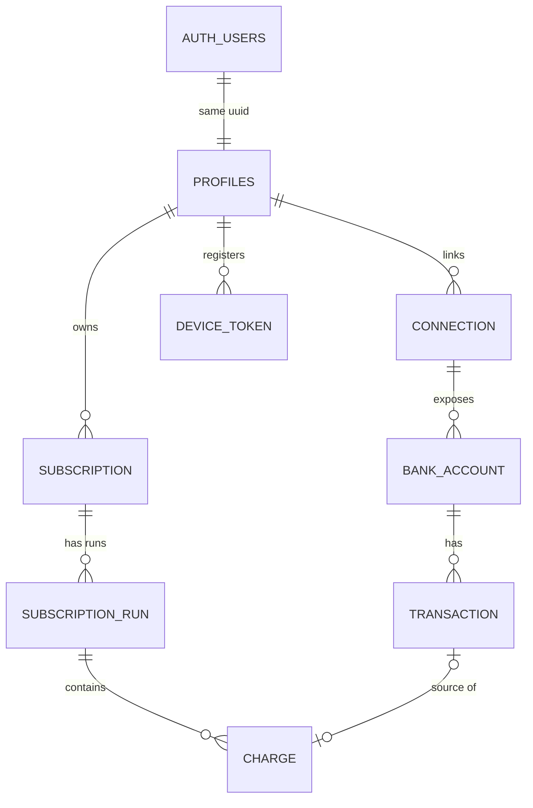

# Signu — Data Model

> **Living document** · Last updated **2026-07-20** (v13) · See [changelog](#changelog) at the bottom.
>
> **Name locked 2026-07-15**: the app is **Signu** (from *assinatura* — subscriptions are things you signed). Verified unused: no app, no Brazilian trademark (INPI classes checked empty), no active brand on the string. With the project now personal-only, domains/trademark/App Store availability are moot — the name was chosen clean anyway, on principle.

## Entity relationship diagram

---

## Tables

### AUTH_USERS

Managed entirely by Supabase Auth — not part of our schema.

| Column | Type | Notes |
|---|---|---|
| `id` | uuid PK | Managed by Supabase Auth |
| `email` | string | Lives here, **not** in profiles |
| `providers` | string | google / email+password |

### PROFILES

| Column | Type | Notes |
|---|---|---|
| `id` | uuid PK | References `auth_users(id)` — same UUID, PK and FK |
| `display_name` | string | |
| `reminder_channels` | string | push / email / both; default `'email'` (semantic default — the birth-state channel; an email address always exists); user-owned (RLS UPDATE grant); see [reminder delivery](#reminder-delivery-skeleton) |
| `created_at` | timestamptz | |

### CONNECTION

| Column | Type | Notes |
|---|---|---|
| `id` | uuid PK | |
| `user_id` | uuid FK | References `profiles(id)` |
| `provider_connection_id` | string | Aggregator (Pluggy) item id; `UNIQUE(user_id, provider_connection_id)` |
| `institution_id` | string | Aggregator connector id, for re-initiating flows |
| `institution_name` | string | |
| `status` | string | active / needs_action / expired / disconnected; **no default, sync states it** |
| `consent_expires_at` | date | Warn user before lapse; renewal is manual |
| `last_synced_at` | timestamptz | Incremental sync cursor |
| `last_sync_error` | string | Nullable; surfaced in UI |
| `created_at` | timestamptz | |

### BANK_ACCOUNT

| Column | Type | Notes |
|---|---|---|
| `id` | uuid PK | |
| `connection_id` | uuid FK | |
| `provider_account_id` | string | Aggregator account id; `UNIQUE(connection_id, provider_account_id)` |
| `type` | string | credit_card / checking |
| `brand` | string | Card network: Visa / Mastercard / Elo…; null for non-cards |
| `last4` | string | |
| `official_name` | string | Bank's display name; **sync may overwrite** |
| `nickname` | string | User's own label; **never touched by sync** |
| `status` | string | active / closed; no default, sync states it |
| `created_at` | timestamptz | |

### TRANSACTION

| Column | Type | Notes |
|---|---|---|
| `id` | uuid PK | |
| `account_id` | uuid FK | |
| `provider_tx_id` | string | `UNIQUE(account_id, provider_tx_id)`; idempotent sync |
| `status` | string | pending / posted; only posted feeds detection; no default |
| `type` | string | DEBIT / CREDIT; Pluggy's direction signal; **detection keys off this, never off sign** |
| `date` | date | When the purchase happened; drives interval detection |
| `amount` | numeric | Exactly as sent; sign varies by account type (cards: positive = charge) |
| `currency` | string | 3-char, NOT NULL, no default; sync copies Pluggy `currencyCode` |
| `raw_description` | string | Immutable once posted |
| `normalized_merchant` | string | Derived; pipeline may rewrite anytime |
| `provider_category` | string | Aggregator's hint, nullable, sync-owned |
| `created_at` | timestamptz | = first import of this row |

### SUBSCRIPTION

| Column | Type | Notes |
|---|---|---|
| `id` | uuid PK | |
| `user_id` | uuid FK | Belongs to the **user, not the card** |
| `service_name` | string | Display name, e.g. Netflix; catalog- or pipeline-seeded |
| `nickname` | string | User's own label, e.g. "Netflix (mom)"; nullable |
| `merchant_key` | string | Matching attribute; **non-unique** |
| `dedupe_key` | string | Identity; `UNIQUE(user_id, dedupe_key)`; engine-assigned |
| `category` | string | Seeded by detection, user-editable after |
| `identification` | string | auto / user_confirmed / user_renamed; default `auto` |
| `ignored` | boolean | User said not-a-subscription; remembered across syncs; default `false` |
| `remind_before_days` | int | Nullable; null = reminders off; user-owned (RLS UPDATE grant); delivery deferred |
| `created_at` | timestamptz | First detected = "tracking since" |

### SUBSCRIPTION_RUN

| Column | Type | Notes |
|---|---|---|
| `id` | uuid PK | |
| `subscription_id` | uuid FK | |
| `start_date` | date | Corrected retroactively by R2 backfill |
| `end_date` | date | Null = active; = last charge + 1 interval (**paid-through**); recomputed if R5 trailing charge appends |
| `cancelled_date` | date | Nullable; null on non-cancelled runs; when the user asserted cancellation; `date` not `timestamptz` (date-granularity doctrine) |
| `billing_interval` | string | monthly / annual (more later if needed); R4 runs: provisional monthly at creation, user-stated at confirmation — see [R4 billing interval](#r4-billing-interval-locked-2026-07-15) |
| `status` | string | possible / active / overdue / ended / cancelled; no default, writer states it (engine or cancel Edge Function) |
| `detected_by` | string | R1 / R3 / R4; engine-stated, no default; powers expected-exact vs expected-approximate |
| `next_expected_date` | date | Engine cache: last charge + interval; powers renewal alerts; **always NULL on cancelled runs** (never in "Coming up", never overdue) |
| `created_at` | timestamptz | |

### CHARGE

| Column | Type | Notes |
|---|---|---|
| `id` | uuid PK | |
| `run_id` | uuid FK | |
| `transaction_id` | uuid FK | Nullable; UNIQUE where present (no double-count); `ON DELETE SET NULL` |
| `date` | date | Duplicated on purpose (self-contained history) |
| `amount` | numeric | Duplicated on purpose |
| `currency` | string | 3-char, NOT NULL, no default; engine copies from source transaction |
| `card_label` | string | Snapshot at billing time, e.g. "Visa 4821"; survives raw-data deletion |
| `created_at` | timestamptz | |

### DEVICE_TOKEN

| Column | Type | Notes |
|---|---|---|
| `id` | uuid PK | |
| `user_id` | uuid FK | References `profiles(id)`; `ON DELETE CASCADE` |
| `token` | string | APNs device token; UNIQUE |
| `platform` | string | ios (more later if needed) |
| `created_at` | timestamptz | |
| `last_seen_at` | timestamptz | Refresh on app launch; prune stale tokens later |

---

## Core decisions

### Identity & auth

- **USER replaced by AUTH_USERS + PROFILES** (v2): `AUTH_USERS` is managed by Supabase Auth; `PROFILES` is our table. `profiles.id = auth.users.id` (same UUID, PK and FK). No email / password_hash in our schema — identity lives in `auth.users`.
- **Account linking ON (both directions)**: same verified email = same account, whether Google or email+password came first. One `auth.users` row with multiple identities; profiles and all downstream data unaffected. (Google-first case: adding a password goes through the verified "set password" flow, not plain signup.)

### Connections & accounts

- **Connection death never deletes data**: expiry / revocation / disconnect changes status and stops syncing, but all downstream rows survive. (Explicit user-initiated deletion is separate — see [User deletion tiers](#user-deletion-tiers).)
- **`UNIQUE(user_id, provider_connection_id)`**: the DB rejects duplicate registration of the same bank link (double-tap / retry / duplicate webhook).
- **Accounts die independently of connections**: closed card ⇒ `status = closed`, data survives. Card replacement = new `BANK_ACCOUNT` row (new provider id / last4); subscriptions are unaffected since they belong to the user, not the card.
- **Sync-owned vs user-owned columns never overlap**: `official_name` is sync's, `nickname` is the user's. Now **enforced**, not convention — see [RLS](#migration-1-decisions).

### Transactions & sign convention

- **Transaction immutability, precisely**: `raw_description` / `date` / `amount` are frozen once posted; pending rows are drafts (may update or vanish); `normalized_merchant` is derived and rewritable by the pipeline.
- **Sign convention (locked, Option A — faithful mirror)**: `amount` is stored **exactly as Pluggy sends it**, `type` numeric. Pluggy's dialects differ: bank accounts negative = outflow; credit cards positive = new charge. The sync-owned column `TRANSACTION.type` (DEBIT / CREDIT — Pluggy's explicit direction signal) is what detection keys direction off, **never the sign**. Outflow = type DEBIT; refunds = type CREDIT (still ignored by detection). The raw layer stays a literal record of the aggregator; no interpretation smuggled into the evidence.
  - Consequence for doctrine: "same amount" in R1/continuation compares **magnitudes** — `abs(amount)` — so cross-account-type comparisons never break on sign.
- **`currency` on TRANSACTION and CHARGE**: 3-char, NOT NULL, no default; always written explicitly. No more BRL default — sync copies Pluggy's `currencyCode`; detection copies the source transaction's currency onto the charge.
- **Writer-states-everything doctrine**: no status column anywhere has a DB default. Sync states status for the raw chain, the engine states it for runs. Rationale: a connection is not "active" until verified; defaults that guess hide bugs, explicit writes surface them. Only semantic defaults kept: `subscription.identification = 'auto'` and `ignored = false` (the true birth state of every subscription).
- **Refunds**: never rewrite a charge; a refund is a separate transaction (type CREDIT) in the raw layer, ignored by detection (DEBITs only). Optional later: `refund_transaction_id` link on CHARGE, purely additive.

### Subscription identity

- **`merchant_key` matches, `dedupe_key` identifies.** Handles both mirror problems:
  - one merchant / several instances (`netflix`, `netflix:2` — forked when two charges land in one cycle), and
  - one descriptor / several services (`apple:4.90`, `apple:34.90`).
- Ambiguous splits are resolved by the user via merge/split actions (later UI).
- **Future app-level table — MERCHANT_CATALOG** (patterns → service, **domain**, category, subscription-only flag). Feeds R4 and the [logo sourcing contract](#logo-sourcing-contract) — the nullable `domain` field is what drives logo resolution (v12).

---

## Detection doctrine

Replayable over full history, date granularity only. **Strict to create, generous to extend, re-runs repair.** Runs need a possible/confirmed state to host R3/R4 suggestions.

| Rule | Mode | What it does |
|---|---|---|
| **R1 — anchor** | auto | 2 charges, same merchant+amount, one cadence apart (monthly = 28–33d, ±3d window). Continuation is amount-flexible (price hikes never split a run). |
| **R2 — backfill** | auto | On confirmation, claim an unclaimed same-merchant charge ~1 interval before run start, any amount; fix `start_date`. |
| **R3 — cadence-beats-amount** | suggest-only | 3+ date-aligned charges, varying amounts (FX-priced subs, utilities). User confirms/ignores. On BR credit cards, international (USD-priced) subs post converted to BRL with fluctuating amounts — **R3 is what catches them**; the currency column does not (it will read BRL). |
| **R4 — catalog fast path** | suggest-only | 1 charge from a known subscription-only merchant ⇒ "possible" immediately. Interval is asked, not guessed — see [R4 billing interval](#r4-billing-interval-locked-2026-07-15). |
| **R5 — trailing charge on cancelled runs** | auto | See below. |

### R5 — trailing charge on cancelled runs

A cancelled run may claim **at most one** continuation charge — `merchant_key` match, within one cadence (−3/+3) of the run's last claimed charge, amount-flexible like any continuation.

- Claiming it recomputes `end_date` (paid-through extends one interval); the timeline renders it as *"Charged · after cancellation"*.
- If a **second** matching charge lands one cadence later, the trailing charge is **un-claimed**: removed from the cancelled run (original `end_date` restored) and both charges anchor a **new run** via standard R1 (`detected_by = 'R1'`) — a resubscription, not a resurrection.
- Beyond one cadence, a post-cancel charge is just an unclaimed charge waiting for R1 the normal way.
- Stated as a **replay rule** on purpose: incremental sync and full replay must converge on identical state.

> **Note:** this is the **only** place a charge ever moves between runs — un-claiming is a required engine capability; replayability is what makes it safe.

### R4 billing interval (locked 2026-07-15)

R4 creates a run from a **single charge** — cadence cannot be measured, so the engine cannot honestly state an interval. Resolution: **ask the user at confirmation.**

- **At creation**: the engine writes a provisional `billing_interval = 'monthly'`. Keeps the column NOT NULL, keeps the pre-confirmation "renews ~\<date\>" prediction renderable (`next_expected_date` computable), and monthly is the overwhelmingly common case. Same shape as `detected_by` re-stamping: a provisional engine write, overwritten by better information at confirmation.
- **At confirmation ("Track it")**: the confirm flow asks *monthly or annual?* — the user's answer overwrites `billing_interval`. This is the authoritative write.
- **R3 confirmations never ask**: 3+ date-aligned charges already *measure* the cadence; asking would be the system pretending not to know something it proved. The extra step is R4-only.
- **Engine test case (flagged for implementation)**: a confirmed R4 run that never receives a second charge must die quietly through the normal machinery — expected date passes ⇒ overdue ⇒ ended at +10. No special casing; the lifecycle already covers it, but it warrants an explicit test.

### Possible state

R3/R4 suggestions live as real runs; user says yes ⇒ `active`, no ⇒ parent subscription `ignored = true` (recoverable in the settings screen).

---

## Run lifecycle

- **Asymmetric matching window** around the expected date: −3/+3 days = normal charge matching.
- Expected date passes with no charge ⇒ **overdue**. Overdue lingers to **+10 days** (documented payment retry window) before flipping to **ended**, with `end_date` set. A late charge within +10 (same merchant+amount) still claims the run.
- **No reopening after ended**: any later matching charge starts a **new run**, always. (Applies to `ended`; `cancelled` runs have the narrow one-charge R5 trailing exception.)
- **`end_date` semantics**: paid-through (last charge + 1 `billing_interval`), not last-charge date (which stays derivable from charges). Holds for cancelled runs too.

### User cancellation (locked 2026-07-14)

The user can assert "I cancelled this" from the detail screen.

- New run status **`cancelled`** (added to the CHECK — this is exactly why CHECK beat enums), distinct from `ended`: **ended** = engine inferred death at +10; **cancelled** = user asserted it. UI copy differs ("You cancelled this" vs "Charges stopped").
- The action goes through an **Edge Function** (status is not a user-owned column) which sets `status = 'cancelled'`, `cancelled_date` (nullable DATE column on SUBSCRIPTION_RUN — date not timestamptz, consistent with the date-granularity doctrine; null on all non-cancelled runs), `end_date` = paid-through as usual, and **NULLs** `next_expected_date`.
- `next_expected_date` **stays** null on cancelled runs even if a trailing charge appends (R5) — cancelled runs never appear in "Coming up" and can never trip overdue.
- Charges landing after cancellation are handled by R5: one = trailing charge of the cancelled run; two = resubscription, new run.

---

## Home screen contract

*Locked 2026-07-13 — defines the queries/endpoint powering the home screen; UI reads state, never guesses.*

- **Hero number** = sum of **landed** charges in the current calendar month (`charge.date >=` first of month), joined up to non-ignored subscriptions, restricted to the user's primary currency. Pure read of CHARGE — no predictions, no annual amortization. The number grows through the month as charges land.
- **Delta ("vs Jun")** = like-for-like partial-month comparison: current month-to-date vs the **same day-span** of the previous month (Jul 1–13 vs Jun 1–13), never vs the previous month's full total. Hidden when the difference is exactly zero (no threshold — real amounts rarely tie exactly; a threshold would invent a magic number).
- **Primary currency** = derived per user, never stored/configured: the dominant currency across the user's charges. No `user.currency` column, no country setting, nothing hardcoded to 'BRL' in the display path — **the data decides**. BR users compute to BRL today; a future non-BR Open-Finance-equivalent integration works with zero migration. Rationale: BR banks auto-convert foreign purchases to BRL (+ IOF) before posting, so BR raw data is uniformly BRL anyway — fluctuating converted amounts are R3's job to catch, not currency's.
- **Charges outside the primary currency**: excluded from the hero sum, never silently hidden — surfaced via footnote:
  - exactly 2 distinct currencies present ⇒ *"+N charges in \<code\>"* (name the one other currency, e.g. "+2 charges in USD");
  - 3+ distinct currencies ⇒ *"+N charges in other currencies"*.
  - In v1 the footnote simply never renders.
- **Prediction confidence**: "Coming up" amounts are predictions from the last charge. The endpoint must flag each as **expected-exact** (R1-stable) or **expected-approximate** (R3 cadence-matched, FX-priced); the UI renders approximate amounts with a tilde ("~R$ 21,90"). Backing column: `SUBSCRIPTION_RUN.detected_by` (R1 / R3 / R4; text + CHECK, engine-stated, no default — writer-states-everything). R1 ⇒ exact; R3 ⇒ approximate; R4 runs are possible-only until confirmed (a confirming charge pattern re-stamps them R1/R3). Note R2 is backfill, not creation — it never appears in `detected_by`.
- **Overdue surfacing**: overdue runs render as standalone tinted rows above "Coming up" (subtitle "Overdue · N days" = days past expected date, i.e. depth into the +10 retry window). Multiple simultaneous overdue subs **stack** as separate rows — no "+1 more" collapse; rare but must stay visible (payment failures are never summarized away).
- **Connection problems and overdue runs are separate severity channels**: connection issues get the top banner (data is stale — structural), overdue never does (payment may have failed — transactional; lives in subtitle count + tinted rows only). The banner slot always means "plumbing problem".

---

## Subscriptions tab contract

*Locked 2026-07-15 — design 7a (groups + /yr hero) with 8a (inactive view) and 9a/9b (suggested flow); supersedes 6a/6b, which merged into one screen (6b's cost view became a per-group sort mode). UI reads state, never guesses.*

### Hero & totals

- **Hero = /yr total**, the number with **no invented math**: Σ(monthly last-charges × 12) + Σ(annual last-charges × 1) — every term derived from a stated contract price. The **/mo companion = /yr ÷ 12**, always rendered with a tilde (it's a derived approximation by construction).
  - This inverts an earlier same-day decision (amortize annual ÷ 12 into a /mo hero) — superseded because the /yr direction needs no invisible division and gives the /yr slot a real job.
- **Per-subscription amount source**: the **last charge of the latest run** — the same number the prediction rows use. One source of truth; no averaging, ever.
- **Hero is invariant**: the All / Active / Inactive chips filter the **list only, never the hero**. The hero always answers "current cost rate"; dead subs never enter it, suggestions never enter it. (Locked by 8a's rendering — resist the future temptation to make it react to the filter.)
- **Tilde propagation**: R3/R4 rows render predicted amounts with a tilde; any total an R3/R4 run contributes to (the /yr hero, the affected group subtotal) inherits it. **One marker, one meaning** — "this number is approximate" — whether the cause is R3 amount variance or the /mo unit conversion. Never stack markers; there is only the tilde.
- **Copy rule (Home vs Subs)**: two heroes coexist in one session — Home = *landed spend* ("spent in July"), Subs = *cost rate* ("monthly/yearly cost"). Labels must carry the difference or the mismatch reads as a bug. Different questions, different math — no conflict with Home's no-amortization stance, which is about landed spend.
- **Primary-currency footnote rule** (inherited from the home contract): applies to these totals too — a sub charged outside the primary currency is excluded from the sums but surfaced, never silently hidden.

### Grouping & sorting

- Subscriptions group into **MONTHLY and ANNUAL sections**, each with a **subtotal in its native unit** (R$ X /mo, R$ Y /yr) — no cross-unit blending anywhere below the hero. Rows always show the **real charge amount** ("R$ 349,00 · Annual") — never an amortized figure.
- **Sort modes: By date / By cost**, applied **within groups** (a global cost sort would compare /mo against /yr numbers — unit-dishonest by construction).
  - *By date* = next-charge order; overdue runs float to the top for free (expected date is in the past — emergent, no special-casing).
  - *By cost* adds share-of-total bars; percentages are **per-group** (share of the group subtotal). Copy says "% of total" — accepted as-is, the surrounding bars make the reference frame obvious.
  - The toggle is a **global control** for both groups despite sitting on the MONTHLY header row (accepted placement).

### Inactive view (8a)

- Selecting **Inactive** shows a **flat list** — no MONTHLY/ANNUAL grouping, no sort toggle (neither concept earns its place on dead subs). Hero stays put (invariance rule above).
- **Row copy encodes the ended/cancelled distinction**: *"Was R$ X /mo · last charge \<date\>"* + **Ended** badge (engine-inferred) vs *"Was R$ X /mo · cancelled by you \<date\>"* + **Cancelled** badge (user-asserted) — the same split as the detail screen's "Charges stopped" / "You cancelled this". "Was" framing = historical fact, so **no tilde ever** on inactive rows.
- Both rows show **"Paid through \<end_date\>"** — grouping reflects **billing state, not access state**; a cancelled sub with a future paid-through date still lives under Inactive, the paid-through copy carries the access story.
- **Footer copy**: *"If charges come back, two in a row start a new run."* — true for both statuses (ended: plain R1 restart; cancelled: R5 trailing charge then un-claim + new R1 run) and honest about the one-cycle blind spot. Satisfies the detail contract's footer-honesty rule.

### Suggested flow (9a/9b)

- **SUGGESTED section** (9b, final shape): surfaces above MONTHLY **only when non-empty**; compressed evidence per row ("3 charges · looks monthly · ~R$ 112"); rows are **pure tap-throughs to the review screen (9a) — no inline actions**. Suggestions are **excluded from the hero and from chip counts** (they are neither active nor inactive).
  - *Supersession note*: an earlier iteration had inline Track/✕ on 9b rows — cut. All confirm/dismiss actions live on 9a only, so every decision is made with the charge evidence visible (evidence-before-decision as a rule, not a preference), the mis-tap-dismiss hazard is deleted rather than mitigated, and the R4 monthly/annual sheet attaches to exactly one button in one place. Accepted cost: dismissing a certain false positive takes two taps instead of one.
- **Review screen** (9a, reached from Home "Review →" and by tapping a SUGGESTED row): full **charge evidence** per suggestion — dates, cards, amounts — plus the predicted renewal line; **Track it / Not a subscription** actions per suggestion. Two-surface split, now strict: **9b informs, 9a decides.**
- Actions map to doctrine: **Track it** ⇒ run `active` (R4 path additionally asks monthly/annual — see [R4 billing interval](#r4-billing-interval-locked-2026-07-15)); **Not a subscription / ✕** ⇒ `subscription.ignored = true`, recoverable in Settings (footer states this).
- **Copy honesty rule**: prediction copy states only what the engine measured. *"(foreign price, converted)" was cut* — the engine knows *amounts vary*, not *why*; the FX explanation would require a merchant-catalog flag that doesn't exist yet. Use "amount varies month to month"-class copy.

---

## Subscription detail contract

*Locked 2026-07-14 — design 4b: ink hero card + self-narrating timeline; UI reads state, never guesses.*

- **Timeline**: single event stream, newest first. First-class event types (extended 2026-07-14, screens 5a–5d):
  - upcoming renewal (*"Renews"*),
  - landed charge (*"Charged"*),
  - price change (*"Price raised · was R$ X"* — continuation is amount-flexible, so raises live **inside** a run and the history narrates them),
  - trailing charge (*"Charged · after cancellation"*, from R5),
  - run start (*"Started · new run · charged"* — the oldest charge of a run marks the boundary; rendered as a distinct boundary event on runs after the first),
  - subscription gap (*"NOT SUBSCRIBED · \<ended date\> – \<new start\> · N months"* — synthesized from the span between a dead run's end and the next run's start; see run segmentation below),
  - user cancellation (*"Cancelled by you · paid through \<end_date\>"* — synthesized from `cancelled_date`),
  - missed charge (*"Expected charge missed"* — synthesized from the expected date that passed unclaimed),
  - run death (*"Ended · charges stopped · paid through \<end_date\>"* — synthesized from `status = ended` + `end_date`; copy amended 2026-07-15 by 11a: paid-through replaces "N days past expected" — user-meaningful date over engine trivia).

  **Endpoint-synthesis note**: the timeline is **not** a pure CHARGE query. The last four event types are synthesized by the **endpoint** from run state (`cancelled_date`, `end_date` + `status`, expected-date arithmetic) and interleaved with charge rows by date. "UI reads state, never guesses" therefore means the *endpoint* derives these rows — the client renders a pre-assembled event stream and computes nothing.

  Lifetime totals in the hero (THIS YEAR / SINCE \<start\>) are pure CHARGE aggregations — the permanent-history promise made visible.
- **Tilde rule** (inherited from the home contract, applies here too): the "Renews" row amount is a prediction from the last charge; R1-stable runs render exact, R3 cadence-matched runs render approximate ("~R$ 21,90"). `detected_by` powers it; **detail and home must never disagree**.
- **Hero date slot is uniform per run state** (locked 2026-07-14; label refined 2026-07-15 by 10a): one slot, one date column, **three labels by state** — active runs show **RENEWS + `next_expected_date`**; overdue runs show **EXPECTED + `next_expected_date` + "not seen"** (same column; "RENEWS" on a passed date would read as a lie); dead runs — both `cancelled` **and** `ended` — show **PAID THROUGH + `end_date`**. Never "last charge" (derivable from charges, and easily confused with the expected date). "Paid through" also tells the user when access actually lapsed.
- **Card row**: means "card of the **most recent** charge", derived at query time — nothing stored on subscription, no "preferred card" concept ever (the data decides, same philosophy as primary currency).
  - If the latest charge's `transaction_id` resolves: join charge → transaction → bank_account for the rich row (brand icon, "Visa – 4821", "Nubank · credit", chevron, tap-through). **Tap destination locked (2026-07-15): the connection detail screen (12b)** of the bank the card belongs to — no new screen; 12b is *the* bank/card surface, and the tap-through doubles as the path to Reconnect when that card's connection needs action.
  - If `transaction_id` is NULL (raw data deleted): degrade to the `card_label` snapshot alone — no subtitle, no chevron. The row never disappears, it loses depth (self-sufficient history rendering, literally).
  - Card-hopping is implicit: the row tracks the newest charge; older charges keep their own `card_label`.
  - **Card-change rendering (locked 2026-07-14, from 5d — un-defers the polish)**: history rows show inline `card_label` **only when it differs from the current card** ("Charged · Tue, Apr 15 · Visa 4821"); the switch-point charge additionally carries a transition annotation (*"card changed to Master 7730"*). The redundant section-header note ("card changed in May") is **cut** — two renderings of the fact, not three.
- **Cancel action**: "Mark cancelled" triggers the [user cancellation](#user-cancellation-locked-2026-07-14) flow (Edge Function). The badge is **derived** from the latest run's status; the screen needs active / overdue / ended / cancelled variants.
- **No `possible` detail variant** (locked 2026-07-15): possible runs surface **only** on the review screen (9a) — confirmation is the moment a subscription earns a detail screen. Once tracked, it's a subscription like any other.
- **Overdue variant locked** (2026-07-15, screen 10a): Overdue badge on the hero; EXPECTED label per the slot rule above; missed-charge timeline row rendered with an **open ring** marker (vs filled dots for landed events — the marker itself distinguishes "hasn't happened" from "happened"); footer states the exact deadline and consequence (*"If no charge arrives by \<expected + 10\>, we'll mark this run ended."*) — plain fact, no vague "soon".
- **Tilde stays `detected_by`-only** (reaffirmed 2026-07-15): overdue does **not** downgrade prediction confidence — an R1 run's expected amount renders exact even while overdue. What's uncertain about an overdue run is *whether* the charge lands, not *how much* — and the "not seen" copy carries that. The tilde keeps its one meaning; a screen must never make two confidence claims about one number.
- **"Since \<date\>" copy** pins to the first run's `start_date` (R2-corrected, *actual* since), **not** `subscription.created_at` (tracking since).
- **Reminder toggle**: maps to `subscription.remind_before_days` (see [reminder delivery skeleton](#reminder-delivery-skeleton)); toggle on = 2 for now. Renders today, delivers later — email channel committed, push a maybe.
- **Ended-run footer copy** must stay honest about R1's two-charge requirement: a resubscription is invisible for up to one full cycle (first post-ended charge sits unclaimed until the second anchors R1). Copy along the lines of *"if charges resume, tracking restarts after two"* — never promise instant restart.
- **Run segmentation locked** (2026-07-15, screen 11a): the gap between runs is a **first-class timeline event**, not whitespace — *"NOT SUBSCRIBED · Nov 15 – May 05 · 6 months"* with a **dashed connector line and open marker** (solid line = covered, dashes = no coverage; open marker consistent with 10a's "didn't happen" semantics). Boundary semantics: the gap's start = the dead run's ended/cancelled date; its end = the next run's `start_date` — which R1 backdates to the first charge, so replay renders the resubscription from its true beginning even though the run was only *created* when the second charge anchored it. The new run's first charge renders as the *"Started · new run"* boundary event; price differences across the gap narrate themselves (each run's charges show their own amounts). The hero's SINCE stat gains a **run count** when > 1 (*"SINCE SEP 25 · 2 RUNS"*) — explains the gap before the user scrolls.
- **Tilde is amounts-only — dates never carry tildes** (locked 2026-07-15): every predicted date has the same −3/+3 matching window, so marking dates approximate adds noise without information; relative copy ("in 3w") already reads soft. RENEWS/EXPECTED dates render bare everywhere.

---

## Tab bar & navigation contract

*Locked 2026-07-20, during Home screen implementation review. Deliberate deviation from the mockups, which show the floating capsule bar always present — do not "fix" implementations back to the static mockup rendering.*

- **Safari-style auto-hiding tab bar**: visible by default; scrolling down slides it out of view (ease-out, ~250ms); **any upward scroll immediately brings it back**. Reaching the very bottom of the content also reveals it — without this, a user parked at the end of a list would have no scroll-down gesture left and no bar.
  - Chosen over reveal-only-at-bottom (Rafael's first instinct, superseded same discussion): bottom-reveal makes tab switching require scrolling to the end of every screen — real friction on long lists like the Subscriptions tab. Safari-style keeps navigation one gesture away while still clearing the last rows.
- **Short-content rule**: if a screen's content doesn't scroll (empty states like the connected-syncing Home, short screens), the bar is **always visible** — it must never be unreachable.
- **Reduce Motion**: crossfade instead of slide (same accessibility posture as the welcome carousel).
- **Bottom content inset**: scroll content clears the bar when visible — exactly bar height + small margin + safe area, nothing more (oversized clearance was the bug that prompted this contract).
- **Applies uniformly to all three tab screens** (Home / Subs / Settings); previews must render tab screens inside RootView with the bar overlaid so clearance and hide/show behavior are reviewable.

---

## Logo sourcing contract

*Locked 2026-07-20 (from the 21r logo discussion). A frontend/cross-cutting contract: how merchant logos are resolved for every row and hero that renders one.*

- **Three-tier fallback chain, freshness-first** (order deliberately inverted from the first proposal — Rafael's call: logos should track merchant rebrands without manual asset maintenance):
  1. **Runtime fetch by domain, cached.** Primary path. Source: **logo.dev** — `https://img.logo.dev/{domain}?token={key}&size=128&format=png`. Chosen over Google's favicon endpoint for the primary tier on quality grounds (128px favicons read poorly at row-icon size; logo.dev serves proper square marks). Free tier covers the deployment's volume by orders of magnitude. The API key is a **publishable key, embedded client-side by design** — no Edge Function proxy, no secret handling.
  2. **Bundled assets, deferred.** Insurance tier: first-launch-offline, logo.dev outage, uncovered domain. **Deliberately not populated at the start** — "don't build it until it hurts": bundled assets are only added if tier 1 fails in practice.
  3. **Monogram tile** (the existing colored-initial design). Final fallback: no known `domain`, or both fetches fail. Needs no data at all — same graceful-degradation philosophy as the `card_label` snapshot.
- **Cache contract**: fetched logos cached **to disk, keyed by domain**, TTL **30 days** (drop to 7 if rebrand latency ever bothers — request volume is trivial either way). Within TTL: offline behavior and instant renders (what bundling would have bought). On expiry: re-fetch picks up rebrands automatically — the point of the tier swap. Accepted consequence, eyes open: a rebrand can take up to one TTL to appear. Implementation: `URLCache` with long TTL, or a tiny custom disk cache keyed by domain (more predictable; barely more work).
- **Schema impact: one field.** Nullable **`domain`** on the future MERCHANT_CATALOG table drives tiers 1 and 2; tier 3 needs nothing. No new tables, no image storage in Supabase — bytes live in the app bundle and the iOS disk cache only.
- **`subscription.logo_url` dropped** (same-day amendment): the column predated this contract as a denormalized landing spot for a catalog-provided URL — a mechanism that was never designed. The locked chain gives it no writer (detection copies nothing), no reader (the client resolves from `domain` at render time), and one liability (a stored URL goes stale on rebrand — the frozen-asset failure mode the tier inversion exists to avoid). Migration #1 hasn't been written, so removal is free. The keep-as-override reading (user-supplied logos) was rejected as a speculative feature with no design; if it ever materializes, re-adding a nullable column is a one-line additive migration.
- **Legal posture** (settled before the mechanism): displaying real merchant marks to identify the merchant's own charges is nominative-fair-use territory — the pattern every finance app uses — and the personal-only deployment removes even the theoretical exposure (no commerce, no App Store review gate). Constraints kept anyway, as-if-public standard: marks rendered undistorted, never used in Signu's own icon or as branding.
- **Rendering treatment locked (same-day amendment): full-color mark inside a neutral tile.** Real logos arrive at full brand saturation and would turn the muted-palette list into competing billboards; a uniform neutral container (paper/white tile, mark rendered smaller within it) re-imposes the tile-grid calm while keeping the mark's color — recognition is the point of fetching real logos, so grayscale was ruled out (pays the fetch complexity, loses the recognition value). The neutral container is also the robust choice for runtime-fetched images: logo.dev marks vary in shape and background, and the container absorbs all of it with zero per-merchant styling. **Open check, not a blocker**: white tiles on the ink-dark detail hero will pop brighter than the current monograms — verify on that screen; a surface-matched off-white tile is the known fix if it bothers. Judged against a three-treatment comparison (monogram / naked full-color / neutral tile), not a re-rendered 21r.

---

## Reminder delivery skeleton

*Push skeleton locked 2026-07-14; channel preference + email commitment locked 2026-07-15. Schema only, nothing runs yet.*

- New table **DEVICE_TOKEN** (`user_id` FK → profiles, CASCADE; `token` UNIQUE; `platform`; `created_at`; `last_seen_at`). RLS: user SELECTs own rows; writes via Edge Function, consistent with posture.
- New column **`subscription.remind_before_days`** (nullable int; null = off; the detail-screen toggle maps to it, e.g. 2 = remind 2 days before) — **added to the user-owned column list** in the RLS column-scoped UPDATE grant, alongside nickname/category/ignored.
- New column **`profiles.reminder_channels`** (text + CHECK: `push` / `email` / `both`; default `'email'`) — a **global user preference, deliberately not per-subscription**. Division of labor: `remind_before_days` decides *whether and when*, per subscription; `reminder_channels` decides *how*, once, per user. Added to the user-owned RLS UPDATE grant list (alongside `display_name`). The `'email'` default is a semantic default in the doctrine's sense (like `ignored = false`): it's the true birth state — the only channel guaranteed deliverable for every account, since an email address always exists.
- **Reminder address is derived, never stored**: reminders go to **`auth.users.email`** — whatever address the account was created with (Google identity or email+password signup; with account linking both resolve to the same verified address). No separate reminder-email column, no setting — same "the data decides" doctrine as primary currency and the card row.
- **Delivery commitment split (2026-07-15)**:
  - **Email is committed** — will be implemented at a later development stage. Shape: a scheduled Edge Function (Supabase cron) reads `next_expected_date` against `remind_before_days` and sends via a free transactional email provider (e.g. Resend free tier). Free-tier providers restrict recipients to the account owner's address until a custom domain is verified — a non-issue for the single-user deployment, where the owner is the only recipient by construction.
  - **Push is a maybe, no longer planned-for-sure** — APNs requires the paid Apple Developer account, and with the app now personal-only (never going live), that purchase is uncertain. `DEVICE_TOKEN` and the `push`/`both` CHECK values stay in the schema so a future yes lands without redesign; a permanent no costs nothing (an unused table and two unused enum-ish values).
- Schema additions here travel as a versioned migration when reminder implementation begins (or fold into `initial_schema.sql` if it hasn't been applied yet).

---

## Settings contract

*Locked 2026-07-15 — designs 12a–12d: single scrollable screen + one sub-page (connection detail). UI reads state, never guesses.*

### Structure

- **Single scrollable screen** (12a) with exactly **one sub-page**: connection detail (12b). Everything else lives inline or in confirmation sheets.
- Sections: **Profile** (name, email, sign-in method chips — read from `auth.users` identities), **Connected banks**, **Dismissed suggestions**, **Data** (delete account). No Notifications section yet — `remind_before_days` is per-subscription and its toggle lives on the detail screen; a global section has nothing real to control until delivery infrastructure exists.
- **No Appearance/currency section**: primary currency is derived, never stored/configured (home contract) — a currency setting would either violate that doctrine or be a dead toggle.

### Connected banks (12a rows → 12b detail)

- Rows: bank + status chip + one-line context. Chips map to schema: **Active** (`status = active`, subtitle "Synced \<ago\> · N cards"), **Needs action** (`needs_action`/`expired`, subtitle "Sign in again to resume syncing"), **Expiring** (`consent_expires_at` near — the warn-before-lapse behavior, subtitle "Consent expires \<date\> · renew soon").
- **Connection detail (12b) is also the Home banner's tap destination** — one screen serves both entry points; the banner-destination gap from the home contract is closed here.
- Detail hero (ink card, same language as the subscription detail screen): institution, connected-since, status badge, LAST SYNCED (`last_synced_at`) + CONSENT EXPIRES (`consent_expires_at`) stat slots, **Reconnect** primary action, and reassurance copy stating the connection-death doctrine in user terms: *"Signing in again resumes syncing — nothing was lost."*
- Below the hero: **cards on this link** (bank_account rows, "N subscriptions billed here" per card) and a summary row (*"N subscriptions found via this bank · R$ X tracked since \<date\>"*) — counts use the attribution rule below.

### Remove-bank-link flow (12c) — deletion tier (b) made concrete

- The **history choice is captured up front** in the removal sheet, before the destructive tap — required by the sequencing rule (the Edge Function must delete affected subscriptions *before* the connection; after it, `transaction_id`s are NULL and the linkage is gone).
- **"Keep their history" is the pre-selected default.** Copy is generic, no service names (*"They stay in your list with their charge history — they just stop updating from this bank."*) — "their" scopes the promise to the subscriptions, avoiding a read of "we keep your bank's data" that would contradict the header's deletion statement; "from this bank" because subscriptions belong to the user, not the card — a sub that card-hops to another connection keeps updating. Delete option mirrors the vocabulary (*"Erases those 6 subscriptions (including dismissed ones) and their charge history."*) so the two options read as opposites of the same thing.
  - *Amended same-day*: an earlier iteration named affected services in the sheet ("Globoplay, Smart Fit and 4 more"). Cut — the sheet states the count and the consequence; **the names live one level up**, see the tap-through requirement below.
- **Attribution rule (locked)**: a subscription counts as *"found via this bank"* iff the **latest charge of its latest run** resolves (via `transaction_id`) to a transaction under this connection. Same doctrine as the card row: most recent charge wins, the data decides.
  - Consequence, accepted with eyes open: a mixed-evidence subscription (latest charge here, older charges on another bank) **is counted** — and "Delete them too" erases those other-bank charges as well. With the sheet copy now generic, **the 12b tap-through list is the load-bearing visibility surface** (below), not the sheet.
  - Inverse: a sub that card-hopped *away* is not counted; its old charges under this connection survive **on either path** with `transaction_id = NULL` + `card_label` (standard SET NULL degradation) — which is why the generic keep copy is safe: "subscriptions that once touched this bank keep those charges" holds universally.
- **Tap-through requirement (now mandatory, not polish)**: the 12b summary row (*"N subscriptions found via this bank"*) **must** open the attributed-subscriptions list — designed as **13a**, contract below. It is the user's only pre-delete view of exactly what "Delete them too" takes — the eyes-open safeguard moved here when the sheet went generic.

### Attributed-subscriptions list (13a)

*Locked 2026-07-15 — the load-bearing eyes-open surface behind 12b's summary row; back returns to 12b.*

- **Richer than the original "name + last charge" spec — amended to match the build**: the screen's job is showing what "Delete them too" would take, so rows carry real state: name, status/renewal line (Overdue · expected \<date\> / Renews \<date\> / Ended · paid through \<date\>), amount + unit. All existing rendering rules apply unchanged — tilde on R3 amounts, copy-honesty (no FX explanations; the tilde or "amount varies"-class copy only), overdue tinting, annual unit shown.
- **Grouped by card** (bank_account rows of this connection), section headers "VISA ···· 4821 · N". Dead subs (ended/cancelled) appear under the card of their latest charge like any other.
- **DISMISSED section** (`ignored = true` attributed subs) sits below the card groups, outside them — a dismissed sub's card is irrelevant to its status. Row mirrors 12a's dismissed row copy ("Not a subscription · \<date\>") **without the Restore button**.
- **Fully read-only, no actions** — strict 9b precedent (informing surface, not acting surface). Restore lives in 12a only.
- **Header count arithmetic is checkable on-screen**: "N subscriptions · R$ X since \<date\>" where N = total attributed **including dismissed** (card-group counts + dismissed count = N). The same N appears on 12b's summary row and in 12c's sheet ("those N subscriptions (including dismissed ones)") — three surfaces, one number, never diverging.
- **Tracked-total definition (locked)**: R$ X = the **full charge history of the N attributed subscriptions** — including mixed-evidence subs' other-bank charges and dismissed subs' charges. Chosen over "charges resolving to this connection" because the number's job is to equal exactly what "Delete them too" erases. Same figure on 12b's summary row.
- **Footer** connects the list to the flow that gives it purpose: *"Removing this bank link decides what happens to these."* (Shortened from an earlier "— see Remove this bank link" pointer; the button lives one back-tap away on 12b, so naming it duplicated navigation the layout already provides.)
- **The count includes ignored subscriptions.** Dismissed suggestions have charges too; "Delete them too" takes their data with it — silently keeping ghost data the user can't see would be the worst outcome.
- The final destructive button restates the choice (*"Remove link, keep history"* / *"Remove link and history"*) — the last tap carries the decision, not just the radio above it.

### Dismissed suggestions (12a)

- Flat list of `ignored = true` subscriptions ("Not a subscription · \<dismissed date\>") with a per-row **Restore** action. This is the "recoverable in Settings" surface promised by the subscriptions-tab and review-screen contracts.
- **Restore = `ignored = false`, nothing more.** The run returns to `possible` and resurfaces via SUGGESTED/9a; footer copy states it: *"Restoring puts the suggestion back in review — nothing is tracked until you confirm it."* Restore never auto-tracks.

### Edge states

- **Empty state (12d)**: no banks connected ⇒ Connected banks section renders an explainer (*"Subscriptions are detected from your card charges — connect a bank to start"*) + **Connect a bank** CTA. Doubles as the first-run landing shape for the (still undesigned) onboarding flow.
- Needs-action and expiring states render **inline on the rows** (12a) — no separate screen variants; the row chip + subtitle carry the state, the detail page resolves it.

### Delete account (12a/12d Data section → 14a)

- Tier (a): one `auth.admin.deleteUser()` call, cascade wipes everything. Row subtitle states scope plainly: *"Everything, permanently — banks, history, profile."*
- **Confirmation sheet locked (14a): type-to-confirm.** The heavier-than-standard pattern is earned — the most irreversible action in the app gets its friction exactly once. Header copy is honest to the implementation: *"This is permanent. There's no grace period and no undo."* (accurate: hard cascade, nothing soft-deleted).
- **Concrete scope list, real counts from the user's data** (same checkable-arithmetic instinct as 13a — never generic "all your data"): *"N bank links and their transactions · M subscriptions and every charge since \<date\> · Your profile and sign-in methods."*
  - **M = total subscriptions including `ignored = true`** — the no-ghost-data principle; nothing the cascade takes is uncounted.
- **Button disabled until the input matches** "DELETE"; match is **case-insensitive** (the field renders uppercase regardless — implementation note).

---

## Welcome screen contract

*Locked 2026-07-17 — design 16a: auto-advancing value-prop carousel with tap dots; replaces static 15b. Pure marketing/auth surface — reads no user state (nothing exists yet); the "UI reads state" doctrine is trivially satisfied by having no state to read.*

### Structure

- **Two zones**: upper zone = wordmark + carousel (only this swaps); lower zone = **anchored CTA stack** (Create account / Continue with Google / "Already have an account? Sign in" / Terms line) — never moves during auto-advance, so the tap targets are stable by construction.
- **Three slides, one doctrine each**, in narrative order (locked — story build chosen over partial-viewer optimization, with eyes open that slide 1 gets disproportionate exposure on auto-advance):
  1. **"Know what you're really paying for."** — mock subscription list with renewal dates ("Renews \<date\>") and exact amounts; the all-in-one-place promise.
  2. **"Catch every price hike."** — single mock row with PRICE RAISED badge, strikethrough old price → new price + "since \<date\>"; the price-change-narration differentiator (timeline's "Price raised · was R$ X" story, told visually).
  3. **"Found straight from your bank."** — single mock row with FOUND badge, **tilde on the detected amount** ("~R$ 24,90 /mo · spotted in your bank activity"); the automatic-detection differentiator. The tilde semantic is taught before the user ever sees real data.

### Mock-data rules

- **No real bank brands** in mock copy — "spotted in your bank activity", never "your Itaú activity" (a claim of knowledge the app can't have pre-signup, and a brand on a marketing surface).
- **Mock renewal dates staggered** — no two mock rows share a date (coincidence reads as a rendering bug).
- Mock service rows may use real service names (Netflix, Spotify, Globoplay, iCloud+) — they read as examples, not claims.
- Mock rows stay visually distinct from live home-screen rows (card stagger/overlap treatment) — the glimpse must not be mistakable for real data.

### Legal line

- **"By continuing you agree to our Terms and Privacy Policy." is present, always** — as-if-public standard. Rationale: a public launch would require it three ways independently (LGPD disclosure for financial data, Apple App Store privacy-policy URL requirement, Google OAuth production consent-screen requirement), and the clickwrap-adjacent placement (agreement tied to the sign-up action, docs linked adjacent) is the pattern that constitutes valid consent. ToS not legally mandated but carries the liability framing (detection may be wrong/incomplete, not financial advice, Pluggy dependency).
- **Docs are stubbed** for the personal deployment — links must resolve to placeholder pages, never dead links; the screen stays truthful.

### Carousel behavior

- **Auto-advance pauses on any user touch**; tap dots are the manual navigation path.
- **Respects Reduce Motion** — no auto-advance when the OS accessibility setting is on; dots-only navigation.

---

## Auth flow contract

*Locked 2026-07-17 — designs 17a–17e: sign in, create account, confirm email, forgot password, choose new password. Completes the auth surface begun by 16a. Reads no app state; the contract's substance is Supabase Auth semantics + copy honesty.*

### Cross-cutting mechanics

- **Google sign-ins never require email confirmation**: Google verified the address; Supabase sets `email_confirmed_at` automatically, no email is sent, no interstitial renders. The confirmation gate applies **only** to accounts born via 17b (email+password signup).
- **Email confirmation stays ON — non-negotiable**: it is what makes bidirectional account linking safe. Attack it prevents: attacker signs up email+password with the victim's address (unverified); victim later signs in with Google (same verified email); linking would merge attacker's account with victim's. Verification-before-entry is the precondition of the "same verified email = same account" rule. A soft "signed in but unverified, nagged by banner" mode does not exist in Supabase and must not be built around.
- **Deep-link redirect**: confirmation and reset emails carry a registered redirect URL (custom scheme, e.g. `signu://auth-callback`; universal link possible later). Tapping the link opens the app, the Swift SDK exchanges the tokens, `onAuthStateChange` fires with a live session, and the app navigates forward. **The session arriving is the signal** — no polling, no status checks. The redirect URL must be whitelisted in the Supabase dashboard and registered in the Xcode project; the confirm and reset flows share this one mechanism.
- **Password policy (enforced + copy contract)**: minimum 8 characters, ≥1 uppercase, ≥1 number — Supabase setting: min length 8 + required-characters preset lowercase/uppercase/digits (the preset's lowercase requirement is accepted; in practice always satisfied). Hint copy on 17b and 17e is identical and matches exactly: *"At least 8 characters, with 1 uppercase letter and 1 number."* One policy, two surfaces, never diverging.
- **Enumeration-safe copy doctrine**: Supabase deliberately returns generic errors (sign-in) and unconditional success (reset request) so that no response reveals whether an account exists or how it signs in. All auth copy inherits this constraint — no screen may claim knowledge the API refuses to give.

### Sign in (17a)

- Email + password only — **no Google button**; "Continue with Google" lives one back-tap away on 16a.
- **Failed sign-in copy (locked)**: *"Couldn't sign in. Check your password — if you signed up with Google you need to set a password first by tapping on Forgot password, or go back and continue with Google."* Generic by necessity (enumeration-safe), but signposts both exits from the Google-first-user trap: the Forgot-password path **is** the set-password flow (verified-email reset adds a password identity; account linking merges it — same account, two ways in).
- **Distinct unverified-error variant**: Supabase returns a specific "email not confirmed" error, different from invalid credentials — 17a catches it and renders verify-specific copy with a resend action. Covers the user who abandoned 17c and returned days later.

### Create account (17b)

- Fields: **Name (mandatory)**, Email, Password (hint copy per the policy contract).
- **Signup trigger amendment**: signup passes Name in user metadata; the profiles-creation trigger's `display_name` fallback order becomes **Google `full_name` → signup-provided name → email**. (Amends the Migration #1 trigger note.)
- Terms/Privacy line present on 17b (the account-creating action = the clickwrap moment) and **deliberately absent on 17a** — signing in agrees to nothing new. The asymmetry is correct; do not "fix" it.

### Confirm email (17c)

- Shown **only** after 17b signup (never Google). States the sent-to address; copy promises the deep-link behavior ("we'll take you straight in").
- **State machine**: waiting → (deep link fires ⇒ session arrives ⇒ Home) | (**"I've confirmed my email"** ⇒ `getUser()` checks `email_confirmed_at`: set ⇒ proceed; not set ⇒ inline "Not confirmed yet — check your inbox") | (**Resend** ⇒ 120s countdown renders under the link, then reactivates). The manual check exists for the wrong-device case (link opened on a laptop ⇒ deep link fired elsewhere or nowhere).
- **120s resend cooldown** comfortably clears Supabase's ~60s email rate limit — the UI never shows a live link that would error.
- **"Wrong address? Go back" is a fresh signup, not an edit** — stated honestly: the account already exists (unverified) and pre-session `updateUser` is impossible, so go-back returns to 17b for a new signup, leaving an **orphaned unverified account** behind. Accepted: orphans are inert (no sign-in, no data) and prunable. Typo'd-someone-else's-address case: that person receives a confirmation email for an account they didn't create; ignoring it is harmless — no design response needed.

### Forgot password (17d)

- Reached from 17a. Subtitle verb is **"set"**, not "reset" — for Google-first accounts there is no old password; this screen doubles as the set-password flow.
- **Sent state (second state of the same screen, no new screen)**: button becomes the **120s countdown** (same cooldown contract as 17c) and the enumeration-safe line renders: *"If an account exists for \<email\>, a link is on its way."* Never "we sent it" — the API succeeds unconditionally, so the copy may not claim a send happened.

### Choose new password (17e)

- **Deep-link destination** of the reset email — **no back chevron by design** (not part of a navigation stack; exits are submit or app-kill).
- Header states the session honestly: *"You're signed in as \<email\>"* — the link authenticated the user; this screen finishes the job, and the line doubles as a right-account check.
- New password + confirm field (kept alongside the eye toggle — belt-and-suspenders on the screen where a typo re-locks the user out); hint copy identical to 17b.
- Submit calls `updateUser` on the deep-link session ⇒ **straight to Home** — already authenticated, no second sign-in.
- **Expired/invalid link branch (required)**: reset links expire (default ~1h); the deep-link handler routes failures back to 17d with a *"link expired — request a new one"* notice, never a silent dead end.

---

## User deletion tiers

- **(a) Delete account** = `auth.users` cascade wipes everything.
- **(b) Delete a bank link** = connection → bank_accounts → transactions removed; the user chooses whether associated subscription history (charges/runs/subs) survives or goes with it. `card_label` + duplicated date/amount/currency keep surviving history self-sufficient.
  - **"Associated" is now defined** — see the [remove-bank-link flow](#remove-bank-link-flow-12c--deletion-tier-b-made-concrete): latest charge of the latest run resolves to this connection; count includes `ignored = true` subscriptions.

---

## Migration #1 decisions

*All locked, implemented in `initial_schema.sql`.*

- **Status/interval fields: text + CHECK constraints, NOT enums.** Value lists are expected to grow ("more later if needed"); CHECK changes are plain transactional migrations, enum ALTERs have sharp edges. Cost: generated TS types say `string`, not unions — recovered by hand-written union types in a shared `types.ts`.
- **FK delete map**: CASCADE on all seven FKs **except** `charge.transaction_id`, which is `ON DELETE SET NULL`. That single clause implements deletion tier (b) "preserve history": the raw-chain cascade nulls the bridge, the charge survives self-described. `profiles.id → auth.users(id)` also CASCADEs, so tier (a) is one `auth.admin.deleteUser()` call.
  - **Sequencing rule**: tier (b) "delete history too" is **not** handled by cascade (the interpreted chain hangs off profiles, not connection). The Edge Function must find + delete affected subscriptions **before** deleting the connection — after it, `transaction_id`s are NULL and the linkage is gone.
- **RLS** (settled, was an open question): enabled on all 7 tables. Direct `user_id` check on profiles/connection/subscription; join-based EXISTS up the chain for bank_account/transaction/run/charge. `(select auth.uid())` idiom for per-query evaluation.
  - Posture: `authenticated` role = SELECT everywhere + column-scoped UPDATE grants on user-owned columns only (`profiles.display_name`, `bank_account.nickname`, `subscription.{nickname,category,ignored}`); no INSERT/DELETE ever; `anon` = nothing.
  - All writes go through Edge Functions (service role, bypasses RLS). Sync/detection never pay the RLS join cost.
- **Indexes (minimal, migration #1)**: FK-support indexes on `bank_account(connection_id)`, `subscription_run(subscription_id)`, `charge(run_id)`; transaction's widened to `(account_id, date)` — one index serves FK support **and** the engine's fundamental scan. Everything else (`normalized_merchant`, `next_expected_date`, partial status indexes) deferred until real query patterns exist.
- **Signup trigger**: on `auth.users` insert, a security-definer function creates the profiles row. `display_name` fallback order (amended by the [auth flow contract](#auth-flow-contract), v11): Google `full_name` metadata → signup-provided name (17b passes the mandatory Name field in user metadata) → email. Works for both providers.

---

## Open questions

- **Pluggy delete/recreate**: Pluggy may delete a transaction and create a new one (new id) when its data changes too much to confirm identity. Interacts with idempotent sync (`UNIQUE provider_tx_id`) and with `charge.transaction_id` links (a claimed transaction could vanish and reappear under a new id — the charge would go NULL via SET NULL if we hard-delete, or point at a ghost if we don't). Needs a decision when designing the sync function: hard-delete vs soft-delete vanished transactions, and whether re-linking is attempted.

---

## Changelog

- **v13** — TAB BAR & NAVIGATION CONTRACT locked (2026-07-20, from Home implementation review; deliberate mockup deviation — mockups show the bar static). Safari-style auto-hiding floating capsule: hides on scroll-down, returns on any scroll-up, also revealed at content bottom; always visible when content is too short to scroll (never unreachable); Reduce Motion ⇒ crossfade; bottom inset = bar + margin + safe area exactly. Reveal-only-at-bottom considered and superseded same discussion (would gate tab switching behind scrolling to the end of long lists). Previews must render tab screens inside RootView.

- **v12** — LOGO SOURCING CONTRACT locked (from the 21r discussion, 2026-07-20). Three-tier chain, **freshness-first by explicit choice** (runtime fetch promoted over bundling so rebrands propagate without manual asset maintenance): (1) logo.dev fetch by domain (publishable key embedded client-side; chosen over Google favicons on quality at row-icon size), (2) bundled assets **deferred until tier 1 fails in practice**, (3) existing monogram tile as the zero-data fallback. Cache: disk, keyed by domain, 30-day TTL (7 if rebrand latency bothers); rebrand-visible-within-one-TTL accepted eyes open. Schema impact: one nullable **`domain`** field on the future MERCHANT_CATALOG — no new tables, no image storage in Supabase. Legal posture settled first: nominative fair use + personal-only deployment; as-if-public constraints kept (marks undistorted, never Signu branding). *Same-day amendment — both opened questions closed*: (1) **rendering treatment locked: full-color mark inside a neutral tile** (chosen over naked full-color, which turns the muted list into competing billboards, and over grayscale, which pays fetch complexity while losing recognition value; neutral container also absorbs logo.dev's shape/background variance with zero per-merchant styling; open check: white tiles vs. the ink-dark detail hero). (2) **`subscription.logo_url` dropped** — a pre-contract placeholder for a copy-from-catalog mechanism that was never designed; under the locked chain it has no writer, no reader, and the exact staleness liability the tier inversion avoids; keep-as-override rejected as speculative (re-adding later = one-line additive migration). Migration #1 unwritten, so the drop is free.

- **v11** — AUTH FLOW CONTRACT locked (designs 17a–17e; completes the auth surface begun by 16a — every screen state in the app is now designed). Cross-cutting: **Google sign-ins never require email confirmation** (Google-verified, `email_confirmed_at` auto-set; the gate applies only to 17b signups); **confirmation stays ON as a linking-safety precondition** (unverified email+password signup + later Google sign-in with the same address must never merge — verification-before-entry is what makes "same verified email = same account" safe); deep-link redirect mechanism shared by confirm + reset flows (session arriving via `onAuthStateChange` **is** the signal — no polling); password policy locked (8+ / 1 uppercase / 1 number; Supabase preset adds lowercase, accepted; identical hint copy on 17b/17e); enumeration-safe copy doctrine (no screen claims knowledge the API refuses to give). 17a: no Google button (one back-tap away); failed-sign-in copy signposts both exits of the Google-first trap — Forgot password **is** the set-password flow; distinct unverified-error variant with resend. 17b: Name mandatory ⇒ signup-trigger fallback order amended (Google `full_name` → signup name → email); Terms line on 17b only, deliberately absent on 17a (signing in agrees to nothing new). 17c: shown only after 17b; state machine (deep link ⇒ Home / manual `getUser()` check for the wrong-device case / resend with **120s cooldown** clearing the ~60s rate limit); "Go back" honestly documented as fresh-signup-plus-inert-orphan, not an edit. 17d: "set" not "reset" (Google-first accounts have no old password); sent state = countdown + *"If an account exists for \<email\>…"* (unconditional API success forbids "we sent it"). 17e: deep-link destination, no back chevron by design; "You're signed in as" states the session honestly; submit ⇒ `updateUser` ⇒ straight to Home; expired-link branch routes back to 17d, never a silent dead end.

- **v10** — WELCOME SCREEN CONTRACT locked (design 16a: auto-advancing value-prop carousel, replaces static 15b; 15a/15c rejected — 15c's fabricated hero total violated the spirit of the empty-state doctrine: money-shaped numbers read as claims). Three slides, one doctrine each, **narrative order kept** (list → price hikes → found-from-bank; story build chosen over partial-viewer optimization with eyes open). Anchored CTA stack — only the upper zone swaps. Slide 3 teaches the tilde semantic pre-signup. Mock-data rules: no real bank brands ("your bank activity", never a named bank — pre-signup knowledge claim + brand on marketing surface), staggered mock dates, mock rows visually distinct from live rows. **Terms/Privacy line present on principle** (as-if-public standard: LGPD + Apple privacy-policy requirement + Google OAuth production requirement would each independently mandate it; clickwrap-adjacent placement is the valid-consent pattern); docs stubbed, never dead links. Carousel: pause on touch, Reduce Motion respected, tap dots as manual path.

- **v9** — **App named: Signu** (from *assinatura*; locked 2026-07-15). Chosen after a collision hunt that eliminated twelve candidates (Subly, Subcycle, Itera, Loopa, Talli, Peri, Subka, Cyva, Vylo, Ciclou, Assiny, Renvy — all taken or compromised); Signu verified clean across web, app stores, and INPI. Personal-only deployment makes domains/trademark moot, but the name was verified unused regardless. REMINDER DELIVERY locked (channel preference + email commitment): new column `profiles.reminder_channels` (text + CHECK: push / email / both; default `'email'` — semantic default, the only channel guaranteed deliverable; user-owned, added to the RLS UPDATE grant). Global user preference by design, not per-subscription — `remind_before_days` = whether/when per sub, `reminder_channels` = how, once. Reminder address is derived from `auth.users.email` (the address the account was created with, Google or email+password) — never stored, no setting; same "data decides" doctrine as primary currency. Delivery commitment split: **email committed** (later stage; scheduled Edge Function + free transactional provider, e.g. Resend — free-tier single-recipient restriction moot for the single-user deployment) / **push downgraded to maybe** (APNs requires the paid Apple Developer account, uncertain now that the app is personal-only; DEVICE_TOKEN and the push values stay so a future yes needs no redesign). Section renamed "Push notification skeleton" → "Reminder delivery skeleton". Context: multi-user go-live scrapped this session after Pluggy pricing research (no permanent free tier for third-party users; Meu Pluggy free path covers the owner's own banks only) — architecture stays multi-user-shaped, deployment is single-user.

- **v8** — SETTINGS CONTRACT locked (designs 12a–12d + 13a + 14a): single scrollable screen + one sub-page (connection detail, which doubles as the Home connection-banner destination — that gap is closed). Sections: Profile / Connected banks / Dismissed suggestions / Data; no Notifications section yet (per-sub toggle lives on detail; nothing global to control pre-delivery); no currency setting ever (derived-currency doctrine). Remove-bank-link flow makes deletion tier (b) concrete: history choice captured up front (sequencing rule), keep-history pre-selected, copy names affected services and says "stop updating **from this bank**". **Attribution rule locked**: "found via this bank" = latest charge of latest run resolves to this connection (most-recent-charge doctrine, same as the card row); mixed-evidence subs are counted — "Delete them too" erases their other-bank charges as well, accepted with eyes open; **count includes `ignored` subscriptions** (no invisible ghost data). *Same-day amendment*: sheet copy went generic (named services cut); the eyes-open safeguard moved to the **12b tap-through list** ("N subscriptions found via this bank" must open the attributed list — now mandatory). **13a locked** as that list: grouped by card, real state per row (renewal/overdue/ended lines, tilde rules apply), DISMISSED section outside the card groups (no Restore — fully read-only, strict 9b precedent; Restore lives in 12a only); header count = total **including dismissed**, checkable on-screen (card groups + dismissed = N), same N on 12b and 12c — three surfaces, one number; **tracked total = full charge history of the N attributed subs** (incl. other-bank and dismissed charges) — defined to equal exactly what "Delete them too" erases. Destructive button restates the choice. Dismissed-suggestions surface fulfills the "recoverable in Settings" promise; restore = `ignored = false` only, back to review, never auto-tracks. Empty state (12d) doubles as first-run landing shape. **14a locked**: delete-account confirmation = type-to-confirm sheet (no longer deferred); concrete scope list with real counts (subscriptions count **includes dismissed** — no-ghost-data principle); "no grace period and no undo" copy accurate to the hard cascade; button disabled until case-insensitive "DELETE" match. **Detail-screen card row tap destination locked**: opens 12b (the card's connection detail) — the last dangling chevron in the app; no new screen.

- **v7** — SUBSCRIPTIONS TAB CONTRACT locked (design 7a + 8a + 9a/9b; supersedes 6a/6b): /yr hero with exact composition, ~/mo = ÷12 derived, hero invariant under filter chips; per-subscription amount = last charge of latest run; tilde propagation unified (one marker, one meaning); MONTHLY/ANNUAL groups with native-unit subtotals; per-group By date / By cost sorting; inactive flat list with ended/cancelled copy split and paid-through rendering (billing state, not access state); SUGGESTED section + review screen (excluded from hero and chip counts; 9b rows tap through to 9a — all confirm/dismiss actions on the evidence screen only; dismiss ⇒ `ignored`, recoverable). R4 billing interval rule locked: provisional monthly at creation, user asked monthly/annual at confirmation (R3 never asks — cadence is measured); confirmed-R4-never-charges-again flagged as engine test case. "(foreign price, converted)" copy cut — engine states only what it measured. Detail-screen additions (10a): overdue variant locked (EXPECTED · not seen hero label — hero slot rule refined to three labels by state; open-ring timeline marker for the missed charge; exact +10 deadline in footer copy); no `possible` detail variant — possible runs live on 9a only, confirmation is the moment a subscription earns a detail screen; tilde reaffirmed as `detected_by`-only (overdue never downgrades amount confidence). Run segmentation locked (11a): gap = first-class NOT SUBSCRIBED timeline event (dashed connector + open marker; boundaries = dead run's end date → next run's R1-backdated `start_date`); run count added to SINCE stat when > 1; run-death copy amended to "paid through \<end_date\>"; run-start copy amended to "Started · new run"; tilde ruled amounts-only — dates never carry tildes. Detail contract complete: every state and transition designed.

- **v6** — Detail contract refined from screens 5a–5d: four new timeline event types (run start, cancelled-by-you, expected-charge-missed, ended) + endpoint-synthesis note (timeline is no longer a pure CHARGE query; the endpoint interleaves synthesized run-state events). Hero date slot made uniform (RENEWS on live runs, PAID THROUGH on dead runs — both cancelled and ended; never "last charge"). Card-change rendering locked (inline `card_label` on differing rows + transition annotation; header note cut) — un-defers the v5 polish. Ended-run footer copy honesty rule (no instant-restart promise).
- **v5** — SUBSCRIPTION DETAIL CONTRACT locked (design 4b: ink hero + self-narrating timeline). User cancellation added (status `cancelled` + `cancelled_date`; `end_date` stays paid-through). R5 trailing-charge rule added to detection doctrine. Push notification skeleton added (DEVICE_TOKEN table + `subscription.remind_before_days`; delivery job deferred). Card row contract locked (derived from most recent charge, degrades to `card_label` snapshot). Tilde rule extended to detail screen.
- **v4** — HOME SCREEN CONTRACT locked (hero number, delta, primary currency, prediction confidence, overdue stacking).
- **v3** — Migration #1 decisions locked; writer-states-everything doctrine; sign convention discovered in Pluggy docs and locked (Option A: faithful mirror + `TRANSACTION.type` DEBIT/CREDIT; magnitude-based amount matching). Currency on TRANSACTION and CHARGE: no more BRL default — always set explicitly by the writer. No status column anywhere has a DB default; only semantic defaults kept (`subscription.identification = 'auto'`, `ignored = false`).
- **v2** — USER replaced by AUTH_USERS (managed by Supabase Auth) + PROFILES (our table). `profiles.id = auth.users.id` (same UUID, PK and FK); no email / password_hash in our schema — identity lives in `auth.users`.
